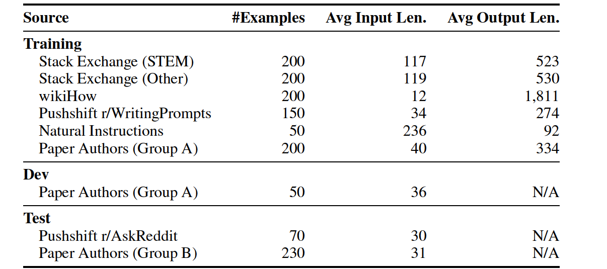

# Lima 数据集

# 简介

这篇论文是为了证明大模型的表面对齐假设(Superficial Alignment Hypothesis)，大模型的大量知识都在预训练里面获取，通过少量的SFT数据即可以训练一个很好的Chat模型去激发大模型中存储的知识。

该数据集在ModelScope中的路径为：https://modelscope.cn/datasets/swift/lima/files

对应的有一个中文版本的LIMA 数据集，ModelScope中的路径为：https://huggingface.co/datasets/Jellyfish042/Chinese-LIMA-V0

# 参考
1. https://arxiv.org/abs/2305.11206
2. https://finisky.github.io/lima-summary/
3. https://www.mikecaptain.com/2023/05/26/captain-lima/
4. https://www.ainavpro.com/3794.html