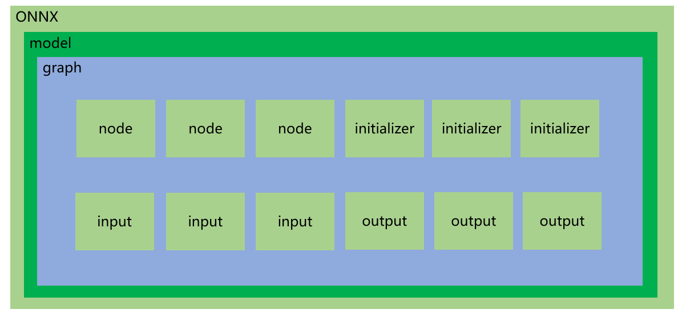

# Proto 类型定义

> 作者: 熊哈哈
>
> 邮箱: 915574300@qq.com

## 背景
这些结构在onnx中使用 protobuf 协议定义，在 onnx/*.proto 文件中。建议使用`onnx.helper` 模块中的函数来创建它们，而不是直接实例化它们。每个结构都可以用函数打印print并呈现为 json 字符串。

onnx文件的结构如下图所示：

## AttributeProto

这个类用于定义由 NodeProto 自身定义的算子属性。它是一个命名属性，包含单个浮点数、整数、字符串、图和张量值，或重复的浮点数、整数、字符串、图和张量值。`AttributeProto` 必须包含 **名称** 字段，并且只能包含以下内容字段之一，从而有效地强制执行 C/C++ 联合等效项。

| 属性 | 类型 | 含义|
|-----| -----| -----|
|DESCRIPTOR|<google.protobuf.pyext._message.MessageDescriptor> |此消息类型的google.protobuf.descriptor.Descriptor。|
|doc_string | onnx.AttributeProto.doc_string | 变量的备注说明|
| f |  onnx.AttributeProto.f ||
| floats | onnx.AttributeProto.floats||
|g| onnx.AttributeProto.g||
|graphs | onnx.AttributeProto.graphs||
|i| onnx.AttributeProto.i||
|ints | onnx.AttributeProto.ints||
|name| onnx.AttributeProto.name||
|ref_attr_name|onnx.AttributeProto.ref_attr_name||
|s| onnx.AttributeProto.s||
|sparse_tensor| onnx.AttributeProto.sparse_tensor||
|sparse_tensors| onnx.AttributeProto.sparse_tensors||
|strings |onnx.AttributeProto.strings||
|t|onnx.AttributeProto.t||
|tensors| onnx.AttributeProto.tensors||
|tp| onnx.AttributeProto.tp||
|type| onnx.AttributeProto.type||
|type_protos| onnx.AttributeProto.type_protos||

## FunctionProto

这定义了一个函数。它不是模型，但可用于定义模型中使用的自定义运算符。

| 属性 | 类型 | 含义|
|-----| -----| -----|
|DESCRIPTOR | <google.protobuf.pyext._message.MessageDescriptor>||
|attribute| onnx.FunctionProto.attribute||
|attribute_proto | onnx.FunctionProto.attribute_proto|
|doc_string|onnx.FunctionProto.doc_string||
|domain|onnx.FunctionProto.domain||
|input| onnx.FunctionProto.input||
|metadata_props |onnx.FunctionProto.metadata_props||
|name| onnx.FunctionProto.name|
|node| onnx.FunctionProto.node|
|opset_import|onnx.FunctionProto.opset_import||
|output|onnx.FunctionProto.output||
|overload| onnx.FunctionProto.overload||
|value_info| onnx.FunctionProto.value_info||

## GraphProto 

这定义了一个图或一组从循环或测试中调用的节点。图定义了模型的计算逻辑，由参数化的节点列表组成，这些节点根据其输入和输出形成有向无环图 DAG。这相当于许多深度学习框架中的 **网络** 或 **图**。

| 属性 | 类型 | 含义|
|-----| -----| -----|
|DESCRIPTOR | <google.protobuf.pyext._message.MessageDescriptor>||
|doc_string |onnx.GraphProto.doc_string||
|initializer |onnx.GraphProto.initializer||
|input | onnx.GraphProto.input||
|metadata_props| onnx.GraphProto.metadata_props||
|name |onnx.GraphProto.name||
|node |onnx.GraphProto.node||
|output | onnx.GraphProto.output||
|quantization_annotation| onnx.GraphProto.quantization_annotation||
|sparse_initializer| onnx.GraphProto.sparse_initializer||
|value_info |onnx.GraphProto.value_info|

## MapProto 

这定义了一个映射或字典。它指定一个由键和值定义的关联表。MapProto 由一个重复的键字段（类型为 INT8、INT16、INT32、INT64、UINT8、UINT16、UINT32、UINT64 或 STRING）和值（类型为 TENSOR、SPARSE_TENSOR、SEQUENCE 或 MAP）组成。键类型和值类型在 MapProto 的整个实例化过程中必须保持不变。

| 属性 | 类型 | 含义|
|-----| -----| -----|
| DESCRIPTOR |<google.protobuf.pyext._message.MessageDescriptor>||
| key_type | onnx.MapProto.key_type||
| keys |  onnx.MapProto.keys||
| name |onnx.MapProto.name||
| string_keys | onnx.MapProto.string_keys||
| values |onnx.MapProto.values||

## ModelProto
这定义了一个模型。这是每个转换库在转换机器学习模型后返回的类型。ModelProto 是一种顶级文件/容器格式，用于捆绑 ML 模型并将其计算图与元数据关联起来。模型的语义由关联的 GraphProto 描述。

| 属性 | 类型 | 含义|
|-----| -----| -----|
|DESCRIPTOR | <google.protobuf.pyext._message.MessageDescriptor>||
| doc_string | onnx.ModelProto.doc_string||
| domain| onnx.ModelProto.domain||
| functions |onnx.ModelProto.functions||
| graph| onnx.ModelProto.graph||
|ir_version| onnx.ModelProto.ir_version||
|metadata_props| onnx.ModelProto.metadata_props||
|model_version|onnx.ModelProto.model_version||
|opset_import|onnx.ModelProto.opset_import||
|producer_name | onnx.ModelProto.producer_name||
|producer_version |onnx.ModelProto. Producer_version ||
|training_info|onnx.ModelProto.training_info||

## NodeProto

这定义了一个算子。模型是数学函数的组合，每个函数都表示为 onnx 算子，存储在 NodeProto 中。计算图由节点的 DAG 组成，这些节点表示机器学习框架中通常称为层或管道阶段的内容。例如，它可以是Conv类型的节点，它接收图像、过滤器张量和偏差张量，并产生卷积输出。

| 属性 | 类型 | 含义|
|-----| -----| -----|
|DESCRIPTOR |<google.protobuf.pyext._message.MessageDescriptor>||
|attribute| onnx.NodeProto.attribute||
|doc_string|onnx.NodeProto.doc_string||
|domain |onnx.NodeProto.domain||
| input |onnx.NodeProto.input||
|metadata_props | onnx.NodeProto.metadata_props||
|name | onnx.NodeProto.name||
|op_type| onnx.NodeProto.op_type||
|output|onnx.NodeProto.output||
|overload | onnx.NodeProto.overload||

## OperatorProto
用户很少使用此类。OperatorProto 表示算子签名和语义的不可变规范。算子被声明为 OperatorSet 的一部分，它还定义了集合的域名。运算符由三部分标识符（domain、op_type、since_version）唯一标识，其中

* domain: 是包含此算子规范的算子集的域。

* op_type: 是 NodeProto.op_type 引用的算子的名称

* since_version: 是此算子最初声明的算子集的版本。

| 属性 | 类型 | 含义|
|-----| -----| -----|
|DESCRIPTOR |<google.protobuf.pyext._message.MessageDescriptor>||
|doc_string| onnx.OperatorProto.doc_string||
|op_type|onnx.OperatorProto.op_type||
|since_version| onnx.OperatorProto.since_version||
|status | onnx.OperatorProto.status||

## OperatorSetIdProto

这是 ModelProto 类的属性类型opset_import。此属性指定模型中使用的运算符的版本。每个运算符或节点都属于一个域。同一域的所有运算符共享同一版本。

| 属性 | 类型 | 含义|
|-----| -----| -----|
| DESCRIPTOR |<google.protobuf.pyext._message.MessageDescriptor>||
|domain| onnx.OperatorSetIdProto.domain||
|version | onnx.OperatorSetIdProto.version||

## OperatorSetProto

OperatorSetProto 表示一组不可变的不可变算子规范。该集合的域 (OperatorSetProto.domain) 是一个反向 DNS 名称，用于消除由独立实体定义的算子的歧义。该集合的版本 (opset_version) 是一个单调递增的整数，表示对算子集成员资格的更改。算子集由两部分标识符 (domain、opset_version) 唯一标识。与 ModelProto 一样，OperatorSetProto 旨在用作顶级文件/线路格式，因此除了算子集信息外，还具有标准格式标头。

| 属性 | 类型 | 含义|
|-----| -----| -----|
| DESCRIPTOR | <google.protobuf.pyext._message.MessageDescriptor>||
|doc_string | onnx.OperatorSetProto.doc_string||
|domain |onnx.OperatorSetProto.domain||
| functions | onnx.OperatorSetProto.functions||
|ir_build_metadata|onnx.OperatorSetProto.ir_build_metadata||
|ir_version| onnx.OperatorSetProto.ir_version||
|ir_version_prerelease|onnx.OperatorSetProto.ir_version_prerelease||
|magic|onnx.OperatorSetProto.magic||

|operator| onnx.OperatorSetProto.operator||

|opset_version| onnx.OperatorSetProto.opset_version||

## 参考：
1. https://zhuanlan.zhihu.com/p/346511883
2. https://www.cnblogs.com/silence-cho/p/17673812.html
3. https://github.com/open-mmlab/mmdeploy/blob/main/docs/zh_cn/tutorial/05_onnx_model_editing.md
4. https://www.cnblogs.com/vh-pg/p/11736174.html