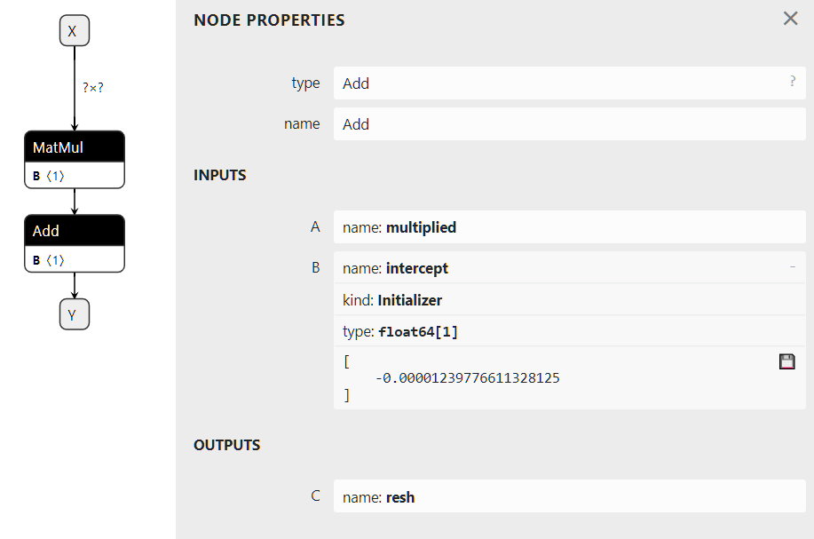

# ONNX 概念

ONNX 可以比作一种专门用于数学函数的编程语言。它定义了机器学习模型使用该语言(指ONNX)实现模型推理功能所需的所有必要运算或者称为算子。一个线性回归的模型可以用以下方式表示：

!!! 熊哈哈注
    **ONNX** (大写)表示描述模型的标准

    **onnx** (小写) ONNX 标准的一种python实现方式，是实现 ONNX 的一个 python 包

``` python
def onnx_linear_regressor(X):
    "ONNX code for a linear regression"
    return onnx.Add(onnx.MatMul(X, coefficients), bias)
```

!!! 熊哈哈注
    上面线性回归模型的数学模型如下：
    $$
    y = X * A + B
    $$

这个示例与开发人员用 `Python` 编写的表达式非常相似。它也可以表示为一个计算图，通过计算图逐步展示线性模型如何转换特征，最后获得预测的结果。这就是为什么使用 ONNX 实现的机器学习模型通常被称为 **ONNX 图**的原因。


ONNX 旨在提供一种任何机器学习框架都可以用其来描述模型的通用语言。第一个场景是让开发者在生产环境中部署机器学习模型变得更加容易。可以在部署该模型的环境中，使用专门实现和优化的 ONNX 模型解释器（或运行时库）以完成此任务。借助 ONNX，可以构建一个独特的流程在生产中部署模型，并且部署框架可以独立于用于构建模型的学习框架。 python 的 `onnx` 库实现了一个运行时库，可用于评估 ONNX 模型以及评估 ONNX 算子。 `onnx` 用来在阐明 ONNX 的语义并帮助理解和调试 ONNX 工具和转换器。`onnx` 不适用于生产环境，运行的性能也不是 `onnx` 的目标（参见onnx.reference）。


# 输入、输出、节点、初始化器、属性

构建 ONNX 计算图意味着使用 ONNX 语言或更准确地说是 ONNX 算子来实现函数。线性回归可以使用下述的方式写。以下几行代码不遵循 Python 语法。它只是一种用于说明模型的伪代码。

``` python
Input: float[M,K] x, float[K,N] a, float[N] c
Output: float[M, N] y

r = onnx.MatMul(x, a)
y = onnx.Add(r, c)
```

上述的代码实现了一个函数 $f(x, a, c) -> y = x @ a + c$。其中 `x`、`a`、`c`是输入，$y$ 是输出。$r$ 是中间结果。 `MatMul` 和 `Add` 是节点。它们也有输入和输出。节点还有类型。上图是根据第 1 节中的【一个简单示例：线性回归】构建的计算图。

上面的计算图也可以有一个初始化器。当某一个输入节点永远不会改变时（例如线性回归的系数），将其转换为计算图中的常量节点是最有效的。

``` python
Input: float[M,K] x
Initializer: float[K,N] a, float[N] c
Output: float[M, N] xac

xa = onnx.MatMul(x, a)
xac = onnx.Add(xa, c)
```

从视觉上看，上述的伪代码对应的计算图如下图所示。计算图中的右侧描述了 算子 `Add`，其中第二个输入定义为初始化器。该图是使用此代码初始化器，默认值获得的。

<!-- <div align=center>  </div> -->


属性是算子的固定参数。 `Gemm` 算子有四个属性，`alpha`、`beta`、`transA`、`transB`。运行时库一旦加载了 ONNX 图，这些值就无法更改，并且对于所有预测过程都保持不变。

# 使用 protobuf 进行序列化

将机器学习模型部署到生产中通常需要复制用于训练模型的整个生态系统，大多数情况下使用 docker 解决这个问题。将模型转换为 ONNX 后，生产环境只需要运行时来执行使用 ONNX 算子定义的计算图。运行时可以使用任何适合生产环境下应用程序的编程语言开发，C、java、python、javascript、C#、Webassembly、ARM.....。

但要实现这一点，需要保存 ONNX 计算图。ONNX 使用 protobuf 将计算图序列化为一整个模块（参见解析和序列化）。这样做的目的是在尽可能优化模型大小。

# 元数据

机器学习模型不断更新。跟踪模型版本、模型作者以及模型的训练方式非常重要。ONNX 提供了在模型本身中存储额外数据的可能性。

* doc_string：当前模型的人类可读文档。允许 Markdown 格式。

* domain：用于表示模型命名空间或域的反向 DNS 名称，例如，“org.onnx”

* metadata_props：将元数据命名为字典 `map<string,string>` ，
`(values, keys)` 应该是不同的。

* model_author：以逗号分隔的名称列表，模型作者的个人姓名和/或其组织。

* model_license：许可证的知名名称或 URL，该模型可供使用。

* model_version：模型本身的版本，以整数编码。

* production_name：用于生成模型的工具名称。

* production_version：生成工具的版本。

* training_info：包含的可选扩展训练信息（参见TrainingInfoProto）

# 可用算子和域的列表

算子主要列表在下面的链接中：ONNX 运算符。ONNX 融合了标准矩阵运算符（`Add`、`Sub`、`MatMul`、`Transpose`、`Greater`、`IsNaN`、`Shape`、`Reshape` ...）、缩减（`ReduceSum`、`ReduceMin`、...）图像转换（`Conv`、`MaxPool`、...）、深度神经网络层（`RNN`、`DropOut`、...）、激活函数（`Relu`、`Softmax`、...）。

ONNX 涵盖了深度机器学习推理功能所需的大多数算子。ONNX 并未实现所有现有的机器学习算子，算子列表是无限的。

主要算子列表用域 `ai.onnx` 标识。**域** 可以定义为一组运算符。此列表中的一些算子专用于文本晕眩，但它们几乎无法满足需求。主列表还缺少在标准机器学习中非常流行的基于树的模型。这些是另一个域 `ai.onnx.ml` 的一部分，它包括基于树的模型（`TreeEnsemble Regressor`，...）、预处理（`OneHotEncoder`、`LabelEncoder`，...）、SVM 模型（`SVMRegressor`，...）、输入器（`Imputer`）。

ONNX 仅定义了这两个域。但是 `onnx` 库支持任何自定义域和算子（请参阅可扩展性）。

# 支持的类型

ONNX 规范针对使用张量的数值计算进行了优化。张量是一个多维数组。它的定义如下：

* 数据类型type：张量中元素类型，张量中的所有元素都相同

* 张量形状shape：一个包含所有维度的数组，此数组可以为空，维度可以为空

* 一个连续的数组array：数组存储了张量所有的值

上述定义不包括步幅 `strides` 或基于现有张量定义张量可视化的属性。ONNX 张量是没有步幅的密集数组。

## 元素类型

ONNX 最初是为了帮助部署深度学习模型而开发的。这就是为什么规范最初是为浮点数（32 位）设计的。当前版本支持所有常见类型。字典 `TENSOR_TYPE_MAP` 给出了 ONNX 和 numpy 之间的对应关系。

``` python
import re
from onnx import TensorProto

reg = re.compile('^[0-9A-Z_]+$')

values = {}
for att in sorted(dir(TensorProto)):
    if att in {'DESCRIPTOR'}:
        continue
    if reg.match(att):
        values[getattr(TensorProto, att)] = att
for i, att in sorted(values.items()):
    si = str(i)
    if len(si) == 1:
        si = " " + si
    print("%s: onnx.TensorProto.%s" % (si, att))
```

``` shell
 0: onnx.TensorProto.UNDEFINED
 1: onnx.TensorProto.FLOAT
 2: onnx.TensorProto.UINT8
 3: onnx.TensorProto.INT8
 4: onnx.TensorProto.UINT16
 5: onnx.TensorProto.INT16
 6: onnx.TensorProto.INT32
 7: onnx.TensorProto.INT64
 8: onnx.TensorProto.STRING
 9: onnx.TensorProto.BOOL
10: onnx.TensorProto.FLOAT16
11: onnx.TensorProto.DOUBLE
12: onnx.TensorProto.UINT32
13: onnx.TensorProto.UINT64
14: onnx.TensorProto.COMPLEX64
15: onnx.TensorProto.COMPLEX128
16: onnx.TensorProto.BFLOAT16
17: onnx.TensorProto.FLOAT8E4M3FN
18: onnx.TensorProto.FLOAT8E4M3FNUZ
19: onnx.TensorProto.FLOAT8E5M2
20: onnx.TensorProto.FLOAT8E5M2FNUZ
21: onnx.TensorProto.UINT4
22: onnx.TensorProto.INT4
23: onnx.TensorProto.FLOAT4E2M1
```

ONNX 是强类型的，其定义的变量不支持隐式转换。即使其他语言支持，也无法添加两个不同类型的张量或矩阵。这就是为什么必须在图中插入显式转换的原因。

## 稀疏张量

稀疏张量可用于表示具有许多空值的数组。ONNX 支持二维 2D 稀疏张量。`SparseTensorProto` 类定义 `dims`、`indices(int64)` 和`values` 这三个属性。

## 其他类型

除了张量和稀疏张量，ONNX 还通过 `SequenceProto` 和 `MapProto` 类型支持张量序列、张量映射、张量映射序列。不过这些类型很少使用。

# 什么是 opset 版本？

`opset` 变量被映射到 `onnx` 包的版本。每次次版 `minor` 本增加时， `opset` 都会增加。每个版本都会带来更新或新的算子。

``` python
import onnx
print(onnx.__version__, " opset=", onnx.defs.onnx_opset_version())
```

``` shell
1.18.0  opset= 23
```

每个 ONNX 计算图还附加了一个 `opset` 变量值。这是一个全局信息。它定义了计算图内所有算子的版本。算子 `Add` 在版本 6、7、13 和 14 中进行了更新。如果计算图 `opset`为 15，则表示算子 `Add` 遵循规范版本 14。如果计算图 `opset`为12，则算子 `Add` 遵循规范版本 7。计算图中的算子遵循小于（或等于）全局计算图 `opset` 定义的算子版本。

一个计算图可能包含来自多个域的算子，例如可能包括 `ai.onnx` 和 `ai.onnx.ml` 这两个域。在这种情况下，计算图必须为每个域定义一个全局算子集合版本。该规则适用于同一域内的每个算子。

# 子图、测试和循环

ONNX 实现测试和循环引用。它们都可以将另一个 ONNX 计算图作为当前计算图的一个属性。这些结构通常很慢且很复杂。如果可能的话，最好避免使用它们。

# If 条件算子

If 条件算子根据条件评估情况执行两个计算图之一。

``` bash
If(condition) then
    execute this ONNX graph (`then_branch`)
else
    execute this ONNX graph (`else_branch`)
```

这两个计算图可以使用计算图中已经计算出的任何结果，并且必须产生完全相同数量的输出。这些输出将是条件算子 `If` 的输出。
<!--  -->


# 扫描算子 Scan

`Scan` 算子实现了具有固定迭代次数的循环。它循环遍历输入的行（或任何其他维度）并沿同一数据轴连接输出。让我们看一个实现成对距离 $M(i, j) = \|X_{i} - X_{j} \|^{2}$的示例：

<!--  -->


即使此循环比成对距离的自定义实现慢，但它仍然很高效。它假设输入和输出都是张量，并自动将每次迭代的输出连接成单个张量。上一个示例只有一个，但可以有多个。

# 环形

循环算子 `Loop` 实现了 `for` 和 `while` 循环。它可以执行固定数量的迭代器和/或在条件不再满足时结束。输出以两种不同的方式处理。第一种类似于循环Scan，输出被连接成张量（沿第一个维度）。这也意味着这些输出必须具有兼容的形状shape。第二种机制将张量连接成张量序列。

# 可扩展性

ONNX定义了一系列算子作为标准：ONNX 算子。但是，在这个域下定义自己的算子或新算子也是完全有可能的。`onnxruntime` 定义了自定义运算符来改进推理。每个节点都有一个类型、一个名称、命名的输入和输出以及属性。只要在这些约束下描述节点，就可以将节点添加到任何 ONNX 图中。

成对距离可以用 Scan 算子实现。但是，专用运算符 CDist 被证明速度明显更快，快到值得为它实现专用的运行时。

# 函数

函数是扩展 ONNX 规范的一种方式。某些模型需要相同的算子组合。可以通过创建一个使用现有 ONNX 算子定义的函数来避免这种情况。一旦定义，函数的行为就与任何其他算子一样。它具有输入、输出和属性。

使用函数有两个优点。第一个优点是代码更短，更易于阅读。第二个优点是任何 onnxruntime 都可以利用该信息更快地运行预测。运行时可以对函数进行特定实现，而不依赖于现有运算符的实现。

# 形状（和类型）推断

了解结果的形状shape对于执行 ONNX 计算图来说并不是必需的，但可以使用此信息来加快执行速度。如果您有以下图表：

``` python3
Add(x, y) -> z
Abs(z) -> w
``` 

如果x和y具有相同的形状，则z和w也具有相同的形状。知道这一点后，就可以重用为z分配的缓冲区，以就地计算绝对值w。形状推断有助于运行时管理内存，从而提高效率。

ONNX 包在大多数情况下可以在知道每个标准运算符的输入形状的情况下计算输出形状。对于官方列表之外的任何自定义运算符，它显然无法做到这一点。

# 工具
netron 非常有助于可视化 ONNX 计算图。这是唯一一款无需编程的工具。第一个屏幕截图就是用这个工具制作的。

<!--  -->


onnx2py.py 从 ONNX 计算图创建一个 python 文件。此脚本可以创建相同的计算图。用户可以修改它来更改计算图。

zetane 可以加载 onnx 模型并在模型执行时显示中间结果。