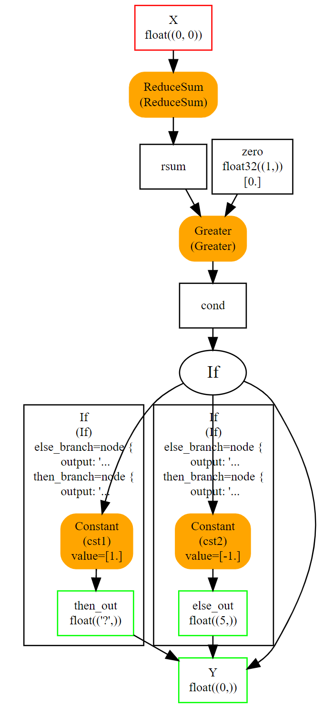

# Python 处理 ONNX

> 作者：熊哈哈
>
> 邮箱: 915574300@qq.com

## 背景

接下来的部分，重点介绍了如何使用 `onnx` 包提供的Python API 来构建 ONNX 计算图所用到的主要函数。

## 一个简单的例子：线性回归

### 线性回归模型

线性回归是机器学习中最简单的模型，以下数学表达式描述了一个线性回归模型: $Y = X * A + B$
我们可以把这个模型看作一个三变量的函数 $Y = f(X, A, B)$，对应的 ONNX 表达式为 `y = Add(MatMul(X, A), B)`。这就是我们需要用 ONNX 算子表示的内容。第一件事是用 ONNX 算子实现一个函数。ONNX 是强类型的。必须为函数的 **输入** 和 **输出** 节点定义形状(shape)和类型(type)。也就是说，我们在 `make_function` 函数中需要用四个函数来构建计算图。

* `make_tensor_value_info`：根据形状shape和类型type声明一个变量（输入或输出）

* `make_node`：创建一个由算子（算子类型）、其输入和输出定义的节点

* `make_graph`：使用前两个函数创建的对象创建 ONNX 计算图

* `make_model`：将计算图和附加元数据融合在一起

在创建过程中，我们需要为计算图的每个节点的每个输入、输出命名。计算图的输入和输出由 onnx 对象定义，字符串用于引用中间结果。构建的过程如下所述。

### onnx 代码实现

<!-- https://facelessuser.github.io/pymdown-extensions/extensions/details/ -->
<!-- https://squidfunk.github.io/mkdocs-material/reference/admonitions/#collapsible-blocks -->

<details>
 <summary>onnx实现的线性回归模型</summary>

  ``` python
  # imports

  from onnx import TensorProto
  from onnx.helper import (
      make_model, make_node, make_graph,
      make_tensor_value_info)
  from onnx.checker import check_model

  # 第一步：构建整个计算图所有的变量
  # inputs

  # 'X' is the name, TensorProto.FLOAT the type, [None, None] the shape
  X = make_tensor_value_info('X', TensorProto.FLOAT, [None, None])
  A = make_tensor_value_info('A', TensorProto.FLOAT, [None, None])
  B = make_tensor_value_info('B', TensorProto.FLOAT, [None, None])

  # outputs, the shape is left undefined

  Y = make_tensor_value_info('Y', TensorProto.FLOAT, [None])

  # 第二步：根据变量构建所有的节点
  # nodes

  # It creates a node defined by the operator type MatMul,
  # 'X', 'A' are the inputs of the node, 'XA' the output.
  node1 = make_node('MatMul', ['X', 'A'], ['XA'])
  node2 = make_node('Add', ['XA', 'B'], ['Y'])

  # 第三步：根据节点构建计算图
  # from nodes to graph
  # the graph is built from the list of nodes, the list of inputs,
  # the list of outputs and a name.

  graph = make_graph([node1, node2],  # nodes
                      'lr',  # a name
                      [X, A, B],  # inputs
                      [Y])  # outputs

  # 第四步：根据计算图等其他信息，构建一个onnx模型
  # onnx graph
  # there is no metadata in this case.

  onnx_model = make_model(graph)

  # 第五步：对模型进行校验
  # Let's check the model is consistent,
  # this function is described in section
  # Checker and Shape Inference.
  check_model(onnx_model)

  # the work is done, let's display it...
  print(onnx_model)
  ``` 
</details>

`#################################################################################`
`#################################完美的分割线######################################`
`#################################################################################`

<details>
  <summary> onnx实现的线性回归模型网络结果：json格式 </summary>

```text 

ir_version: 11
graph {
  node {
    input: "X"
    input: "A"
    output: "XA"
    op_type: "MatMul"
  }
  node {
    input: "XA"
    input: "B"
    output: "Y"
    op_type: "Add"
  }
  name: "lr"
  input {
    name: "X"
    type {
      tensor_type {
        elem_type: 1
        shape {
          dim {
          }
          dim {
          }
        }
      }
    }
  }
  input {
    name: "A"
    type {
      tensor_type {
        elem_type: 1
        shape {
          dim {
          }
          dim {
          }
        }
      }
    }
  }
  input {
    name: "B"
    type {
      tensor_type {
        elem_type: 1
        shape {
          dim {
          }
          dim {
          }
        }
      }
    }
  }
  output {
    name: "Y"
    type {
      tensor_type {
        elem_type: 1
        shape {
          dim {
          }
        }
      }
    }
  }
}
opset_import {
  version: 23
}
```
</details>


### 可视化显示

上述的计算图可视化的表示如下所示：


### 特殊节点-形状shape为空

空形状 (shape为None) 表示任意形状，定义为 `[None, None]` 的形状，表示此对象是二维张量，无需进一步的精度限制。还可以通过查看图中每个对象的字段来检查 ONNX 图。

#### 有空形状节点计算图构图代码
<details>
  <summary> 空形状计算图 </summary>

``` python
from onnx import TensorProto
from onnx.helper import (
    make_model, make_node, make_graph,
    make_tensor_value_info)
from onnx.checker import check_model

def shape2tuple(shape):
    return tuple(getattr(d, 'dim_value', 0) for d in shape.dim)

X = make_tensor_value_info('X', TensorProto.FLOAT, [None, None])
A = make_tensor_value_info('A', TensorProto.FLOAT, [None, None])
B = make_tensor_value_info('B', TensorProto.FLOAT, [None, None])
Y = make_tensor_value_info('Y', TensorProto.FLOAT, [None])
node1 = make_node('MatMul', ['X', 'A'], ['XA'])
node2 = make_node('Add', ['XA', 'B'], ['Y'])
graph = make_graph([node1, node2], 'lr', [X, A, B], [Y])
onnx_model = make_model(graph)
check_model(onnx_model)

# the list of inputs
print('** inputs **')
print(onnx_model.graph.input)

# in a more nicely format
print('** inputs **')
for obj in onnx_model.graph.input:
    print("name=%r dtype=%r shape=%r" % (
        obj.name, obj.type.tensor_type.elem_type,
        shape2tuple(obj.type.tensor_type.shape)))

# the list of outputs
print('** outputs **')
print(onnx_model.graph.output)

# in a more nicely format
print('** outputs **')
for obj in onnx_model.graph.output:
    print("name=%r dtype=%r shape=%r" % (
        obj.name, obj.type.tensor_type.elem_type,
        shape2tuple(obj.type.tensor_type.shape)))

# the list of nodes
print('** nodes **')
print(onnx_model.graph.node)

# in a more nicely format
print('** nodes **')
for node in onnx_model.graph.node:
    print("name=%r type=%r input=%r output=%r" % (
        node.name, node.op_type, node.input, node.output))
```
</details>


<details>
  <summary> 打印json格式的onnx计算图</summary>

``` bash
** inputs **
[name: "X"
type {
  tensor_type {
    elem_type: 1
    shape {
      dim {
      }
      dim {
      }
    }
  }
}
, name: "A"
type {
  tensor_type {
    elem_type: 1
    shape {
      dim {
      }
      dim {
      }
    }
  }
}
, name: "B"
type {
  tensor_type {
    elem_type: 1
    shape {
      dim {
      }
      dim {
      }
    }
  }
}
]
** inputs **
name='X' dtype=1 shape=(0, 0)
name='A' dtype=1 shape=(0, 0)
name='B' dtype=1 shape=(0, 0)
** outputs **
[name: "Y"
type {
  tensor_type {
    elem_type: 1
    shape {
      dim {
      }
    }
  }
}
]
** outputs **
name='Y' dtype=1 shape=(0,)
** nodes **
[input: "X"
input: "A"
output: "XA"
op_type: "MatMul"
, input: "XA"
input: "B"
output: "Y"
op_type: "Add"
]
** nodes **
name='' type='MatMul' input=['X', 'A'] output=['XA']
name='' type='Add' input=['XA', 'B'] output=['Y']
```
</details>


#### 其他
张量 **类型** 是整数（=1）。辅助函数 `onnx.helper.tensor_dtype_to_np_dtype()` 给出了 `numpy` 对应类型的映射关系。

``` python
from onnx import TensorProto
from onnx.helper import tensor_dtype_to_np_dtype, tensor_dtype_to_string

np_dtype = tensor_dtype_to_np_dtype(TensorProto.FLOAT)
print(f"The converted numpy dtype for {tensor_dtype_to_string(TensorProto.FLOAT)} is {np_dtype}.")
```

``` bash
The converted numpy dtype for TensorProto.FLOAT is float32.
```

## 序列化

ONNX 建立在 protobuf 之上。ONNX 添加了描述机器学习模型所需的定义。大多数情况下，ONNX 用于序列化或反序列化一个模型模型。第一部分解决了这一需求（如何描述机器学习模型）。第二部分介绍了张量、稀疏张量等数据的序列化和反序列化。

### 模型序列化

需要保存模型才能部署。ONNX 基于 protobuf。它最大限度地减少了在磁盘上保存图形所需的空间。onnx 中的每个对象（参见Protos）都可以使用方法 `SerializeToString` 序列化。整个模型也可以操作。

<details>
  <summary> 模型序列化 </summary>

``` python
from onnx import TensorProto
from onnx.helper import (
    make_model, make_node, make_graph,
    make_tensor_value_info)
from onnx.checker import check_model

def shape2tuple(shape):
    return tuple(getattr(d, 'dim_value', 0) for d in shape.dim)

X = make_tensor_value_info('X', TensorProto.FLOAT, [None, None])
A = make_tensor_value_info('A', TensorProto.FLOAT, [None, None])
B = make_tensor_value_info('B', TensorProto.FLOAT, [None, None])
Y = make_tensor_value_info('Y', TensorProto.FLOAT, [None])
node1 = make_node('MatMul', ['X', 'A'], ['XA'])
node2 = make_node('Add', ['XA', 'B'], ['Y'])
graph = make_graph([node1, node2], 'lr', [X, A, B], [Y])
onnx_model = make_model(graph)
check_model(onnx_model)

# The serialization
with open("linear_regression.onnx", "wb") as f:
    f.write(onnx_model.SerializeToString())

# display
print(onnx_model)
```
</details>


<details>
  <summary> 模型序列化之后输出的内容：json格式</summary>

``` bash
ir_version: 11
graph {
  node {
    input: "X"
    input: "A"
    output: "XA"
    op_type: "MatMul"
  }
  node {
    input: "XA"
    input: "B"
    output: "Y"
    op_type: "Add"
  }
  name: "lr"
  input {
    name: "X"
    type {
      tensor_type {
        elem_type: 1
        shape {
          dim {
          }
          dim {
          }
        }
      }
    }
  }
  input {
    name: "A"
    type {
      tensor_type {
        elem_type: 1
        shape {
          dim {
          }
          dim {
          }
        }
      }
    }
  }
  input {
    name: "B"
    type {
      tensor_type {
        elem_type: 1
        shape {
          dim {
          }
          dim {
          }
        }
      }
    }
  }
  output {
    name: "Y"
    type {
      tensor_type {
        elem_type: 1
        shape {
          dim {
          }
        }
      }
    }
  }
}
opset_import {
  version: 23
}
```
</details>


可以使用以下 `load` 函数恢复计算：
``` python
from onnx import load

with open("linear_regression.onnx", "rb") as f:
    onnx_model = load(f)

# display
print(onnx_model)
```

<details>
  <summary> 反序列化之后的onnx模型: json格式 </summary>

``` text
ir_version: 11
graph {
  node {
    input: "X"
    input: "A"
    output: "XA"
    op_type: "MatMul"
  }
  node {
    input: "XA"
    input: "B"
    output: "Y"
    op_type: "Add"
  }
  name: "lr"
  input {
    name: "X"
    type {
      tensor_type {
        elem_type: 1
        shape {
          dim {
          }
          dim {
          }
        }
      }
    }
  }
  input {
    name: "A"
    type {
      tensor_type {
        elem_type: 1
        shape {
          dim {
          }
          dim {
          }
        }
      }
    }
  }
  input {
    name: "B"
    type {
      tensor_type {
        elem_type: 1
        shape {
          dim {
          }
          dim {
          }
        }
      }
    }
  }
  output {
    name: "Y"
    type {
      tensor_type {
        elem_type: 1
        shape {
          dim {
          }
        }
      }
    }
  }
}
opset_import {
  version: 23
}
```

</details>


看起来完全一样。任何模型都可以通过这种方式序列化，** 除非它们大于 2 Gb** 。protobuf 的大小限制小于此阈值。下一节将展示如何克服该限制。

`#################################################################################`
`###############################onnx坑爹的地方，模型空间 2G 限制######################`
`###############################onnx坑爹的地方，模型空间 2G 限制######################`
`###############################onnx坑爹的地方，模型空间 2G 限制######################`
`#################################################################################`

### 数据序列化

张量的序列化通常如下进行：

``` python
import numpy
from onnx.numpy_helper import from_array

numpy_tensor = numpy.array([0, 1, 4, 5, 3], dtype=numpy.float32)
print(type(numpy_tensor))

onnx_tensor = from_array(numpy_tensor)
print(type(onnx_tensor))

serialized_tensor = onnx_tensor.SerializeToString()
print(type(serialized_tensor))

with open("saved_tensor.pb", "wb") as f:
    f.write(serialized_tensor)
```

``` bash
<class 'numpy.ndarray'>
<class 'onnx.onnx_ml_pb2.TensorProto'>
<class 'bytes'>
```

反序列化如下：

``` python
from onnx import TensorProto
from onnx.numpy_helper import to_array

with open("saved_tensor.pb", "rb") as f:
    serialized_tensor = f.read()
print(type(serialized_tensor))

onnx_tensor = TensorProto()
onnx_tensor.ParseFromString(serialized_tensor)
print(type(onnx_tensor))

numpy_tensor = to_array(onnx_tensor)
print(numpy_tensor)
```

``` bash
<class 'bytes'>
<class 'onnx.onnx_ml_pb2.TensorProto'>
[0. 1. 4. 5. 3.]
```
相同的模式可用于TensorProto （但不限于） ：
``` python
import onnx
import pprint
pprint.pprint([p for p in dir(onnx)
               if p.endswith('Proto') and p[0] != '_'])
```

``` bash
['AttributeProto',
 'FunctionProto',
 'GraphProto',
 'MapProto',
 'ModelProto',
 'NodeProto',
 'OperatorProto',
 'OperatorSetIdProto',
 'OperatorSetProto',
 'OptionalProto',
 'SequenceProto',
 'SparseTensorProto',
 'StringStringEntryProto',
 'TensorProto',
 'TensorShapeProto',
 'TrainingInfoProto',
 'TypeProto',
 'ValueInfoProto']
```

该代码可以通过函数 `load_tensor_from_string` 简化 （参见加载 Proto）。

``` python
from onnx import load_tensor_from_string

with open("saved_tensor.pb", "rb") as f:
    serialized = f.read()
proto = load_tensor_from_string(serialized)
print(type(proto))
``` 

``` bash
<class 'onnx.onnx_ml_pb2.TensorProto'>
```

## 初始化程序，默认值

前一个模型假设线性回归的系数也是模型的输入。这不太方便。它们应该是模型本身的一部分，作为常量或初始化器，以遵循 onnx 语义。下一个示例模型修改了前一个示例，将输入 A 和 B 更改为初始化器。`onnx` 包实现了两个函数，用于从 `numpy` 与 `onnx` 之间相互转换（参见数组）。

* `onnx.numpy_helper.to_array`：从 onnx 转换为 numpy

* `onnx.numpy_helper.from_array`：从 numpy 转换为 onnx

``` Python
import numpy
from onnx import numpy_helper, TensorProto
from onnx.helper import (
    make_model, make_node, make_graph,
    make_tensor_value_info)
from onnx.checker import check_model

# initializers
value = numpy.array([0.5, -0.6], dtype=numpy.float32)
A = numpy_helper.from_array(value, name='A')

value = numpy.array([0.4], dtype=numpy.float32)
C = numpy_helper.from_array(value, name='C')

# the part which does not change
X = make_tensor_value_info('X', TensorProto.FLOAT, [None, None])
Y = make_tensor_value_info('Y', TensorProto.FLOAT, [None])
node1 = make_node('MatMul', ['X', 'A'], ['AX'])
node2 = make_node('Add', ['AX', 'C'], ['Y'])
graph = make_graph([node1, node2], 'lr', [X], [Y], [A, C])
onnx_model = make_model(graph)
check_model(onnx_model)

print(onnx_model)
```

<details> 
  <summary> 线性模型的计算图: json格式 </summary>

``` bash
ir_version: 11
graph {
  node {
    input: "X"
    input: "A"
    output: "AX"
    op_type: "MatMul"
  }
  node {
    input: "AX"
    input: "C"
    output: "Y"
    op_type: "Add"
  }
  name: "lr"
  initializer {
    dims: 2
    data_type: 1
    name: "A"
    raw_data: "\000\000\000?\232\231\031\277"
  }
  initializer {
    dims: 1
    data_type: 1
    name: "C"
    raw_data: "\315\314\314>"
  }
  input {
    name: "X"
    type {
      tensor_type {
        elem_type: 1
        shape {
          dim {
          }
          dim {
          }
        }
      }
    }
  }
  output {
    name: "Y"
    type {
      tensor_type {
        elem_type: 1
        shape {
          dim {
          }
        }
      }
    }
  }
}
opset_import {
  version: 23
}
```
</details>


再次，可以通过 onnx 结构来检查初始化程序的样子。

``` python
import numpy
from onnx import numpy_helper, TensorProto
from onnx.helper import (
    make_model, make_node, make_graph,
    make_tensor_value_info)
from onnx.checker import check_model

# initializers
value = numpy.array([0.5, -0.6], dtype=numpy.float32)
A = numpy_helper.from_array(value, name='A')

value = numpy.array([0.4], dtype=numpy.float32)
C = numpy_helper.from_array(value, name='C')

# the part which does not change
X = make_tensor_value_info('X', TensorProto.FLOAT, [None, None])
Y = make_tensor_value_info('Y', TensorProto.FLOAT, [None])
node1 = make_node('MatMul', ['X', 'A'], ['AX'])
node2 = make_node('Add', ['AX', 'C'], ['Y'])
graph = make_graph([node1, node2], 'lr', [X], [Y], [A, C])
onnx_model = make_model(graph)
check_model(onnx_model)

print('** initializer **')
for init in onnx_model.graph.initializer:
    print(init)
```

``` bash
** initializer **
dims: 2
data_type: 1
name: "A"
raw_data: "\000\000\000?\232\231\031\277"

dims: 1
data_type: 1
name: "C"
raw_data: "\315\314\314>"
```

类型也定义为整数，含义相同。在第二个示例中，只剩下一个输入。输入A和B被删除。当然它们也可以保留。在保留情况下，它们是可选的：**每个与输入共享相同名称的初始化器都被视为默认值**。如果没有给出这个，它将替换输入。

## 属性

有些算子需要属性，例如 `Transpose` 算子。这让我们可以构建基于表达式的计算图，例如 $y = XA^{\prime} + B$ 或者 `y = Add(MatMul(X, Transpose(Z)) + B)`。`Transpose` 需要一个定义轴排列的属性：`perm=[1, 0]`。它作为命名属性添加到函数 `make_node` 中

``` python
from onnx import TensorProto
from onnx.helper import (
    make_model, make_node, make_graph,
    make_tensor_value_info)
from onnx.checker import check_model

# unchanged
X = make_tensor_value_info('X', TensorProto.FLOAT, [None, None])
A = make_tensor_value_info('A', TensorProto.FLOAT, [None, None])
B = make_tensor_value_info('B', TensorProto.FLOAT, [None, None])
Y = make_tensor_value_info('Y', TensorProto.FLOAT, [None])

# added
node_transpose = make_node('Transpose', ['A'], ['tA'], perm=[1, 0])

# unchanged except A is replaced by tA
node1 = make_node('MatMul', ['X', 'tA'], ['XA'])
node2 = make_node('Add', ['XA', 'B'], ['Y'])

# node_transpose is added to the list
graph = make_graph([node_transpose, node1, node2],
                   'lr', [X, A, B], [Y])
onnx_model = make_model(graph)
check_model(onnx_model)

# the work is done, let's display it...
print(onnx_model)
```

<details>
  <summary> 线性模型的计算图: json格式 </summary>

``` bash
ir_version: 11
graph {
  node {
    input: "A"
    output: "tA"
    op_type: "Transpose"
    attribute {
      name: "perm"
      ints: 1
      ints: 0
      type: INTS
    }
  }
  node {
    input: "X"
    input: "tA"
    output: "XA"
    op_type: "MatMul"
  }
  node {
    input: "XA"
    input: "B"
    output: "Y"
    op_type: "Add"
  }
  name: "lr"
  input {
    name: "X"
    type {
      tensor_type {
        elem_type: 1
        shape {
          dim {
          }
          dim {
          }
        }
      }
    }
  }
  input {
    name: "A"
    type {
      tensor_type {
        elem_type: 1
        shape {
          dim {
          }
          dim {
          }
        }
      }
    }
  }
  input {
    name: "B"
    type {
      tensor_type {
        elem_type: 1
        shape {
          dim {
          }
          dim {
          }
        }
      }
    }
  }
  output {
    name: "Y"
    type {
      tensor_type {
        elem_type: 1
        shape {
          dim {
          }
        }
      }
    }
  }
}
opset_import {
  version: 23
}
```
</details>


以下是make函数的完整列表。其中许多函数在make 函数一节中进行了描述。

``` python
import onnx
import pprint
pprint.pprint([k for k in dir(onnx.helper)
               if k.startswith('make')])
``` 

``` bash
['make_attribute',
 'make_attribute_ref',
 'make_empty_tensor_value_info',
 'make_function',
 'make_graph',
 'make_map',
 'make_map_type_proto',
 'make_model',
 'make_model_gen_version',
 'make_node',
 'make_operatorsetid',
 'make_opsetid',
 'make_optional',
 'make_optional_type_proto',
 'make_sequence',
 'make_sequence_type_proto',
 'make_sparse_tensor',
 'make_sparse_tensor_type_proto',
 'make_sparse_tensor_value_info',
 'make_tensor',
 'make_tensor_sequence_value_info',
 'make_tensor_type_proto',
 'make_tensor_value_info',
 'make_training_info',
 'make_value_info']
```

## Opset 和元数据

让我们加载之前创建的 ONNX 文件并检查它具有什么样的元数据。

``` python
from onnx import load

with open("linear_regression.onnx", "rb") as f:
    onnx_model = load(f)

for field in ['doc_string', 'domain', 'functions',
              'ir_version', 'metadata_props', 'model_version',
              'opset_import', 'producer_name', 'producer_version',
              'training_info']:
    print(field, getattr(onnx_model, field))
```

```
doc_string 
domain 
functions []
ir_version 11
metadata_props []
model_version 0
opset_import [version: 23
]
producer_name 
producer_version 
training_info []
```
其中大部分都是空的，因为在创建 ONNX 图时没有填充。其中两个有值：

``` python
from onnx import load

with open("linear_regression.onnx", "rb") as f:
    onnx_model = load(f)

print("ir_version:", onnx_model.ir_version)
for opset in onnx_model.opset_import:
    print("opset domain=%r version=%r" % (opset.domain, opset.version))
```

``` bash
ir_version: 11
opset domain='' version=23
```

IR定义 ONNX 语言的版本。Opset 定义正在使用的运算符的版本。没有任何精度，ONNX 使用已安装包中提供的最新版本。可以使用另一个。

``` python
from onnx import load

with open("linear_regression.onnx", "rb") as f:
    onnx_model = load(f)

del onnx_model.opset_import[:]
opset = onnx_model.opset_import.add()
opset.domain = ''
opset.version = 14

for opset in onnx_model.opset_import:
    print("opset domain=%r version=%r" % (opset.domain, opset.version))
```

``` bash
opset domain='' version=14
```

只要所有运算符都按照 ONNX 指定的方式定义，就可以使用任何操作集。操作符Reshape的第 5 版 将形状定义为输入，而不是像第 1 版中那样定义为属性。操作集说明在描述图形时遵循哪些规范。

其他元数据可用于存储任何信息，存储有关模型生成方式的信息，以及使用版本号区分一个模型与另一个模型的方式。

``` python
from onnx import load, helper

with open("linear_regression.onnx", "rb") as f:
    onnx_model = load(f)

onnx_model.model_version = 15
onnx_model.producer_name = "something"
onnx_model.producer_version = "some other thing"
onnx_model.doc_string = "documentation about this model"
prop = onnx_model.metadata_props

data = dict(key1="value1", key2="value2")
helper.set_model_props(onnx_model, data)

print(onnx_model)
```

<details>
  <summary> 线性模型的计算图: json 格式</summary>

``` text
ir_version: 11
producer_name: "something"
producer_version: "some other thing"
model_version: 15
doc_string: "documentation about this model"
graph {
  node {
    input: "X"
    input: "A"
    output: "XA"
    op_type: "MatMul"
  }
  node {
    input: "XA"
    input: "B"
    output: "Y"
    op_type: "Add"
  }
  name: "lr"
  input {
    name: "X"
    type {
      tensor_type {
        elem_type: 1
        shape {
          dim {
          }
          dim {
          }
        }
      }
    }
  }
  input {
    name: "A"
    type {
      tensor_type {
        elem_type: 1
        shape {
          dim {
          }
          dim {
          }
        }
      }
    }
  }
  input {
    name: "B"
    type {
      tensor_type {
        elem_type: 1
        shape {
          dim {
          }
          dim {
          }
        }
      }
    }
  }
  output {
    name: "Y"
    type {
      tensor_type {
        elem_type: 1
        shape {
          dim {
          }
        }
      }
    }
  }
}
opset_import {
  version: 23
}
metadata_props {
  key: "key1"
  value: "value1"
}
metadata_props {
  key: "key2"
  value: "value2"
}
```
</details>


字段training_info可用于存储附加图表。请参阅training_tool_test.py 了解其工作原理。

## 子图：测试和循环

它们通常被归类为控制流。通常最好避免使用它们，因为它们的效率不如矩阵操作快得多且经过了优化。

### 条件算子 IF

可以使用运算符If来实现测试。它根据一个布尔值执行一个子图或另一个子图。这不常用，因为函数通常需要一批中多次比较的结果。以下示例根据符号计算矩阵中所有浮点数的总和，返回 1 或 -1。

<details>
  <summary> 条件算子 </summary>

``` python
import numpy
import onnx
from onnx.helper import (
    make_node, make_graph, make_model, make_tensor_value_info)
from onnx.numpy_helper import from_array
from onnx.checker import check_model
from onnxruntime import InferenceSession

# initializers
value = numpy.array([0], dtype=numpy.float32)
zero = from_array(value, name='zero')

# Same as before, X is the input, Y is the output.
X = make_tensor_value_info('X', onnx.TensorProto.FLOAT, [None, None])
Y = make_tensor_value_info('Y', onnx.TensorProto.FLOAT, [None])

# The node building the condition. The first one
# sum over all axes.
rsum = make_node('ReduceSum', ['X'], ['rsum'])
# The second compares the result to 0.
cond = make_node('Greater', ['rsum', 'zero'], ['cond'])

# Builds the graph is the condition is True.
# Input for then
then_out = make_tensor_value_info(
    'then_out', onnx.TensorProto.FLOAT, None)
# The constant to return.
then_cst = from_array(numpy.array([1]).astype(numpy.float32))

# The only node.
then_const_node = make_node(
    'Constant', inputs=[],
    outputs=['then_out'],
    value=then_cst, name='cst1')

# And the graph wrapping these elements.
then_body = make_graph(
    [then_const_node], 'then_body', [], [then_out])

# Same process for the else branch.
else_out = make_tensor_value_info(
    'else_out', onnx.TensorProto.FLOAT, [5])
else_cst = from_array(numpy.array([-1]).astype(numpy.float32))

else_const_node = make_node(
    'Constant', inputs=[],
    outputs=['else_out'],
    value=else_cst, name='cst2')

else_body = make_graph(
    [else_const_node], 'else_body',
    [], [else_out])

# Finally the node If taking both graphs as attributes.
if_node = onnx.helper.make_node(
    'If', ['cond'], ['Y'],
    then_branch=then_body,
    else_branch=else_body)

# The final graph.
graph = make_graph([rsum, cond, if_node], 'if', [X], [Y], [zero])
onnx_model = make_model(graph)
check_model(onnx_model)

# Let's freeze the opset.
del onnx_model.opset_import[:]
opset = onnx_model.opset_import.add()
opset.domain = ''
opset.version = 15
onnx_model.ir_version = 8

# Save.
with open("onnx_if_sign.onnx", "wb") as f:
    f.write(onnx_model.SerializeToString())

# Let's see the output.
sess = InferenceSession(onnx_model.SerializeToString(),
                        providers=["CPUExecutionProvider"])

x = numpy.ones((3, 2), dtype=numpy.float32)
res = sess.run(None, {'X': x})

# It works.
print("result", res)
print()

# Some display.
print(onnx_model)
```
</details>

<details>
  <summary> 有条件算子的计算图: json 格式</summary>


``` text
result [array([1.], dtype=float32)]

ir_version: 8
graph {
  node {
    input: "X"
    output: "rsum"
    op_type: "ReduceSum"
  }
  node {
    input: "rsum"
    input: "zero"
    output: "cond"
    op_type: "Greater"
  }
  node {
    input: "cond"
    output: "Y"
    op_type: "If"
    attribute {
      name: "else_branch"
      g {
        node {
          output: "else_out"
          name: "cst2"
          op_type: "Constant"
          attribute {
            name: "value"
            t {
              dims: 1
              data_type: 1
              raw_data: "\000\000\200\277"
            }
            type: TENSOR
          }
        }
        name: "else_body"
        output {
          name: "else_out"
          type {
            tensor_type {
              elem_type: 1
              shape {
                dim {
                  dim_value: 5
                }
              }
            }
          }
        }
      }
      type: GRAPH
    }
    attribute {
      name: "then_branch"
      g {
        node {
          output: "then_out"
          name: "cst1"
          op_type: "Constant"
          attribute {
            name: "value"
            t {
              dims: 1
              data_type: 1
              raw_data: "\000\000\200?"
            }
            type: TENSOR
          }
        }
        name: "then_body"
        output {
          name: "then_out"
          type {
            tensor_type {
              elem_type: 1
            }
          }
        }
      }
      type: GRAPH
    }
  }
  name: "if"
  initializer {
    dims: 1
    data_type: 1
    name: "zero"
    raw_data: "\000\000\000\000"
  }
  input {
    name: "X"
    type {
      tensor_type {
        elem_type: 1
        shape {
          dim {
          }
          dim {
          }
        }
      }
    }
  }
  output {
    name: "Y"
    type {
      tensor_type {
        elem_type: 1
        shape {
          dim {
          }
        }
      }
    }
  }
}
opset_import {
  domain: ""
  version: 15
}
```
</details>


通过下图可以更容易地形象化整体。



else 和 then 分支都非常简单。节点If甚至可以用节点Where替换，这样会更快。当两个分支都较大时，跳过一个分支会更有效率，这变得很有趣。

## 扫描算子scan

阅读规范时，扫描似乎相当复杂。循环遍历张量的一维并将结果存储在预分配的张量中很有用。

以下示例为回归问题实现了经典的最近邻算法。第一步是计算输入特征X和训练集W之间的成对距离：
接下来是TopK算子，用于提取k 个最近邻居。

<details>
  <summary> 扫描算子 </summary>

``` python
import numpy
from onnx import numpy_helper, TensorProto
from onnx.helper import (
    make_model, make_node, set_model_props, make_tensor, make_graph,
    make_tensor_value_info)
from onnx.checker import check_model

# subgraph
initializers = []
nodes = []
inputs = []
outputs = []

value = make_tensor_value_info('next_in', 1, [None, 4])
inputs.append(value)
value = make_tensor_value_info('next', 1, [None])
inputs.append(value)

value = make_tensor_value_info('next_out', 1, [None, None])
outputs.append(value)
value = make_tensor_value_info('scan_out', 1, [None])
outputs.append(value)

node = make_node(
    'Identity', ['next_in'], ['next_out'],
    name='cdistd_17_Identity', domain='')
nodes.append(node)

node = make_node(
    'Sub', ['next_in', 'next'], ['cdistdf_17_C0'],
    name='cdistdf_17_Sub', domain='')
nodes.append(node)

node = make_node(
    'ReduceSumSquare', ['cdistdf_17_C0'], ['cdistdf_17_reduced0'],
    name='cdistdf_17_ReduceSumSquare', axes=[1], keepdims=0, domain='')
nodes.append(node)

node = make_node(
    'Identity', ['cdistdf_17_reduced0'],
    ['scan_out'], name='cdistdf_17_Identity', domain='')
nodes.append(node)

graph = make_graph(nodes, 'OnnxIdentity',
                   inputs, outputs, initializers)

# main graph

initializers = []
nodes = []
inputs = []
outputs = []

opsets = {'': 15, 'ai.onnx.ml': 15}
target_opset = 15  # subgraphs

# initializers
list_value = [23.29599822460675, -120.86516699239603, -144.70495899914215, -260.08772982740413,
              154.65272105889147, -122.23295157108991, 247.45232560871727, -182.83789715805776,
              -132.92727431421793, 147.48710175784703, 88.27761768038069, -14.87785569894749,
              111.71487894705504, 301.0518319089629, -29.64235742280055, -113.78493504731911,
              -204.41218591022718, 112.26561056133608, 66.04032954135549,
              -229.5428380626701, -33.549262642481615, -140.95737409864623, -87.8145187836131,
              -90.61397011283958, 57.185488100413366, 56.864151796743855, 77.09054590340892,
              -187.72501631246712, -42.779503579806025, -21.642642730674076, -44.58517761667535,
              78.56025104939847, -23.92423223842056, 234.9166231927213, -73.73512816431007,
              -10.150864499514297, -70.37105466673813, 65.5755688281476, 108.68676290979731, -78.36748960443065]
value = numpy.array(list_value, dtype=numpy.float64).reshape((2, 20))
tensor = numpy_helper.from_array(
    value, name='knny_ArrayFeatureExtractorcst')
initializers.append(tensor)

list_value = [1.1394007205963135, -0.6848101019859314, -1.234825849533081, 0.4023416340351105,
              0.17742614448070526, 0.46278226375579834, -0.4017809331417084, -1.630198359489441,
              -0.5096521973609924, 0.7774903774261475, -0.4380742907524109, -1.2527953386306763,
              -1.0485529899597168, 1.950775384902954, -1.420017957687378, -1.7062702178955078,
              1.8675580024719238, -0.15135720372200012, -0.9772778749465942, 0.9500884413719177,
              -2.5529897212982178, -0.7421650290489197, 0.653618574142456, 0.8644362092018127,
              1.5327792167663574, 0.37816253304481506, 1.4693588018417358, 0.154947429895401,
              -0.6724604368209839, -1.7262825965881348, -0.35955315828323364, -0.8131462931632996,
              -0.8707971572875977, 0.056165341287851334, -0.5788496732711792, -0.3115525245666504,
              1.2302906513214111, -0.302302747964859, 1.202379822731018, -0.38732680678367615,
              2.269754648208618, -0.18718385696411133, -1.4543657302856445, 0.04575851559638977,
              -0.9072983860969543, 0.12898291647434235, 0.05194539576768875, 0.7290905714035034,
              1.4940791130065918, -0.8540957570075989, -0.2051582634449005, 0.3130677044391632,
              1.764052391052246, 2.2408931255340576, 0.40015721321105957, 0.978738009929657,
              0.06651721894741058, -0.3627411723136902, 0.30247190594673157, -0.6343221068382263,
              -0.5108051300048828, 0.4283318817615509, -1.18063223361969, -0.02818222902715206,
              -1.6138978004455566, 0.38690251111984253, -0.21274028718471527, -0.8954665660858154,
              0.7610377073287964, 0.3336743414402008, 0.12167501449584961, 0.44386324286460876,
              -0.10321885347366333, 1.4542734622955322, 0.4105985164642334, 0.14404356479644775,
              -0.8877857327461243, 0.15634897351264954, -1.980796456336975, -0.34791216254234314]
value = numpy.array(list_value, dtype=numpy.float32).reshape((20, 4))
tensor = numpy_helper.from_array(value, name='Sc_Scancst')
initializers.append(tensor)

value = numpy.array([2], dtype=numpy.int64)
tensor = numpy_helper.from_array(value, name='To_TopKcst')
initializers.append(tensor)

value = numpy.array([2, -1, 2], dtype=numpy.int64)
tensor = numpy_helper.from_array(value, name='knny_Reshapecst')
initializers.append(tensor)

# inputs
value = make_tensor_value_info('input', 1, [None, 4])
inputs.append(value)

# outputs
value = make_tensor_value_info('variable', 1, [None, 2])
outputs.append(value)

# nodes

node = make_node(
    'Scan', ['input', 'Sc_Scancst'], ['UU032UU', 'UU033UU'],
    name='Sc_Scan', body=graph, num_scan_inputs=1, domain='')
nodes.append(node)

node = make_node(
    'Transpose', ['UU033UU'], ['Tr_transposed0'],
    name='Tr_Transpose', perm=[1, 0], domain='')
nodes.append(node)

node = make_node(
    'Sqrt', ['Tr_transposed0'], ['Sq_Y0'],
    name='Sq_Sqrt', domain='')
nodes.append(node)

node = make_node(
    'TopK', ['Sq_Y0', 'To_TopKcst'], ['To_Values0', 'To_Indices1'],
    name='To_TopK', largest=0, sorted=1, domain='')
nodes.append(node)

node = make_node(
    'Flatten', ['To_Indices1'], ['knny_output0'],
    name='knny_Flatten', domain='')
nodes.append(node)

node = make_node(
    'ArrayFeatureExtractor',
    ['knny_ArrayFeatureExtractorcst', 'knny_output0'], ['knny_Z0'],
    name='knny_ArrayFeatureExtractor', domain='ai.onnx.ml')
nodes.append(node)

node = make_node(
    'Reshape', ['knny_Z0', 'knny_Reshapecst'], ['knny_reshaped0'],
    name='knny_Reshape', allowzero=0, domain='')
nodes.append(node)

node = make_node(
    'Transpose', ['knny_reshaped0'], ['knny_transposed0'],
    name='knny_Transpose', perm=[1, 0, 2], domain='')
nodes.append(node)

node = make_node(
    'Cast', ['knny_transposed0'], ['Ca_output0'],
    name='Ca_Cast', to=TensorProto.FLOAT, domain='')
nodes.append(node)

node = make_node(
    'ReduceMean', ['Ca_output0'], ['variable'],
    name='Re_ReduceMean', axes=[2], keepdims=0, domain='')
nodes.append(node)

# graph
graph = make_graph(nodes, 'KNN regressor', inputs, outputs, initializers)

# model
onnx_model = make_model(graph)
onnx_model.ir_version = 8
onnx_model.producer_name = 'skl2onnx'
onnx_model.producer_version = ''
onnx_model.domain = 'ai.onnx'
onnx_model.model_version = 0
onnx_model.doc_string = ''
set_model_props(onnx_model, {})

# opsets
del onnx_model.opset_import[:]
for dom, value in opsets.items():
    op_set = onnx_model.opset_import.add()
    op_set.domain = dom
    op_set.version = value

check_model(onnx_model)
with open("knnr.onnx", "wb") as f:
    f.write(onnx_model.SerializeToString())

print(onnx_model)
```
</details>

<details>
  <summary>  有扫描算子的计算图: json 格式 </summary>

``` text
ir_version: 8
producer_name: "skl2onnx"
producer_version: ""
domain: "ai.onnx"
model_version: 0
doc_string: ""
graph {
  node {
    input: "input"
    input: "Sc_Scancst"
    output: "UU032UU"
    output: "UU033UU"
    name: "Sc_Scan"
    op_type: "Scan"
    attribute {
      name: "body"
      g {
        node {
          input: "next_in"
          output: "next_out"
          name: "cdistd_17_Identity"
          op_type: "Identity"
          domain: ""
        }
        node {
          input: "next_in"
          input: "next"
          output: "cdistdf_17_C0"
          name: "cdistdf_17_Sub"
          op_type: "Sub"
          domain: ""
        }
        node {
          input: "cdistdf_17_C0"
          output: "cdistdf_17_reduced0"
          name: "cdistdf_17_ReduceSumSquare"
          op_type: "ReduceSumSquare"
          attribute {
            name: "axes"
            ints: 1
            type: INTS
          }
          attribute {
            name: "keepdims"
            i: 0
            type: INT
          }
          domain: ""
        }
        node {
          input: "cdistdf_17_reduced0"
          output: "scan_out"
          name: "cdistdf_17_Identity"
          op_type: "Identity"
          domain: ""
        }
        name: "OnnxIdentity"
        input {
          name: "next_in"
          type {
            tensor_type {
              elem_type: 1
              shape {
                dim {
                }
                dim {
                  dim_value: 4
                }
              }
            }
          }
        }
        input {
          name: "next"
          type {
            tensor_type {
              elem_type: 1
              shape {
                dim {
                }
              }
            }
          }
        }
        output {
          name: "next_out"
          type {
            tensor_type {
              elem_type: 1
              shape {
                dim {
                }
                dim {
                }
              }
            }
          }
        }
        output {
          name: "scan_out"
          type {
            tensor_type {
              elem_type: 1
              shape {
                dim {
                }
              }
            }
          }
        }
      }
      type: GRAPH
    }
    attribute {
      name: "num_scan_inputs"
      i: 1
      type: INT
    }
    domain: ""
  }
  node {
    input: "UU033UU"
    output: "Tr_transposed0"
    name: "Tr_Transpose"
    op_type: "Transpose"
    attribute {
      name: "perm"
      ints: 1
      ints: 0
      type: INTS
    }
    domain: ""
  }
  node {
    input: "Tr_transposed0"
    output: "Sq_Y0"
    name: "Sq_Sqrt"
    op_type: "Sqrt"
    domain: ""
  }
  node {
    input: "Sq_Y0"
    input: "To_TopKcst"
    output: "To_Values0"
    output: "To_Indices1"
    name: "To_TopK"
    op_type: "TopK"
    attribute {
      name: "largest"
      i: 0
      type: INT
    }
    attribute {
      name: "sorted"
      i: 1
      type: INT
    }
    domain: ""
  }
  node {
    input: "To_Indices1"
    output: "knny_output0"
    name: "knny_Flatten"
    op_type: "Flatten"
    domain: ""
  }
  node {
    input: "knny_ArrayFeatureExtractorcst"
    input: "knny_output0"
    output: "knny_Z0"
    name: "knny_ArrayFeatureExtractor"
    op_type: "ArrayFeatureExtractor"
    domain: "ai.onnx.ml"
  }
  node {
    input: "knny_Z0"
    input: "knny_Reshapecst"
    output: "knny_reshaped0"
    name: "knny_Reshape"
    op_type: "Reshape"
    attribute {
      name: "allowzero"
      i: 0
      type: INT
    }
    domain: ""
  }
  node {
    input: "knny_reshaped0"
    output: "knny_transposed0"
    name: "knny_Transpose"
    op_type: "Transpose"
    attribute {
      name: "perm"
      ints: 1
      ints: 0
      ints: 2
      type: INTS
    }
    domain: ""
  }
  node {
    input: "knny_transposed0"
    output: "Ca_output0"
    name: "Ca_Cast"
    op_type: "Cast"
    attribute {
      name: "to"
      i: 1
      type: INT
    }
    domain: ""
  }
  node {
    input: "Ca_output0"
    output: "variable"
    name: "Re_ReduceMean"
    op_type: "ReduceMean"
    attribute {
      name: "axes"
      ints: 2
      type: INTS
    }
    attribute {
      name: "keepdims"
      i: 0
      type: INT
    }
    domain: ""
  }
  name: "KNN regressor"
  initializer {
    dims: 2
    dims: 20
    data_type: 11
    name: "knny_ArrayFeatureExtractorcst"
    raw_data: ",\\&\212\306K7@\333z`\345^7^\300\304\312,\006\217\026b\300Z9dWgAp\300.+F\027\343Tc@\203\330\264\255\350\216^\300\260\022\216sy\356n@\237h\263\r\320\332f\300\224\277.;\254\235`\300\336\370lV\226ob@\261\201\362|\304\021V@c,[Mv\301-\300\322\214\240\223\300\355[@)\036\262M\324\320r@nE;\211q\244=\300\021n5`<r\\\300\207\211\201\2400\215i\300H\232p\303\377\020\\@\317K[\302\224\202P@&\306\355\355^\261l\300\301/\377<N\306@\300#w\001\317\242\236a\300$fd\023!\364U\300\204\327LIK\247V\300J\211\366\022\276\227L@\262\345\254\206\234nL@f{\013\201\313ES@\234\343hU3wg\300\3370\367\305\306cE\300\336A\347;\204\2445\300f\374\242\031\347JF\300\325\2557\'\333\243S@\331\354\345{\232\3547\300\307o)\372T]m@#\005\000W\014oR\300\'\025\227\034>M$\300\310\252\022\\\277\227Q\300l_\243\036\326dP@\333kk\354\363+[@\223)\036\363\204\227S\300"
  }
  initializer {
    dims: 20
    dims: 4
    data_type: 1
    name: "Sc_Scancst"
    raw_data: "\342\327\221?\267O/\277\306\016\236\277\271\377\315>3\2575>\314\361\354>;\266\315\276W\252\320\277\221x\002\277\234\tG?FK\340\276\231[\240\277\3746\206\277\002\263\371?&\303\265\277\020g\332\277$\014\357?b\375\032\276\342.z\277\3778s?/d#\300\207\376=\277\214S\'?\261K]?\0342\304?\205\236\301>\363\023\274?\212\252\036>^&,\277\324\366\334\277Z\027\270\276[*P\277\220\354^\277\241\rf=~/\024\277\320\203\237\276*z\235?m\307\232\276\225\347\231?\263O\306\276\251C\021@ \255?\276\250(\272\277Hm;=\265Dh\277\031\024\004>\262\304T=\256\245:?\374=\277?\005\246Z\277\002\025R\276iJ\240>x\314\341?\313j\017@h\341\314>\223\216z?.:\210=6\271\271\276\231\335\232>\357b\"\277 \304\002\277QN\333>\365\036\227\277k\336\346\2744\224\316\277\026\030\306>\227\330Y\276L=e\277^\323B?]\327\252>\3000\371=\013B\343>hd\323\275\242%\272?\3709\322>(\200\023>\355Ec\277\362\031 >\275\212\375\277\213!\262\276"
  }
  initializer {
    dims: 1
    data_type: 7
    name: "To_TopKcst"
    raw_data: "\002\000\000\000\000\000\000\000"
  }
  initializer {
    dims: 3
    data_type: 7
    name: "knny_Reshapecst"
    raw_data: "\002\000\000\000\000\000\000\000\377\377\377\377\377\377\377\377\002\000\000\000\000\000\000\000"
  }
  input {
    name: "input"
    type {
      tensor_type {
        elem_type: 1
        shape {
          dim {
          }
          dim {
            dim_value: 4
          }
        }
      }
    }
  }
  output {
    name: "variable"
    type {
      tensor_type {
        elem_type: 1
        shape {
          dim {
          }
          dim {
            dim_value: 2
          }
        }
      }
    }
  }
}
opset_import {
  domain: ""
  version: 15
}
opset_import {
  domain: "ai.onnx.ml"
  version: 15
}
```
</details>

从视觉上看，它看起来如下所示：


子图由操作符Scan执行。在这种情况下，有一个扫描输入，这意味着操作符仅构建一个输出。

``` python
node = make_node(
    'Scan', ['X1', 'X2'], ['Y1', 'Y2'],
    name='Sc_Scan', body=graph, num_scan_inputs=1, domain='')
```

在第一次迭代中，子图得到X1和X2的第一行。该图产生两个输出。第一个在下一次迭代中替换X1 ，第二个存储在容器中形成Y2 。在第二次迭代中，子图的第二个输入是X2的第二行。这里有一个简短的总结。绿色是第一次迭代，蓝色是第二次迭代。


## 函数

如上一章所述，如果存在函数的具体实现，则可以使用函数来缩短构建模型的代码，并为运行时运行预测提供更多可能性，从而加快运行速度。如果没有，运行时仍然可以使用基于现有运算符的默认实现。

Functionmake_function用于定义函数。它的工作方式类似于类型较少的图。它更像一个模板。此 API 可能会演变。它也不包含初始化程序。

### 没有属性的函数

这是比较简单的情况。函数的每个输入都是执行时已知的动态对象。

``` python
import numpy
from onnx import numpy_helper, TensorProto
from onnx.helper import (
    make_model, make_node, set_model_props, make_tensor,
    make_graph, make_tensor_value_info, make_opsetid,
    make_function)
from onnx.checker import check_model

new_domain = 'custom'
opset_imports = [make_opsetid("", 14), make_opsetid(new_domain, 1)]

# Let's define a function for a linear regression

node1 = make_node('MatMul', ['X', 'A'], ['XA'])
node2 = make_node('Add', ['XA', 'B'], ['Y'])

linear_regression = make_function(
    new_domain,            # domain name
    'LinearRegression',     # function name
    ['X', 'A', 'B'],        # input names
    ['Y'],                  # output names
    [node1, node2],         # nodes
    opset_imports,          # opsets
    [])                     # attribute names

# Let's use it in a graph.

X = make_tensor_value_info('X', TensorProto.FLOAT, [None, None])
A = make_tensor_value_info('A', TensorProto.FLOAT, [None, None])
B = make_tensor_value_info('B', TensorProto.FLOAT, [None, None])
Y = make_tensor_value_info('Y', TensorProto.FLOAT, [None])

graph = make_graph(
    [make_node('LinearRegression', ['X', 'A', 'B'], ['Y1'], domain=new_domain),
     make_node('Abs', ['Y1'], ['Y'])],
    'example',
    [X, A, B], [Y])

onnx_model = make_model(
    graph, opset_imports=opset_imports,
    functions=[linear_regression])  # functions to add)
check_model(onnx_model)

# the work is done, let's display it...
print(onnx_model)
```

``` bash
ir_version: 11
graph {
  node {
    input: "X"
    input: "A"
    input: "B"
    output: "Y1"
    op_type: "LinearRegression"
    domain: "custom"
  }
  node {
    input: "Y1"
    output: "Y"
    op_type: "Abs"
  }
  name: "example"
  input {
    name: "X"
    type {
      tensor_type {
        elem_type: 1
        shape {
          dim {
          }
          dim {
          }
        }
      }
    }
  }
  input {
    name: "A"
    type {
      tensor_type {
        elem_type: 1
        shape {
          dim {
          }
          dim {
          }
        }
      }
    }
  }
  input {
    name: "B"
    type {
      tensor_type {
        elem_type: 1
        shape {
          dim {
          }
          dim {
          }
        }
      }
    }
  }
  output {
    name: "Y"
    type {
      tensor_type {
        elem_type: 1
        shape {
          dim {
          }
        }
      }
    }
  }
}
opset_import {
  domain: ""
  version: 14
}
opset_import {
  domain: "custom"
  version: 1
}
functions {
  name: "LinearRegression"
  input: "X"
  input: "A"
  input: "B"
  output: "Y"
  node {
    input: "X"
    input: "A"
    output: "XA"
    op_type: "MatMul"
  }
  node {
    input: "XA"
    input: "B"
    output: "Y"
    op_type: "Add"
  }
  opset_import {
    domain: ""
    version: 14
  }
  opset_import {
    domain: "custom"
    version: 1
  }
  domain: "custom"
}
```

### 具有属性的函数
以下函数与上一个函数等效，只是输入B被转换为名为bias 的参数。代码几乎相同，只是 bias 现在是一个常量。在函数定义内部，创建了一个节点Constant以将参数作为结果插入。它通过属性链接到参数ref_attr_name。
``` python
import numpy
from onnx import numpy_helper, TensorProto, AttributeProto
from onnx.helper import (
    make_model, make_node, set_model_props, make_tensor,
    make_graph, make_tensor_value_info, make_opsetid,
    make_function)
from onnx.checker import check_model

new_domain = 'custom'
opset_imports = [make_opsetid("", 14), make_opsetid(new_domain, 1)]

# Let's define a function for a linear regression
# The first step consists in creating a constant
# equal to the input parameter of the function.
cst = make_node('Constant',  [], ['B'])

att = AttributeProto()
att.name = "value"

# This line indicates the value comes from the argument
# named 'bias' the function is given.
att.ref_attr_name = "bias"
att.type = AttributeProto.TENSOR
cst.attribute.append(att)

node1 = make_node('MatMul', ['X', 'A'], ['XA'])
node2 = make_node('Add', ['XA', 'B'], ['Y'])

linear_regression = make_function(
    new_domain,            # domain name
    'LinearRegression',     # function name
    ['X', 'A'],             # input names
    ['Y'],                  # output names
    [cst, node1, node2],    # nodes
    opset_imports,          # opsets
    ["bias"])               # attribute names

# Let's use it in a graph.

X = make_tensor_value_info('X', TensorProto.FLOAT, [None, None])
A = make_tensor_value_info('A', TensorProto.FLOAT, [None, None])
B = make_tensor_value_info('B', TensorProto.FLOAT, [None, None])
Y = make_tensor_value_info('Y', TensorProto.FLOAT, [None])

graph = make_graph(
    [make_node('LinearRegression', ['X', 'A'], ['Y1'], domain=new_domain,
               # bias is now an argument of the function and is defined as a tensor
               bias=make_tensor('former_B', TensorProto.FLOAT, [1], [0.67])),
     make_node('Abs', ['Y1'], ['Y'])],
    'example',
    [X, A], [Y])

onnx_model = make_model(
    graph, opset_imports=opset_imports,
    functions=[linear_regression])  # functions to add)
check_model(onnx_model)

# the work is done, let's display it...
print(onnx_model)
```
``` bash
ir_version: 11
graph {
  node {
    input: "X"
    input: "A"
    output: "Y1"
    op_type: "LinearRegression"
    attribute {
      name: "bias"
      t {
        dims: 1
        data_type: 1
        float_data: 0.6700000166893005
        name: "former_B"
      }
      type: TENSOR
    }
    domain: "custom"
  }
  node {
    input: "Y1"
    output: "Y"
    op_type: "Abs"
  }
  name: "example"
  input {
    name: "X"
    type {
      tensor_type {
        elem_type: 1
        shape {
          dim {
          }
          dim {
          }
        }
      }
    }
  }
  input {
    name: "A"
    type {
      tensor_type {
        elem_type: 1
        shape {
          dim {
          }
          dim {
          }
        }
      }
    }
  }
  output {
    name: "Y"
    type {
      tensor_type {
        elem_type: 1
        shape {
          dim {
          }
        }
      }
    }
  }
}
opset_import {
  domain: ""
  version: 14
}
opset_import {
  domain: "custom"
  version: 1
}
functions {
  name: "LinearRegression"
  input: "X"
  input: "A"
  output: "Y"
  attribute: "bias"
  node {
    output: "B"
    op_type: "Constant"
    attribute {
      name: "value"
      type: TENSOR
      ref_attr_name: "bias"
    }
  }
  node {
    input: "X"
    input: "A"
    output: "XA"
    op_type: "MatMul"
  }
  node {
    input: "XA"
    input: "B"
    output: "Y"
    op_type: "Add"
  }
  opset_import {
    domain: ""
    version: 14
  }
  opset_import {
    domain: "custom"
    version: 1
  }
  domain: "custom"
}
```

## 解析

onnx 模块提供了一种更快的方式来定义图形，并且更容易阅读。当图形是在单个函数中构建时，这很容易使用，当图形是由转换机器学习管道的每个部分的许多不同函数构建时，就不那么容易了。

``` python
import onnx.parser
from onnx.checker import check_model

input = '''
    <
        ir_version: 8,
        opset_import: [ "" : 15]
    >
    agraph (float[I,J] X, float[I] A, float[I] B) => (float[I] Y) {
        XA = MatMul(X, A)
        Y = Add(XA, B)
    }
    '''
onnx_model = onnx.parser.parse_model(input)
check_model(onnx_model)

print(onnx_model)
```

``` bash
ir_version: 8
graph {
node {
    input: "X"
    input: "A"
    output: "XA"
    op_type: "MatMul"
    domain: ""
}
node {
    input: "XA"
    input: "B"
    output: "Y"
    op_type: "Add"
    domain: ""
}
name: "agraph"
input {
    name: "X"
    type {
    tensor_type {
        elem_type: 1
        shape {
        dim {
            dim_param: "I"
        }
        dim {
            dim_param: "J"
        }
        }
    }
    }
}
input {
    name: "A"
    type {
    tensor_type {
        elem_type: 1
        shape {
        dim {
            dim_param: "I"
        }
        }
    }
    }
}
input {
    name: "B"
    type {
    tensor_type {
        elem_type: 1
        shape {
        dim {
            dim_param: "I"
        }
        }
    }
    }
}
output {
    name: "Y"
    type {
    tensor_type {
        elem_type: 1
        shape {
        dim {
            dim_param: "I"
        }
        }
    }
    }
}
}
opset_import {
domain: ""
version: 15
}
```

这种方式用于创建小模型，但在转换库时很少使用。

## 检查器和形状推断

onnx 提供了一个函数来检查模型是否有效。只要检测到不一致，它就会检查输入类型或形状。以下示例添加了两个不同类型的矩阵，这是不允许的。

``` python
import onnx.parser
import onnx.checker

input = '''
    <
        ir_version: 8,
        opset_import: [ "" : 15]
    >
    agraph (float[I,4] X, float[4,2] A, int[4] B) => (float[I] Y) {
        XA = MatMul(X, A)
        Y = Add(XA, B)
    }
    '''
try:
    onnx_model = onnx.parser.parse_model(input)
    onnx.checker.check_model(onnx_model)
except Exception as e:
    print(e)
```

``` bash
b'[ParseError at position (line: 6 column: 44)]\nError context:     agraph (float[I,4] X, float[4,2] A, int[4] B) => (float[I] Y) {\nExpected character ) not found.'
```

check_model由于不一致而引发错误。这适用于主域或 ML 域中定义的所有运算符。对于任何规范中未定义的自定义运算符，它保持沉默。

形状推断有一个目的：估计中间结果的形状和类型。如果已知，运行时可以预先估计内存消耗并优化计算。它可以融合一些运算符，它可以进行现场计算……

``` python
import onnx.parser
from onnx import helper, shape_inference

input = '''
    <
        ir_version: 8,
        opset_import: [ "" : 15]
    >
    agraph (float[I,4] X, float[4,2] A, float[4] B) => (float[I] Y) {
        XA = MatMul(X, A)
        Y = Add(XA, B)
    }
    '''
onnx_model = onnx.parser.parse_model(input)
inferred_model = shape_inference.infer_shapes(onnx_model)

print(inferred_model)
```

``` bash
ir_version: 8
graph {
  node {
    input: "X"
    input: "A"
    output: "XA"
    op_type: "MatMul"
    domain: ""
  }
  node {
    input: "XA"
    input: "B"
    output: "Y"
    op_type: "Add"
    domain: ""
  }
  name: "agraph"
  input {
    name: "X"
    type {
      tensor_type {
        elem_type: 1
        shape {
          dim {
            dim_param: "I"
          }
          dim {
            dim_value: 4
          }
        }
      }
    }
  }
  input {
    name: "A"
    type {
      tensor_type {
        elem_type: 1
        shape {
          dim {
            dim_value: 4
          }
          dim {
            dim_value: 2
          }
        }
      }
    }
  }
  input {
    name: "B"
    type {
      tensor_type {
        elem_type: 1
        shape {
          dim {
            dim_value: 4
          }
        }
      }
    }
  }
  output {
    name: "Y"
    type {
      tensor_type {
        elem_type: 1
        shape {
          dim {
            dim_param: "I"
          }
        }
      }
    }
  }
  value_info {
    name: "XA"
    type {
      tensor_type {
        elem_type: 1
        shape {
          dim {
            dim_param: "I"
          }
          dim {
            dim_value: 2
          }
        }
      }
    }
  }
}
opset_import {
  domain: ""
  version: 15
}
```

有一个新的属性value_info用于存储推断的形状。字母I可以看作一个变量。它取决于输入，但函数能够判断哪个中间结果将共享相同的维度。形状推断并不总是有效。例如，Reshape 运算符。形状推断仅在形状恒定时才有效。如果不是恒定的，则除非以下节点需要特定形状，否则无法轻松推断形状。dim_param: "I"

## 评估和运行时

ONNX 标准允许框架以 ONNX 格式导出经过训练的模型，并使用支持 ONNX 格式的任何后端进行推理。onnxruntime 是一种有效的选项。它适用于许多平台。它针对快速推理进行了优化。可以在ONNX后端仪表板上跟踪其覆盖范围 。onnx 实现了一个有助于理解模型的 Python 运行时。它不适用于生产，性能也不是目标。

### 线性回归的评估
完整 API 描述于onnx.reference。它需要一个模型（ModelProto、文件名等）。方法run返回字典中指定的一组给定输入的输出。

``` python
import numpy
from onnx import numpy_helper, TensorProto
from onnx.helper import (
    make_model, make_node, set_model_props, make_tensor,
    make_graph, make_tensor_value_info)
from onnx.checker import check_model
from onnx.reference import ReferenceEvaluator

X = make_tensor_value_info('X', TensorProto.FLOAT, [None, None])
A = make_tensor_value_info('A', TensorProto.FLOAT, [None, None])
B = make_tensor_value_info('B', TensorProto.FLOAT, [None, None])
Y = make_tensor_value_info('Y', TensorProto.FLOAT, [None])
node1 = make_node('MatMul', ['X', 'A'], ['XA'])
node2 = make_node('Add', ['XA', 'B'], ['Y'])
graph = make_graph([node1, node2], 'lr', [X, A, B], [Y])
onnx_model = make_model(graph)
check_model(onnx_model)

sess = ReferenceEvaluator(onnx_model)

x = numpy.random.randn(4, 2).astype(numpy.float32)
a = numpy.random.randn(2, 1).astype(numpy.float32)
b = numpy.random.randn(1, 1).astype(numpy.float32)
feeds = {'X': x, 'A': a, 'B': b}

print(sess.run(None, feeds))
``` 
``` bash
[array([[ 3.7574928],
       [ 1.4951284],
       [ 1.0837387],
       [-0.7525861]], dtype=float32)]
```

### 节点评估
评估者还可以评估一个简单节点来检查操作员对特定输入的行为。
``` python
import numpy
from onnx import numpy_helper, TensorProto
from onnx.helper import make_node

from onnx.reference import ReferenceEvaluator

node = make_node('EyeLike', ['X'], ['Y'])

sess = ReferenceEvaluator(node)

x = numpy.random.randn(4, 2).astype(numpy.float32)
feeds = {'X': x}

print(sess.run(None, feeds))
```

``` bash
[array([[1., 0.],
       [0., 1.],
       [0., 0.],
       [0., 0.]], dtype=float32)]
```

类似的代码也适用于GraphProto或FunctionProto。

### 逐步评估

转换库采用使用机器学习框架（pytorch、scikit-learn等）训练的现有模型，并将该模型转换为 ONNX 图。复杂模型通常不会在第一次尝试时起作用，查看中间结果可能有助于找到转换错误的部分。参数verbose显示有关中间结果的信息。

``` python
import numpy
from onnx import numpy_helper, TensorProto
from onnx.helper import (
    make_model, make_node, set_model_props, make_tensor,
    make_graph, make_tensor_value_info)
from onnx.checker import check_model
from onnx.reference import ReferenceEvaluator

X = make_tensor_value_info('X', TensorProto.FLOAT, [None, None])
A = make_tensor_value_info('A', TensorProto.FLOAT, [None, None])
B = make_tensor_value_info('B', TensorProto.FLOAT, [None, None])
Y = make_tensor_value_info('Y', TensorProto.FLOAT, [None])
node1 = make_node('MatMul', ['X', 'A'], ['XA'])
node2 = make_node('Add', ['XA', 'B'], ['Y'])
graph = make_graph([node1, node2], 'lr', [X, A, B], [Y])
onnx_model = make_model(graph)
check_model(onnx_model)

for verbose in [1, 2, 3, 4]:
    print()
    print(f"------ verbose={verbose}")
    print()
    sess = ReferenceEvaluator(onnx_model, verbose=verbose)

    x = numpy.random.randn(4, 2).astype(numpy.float32)
    a = numpy.random.randn(2, 1).astype(numpy.float32)
    b = numpy.random.randn(1, 1).astype(numpy.float32)
    feeds = {'X': x, 'A': a, 'B': b}

    print(sess.run(None, feeds))
```
``` bash
------ verbose=1

[array([[-3.0709705],
       [-3.9643714],
       [-3.3978167],
       [-1.5986354]], dtype=float32)]

------ verbose=2

MatMul(X, A) -> XA
Add(XA, B) -> Y
[array([[-1.0014315],
       [-1.7232705],
       [-2.908271 ],
       [-3.8357327]], dtype=float32)]

------ verbose=3

 +I X: float32:(4, 2) in [-1.142913579940796, 0.7031221985816956]
 +I A: float32:(2, 1) in [-2.0527687072753906, -0.8769862055778503]
 +I B: float32:(1, 1) in [-0.35991907119750977, -0.35991907119750977]
MatMul(X, A) -> XA
 + XA: float32:(4, 1) in [-0.6025412678718567, 2.241786003112793]
Add(XA, B) -> Y
 + Y: float32:(4, 1) in [-0.9624603390693665, 1.8818669319152832]
[array([[ 1.8818669 ],
       [-0.96246034],
       [ 0.6445193 ],
       [-0.07070675]], dtype=float32)]

------ verbose=4

 +I X: float32:(4, 2):0.3453322649002075,0.5269743800163269,0.43770021200180054,-0.9788240194320679,-0.2000599205493927...
 +I A: float32:(2, 1):[-0.567805826663971, -0.37489286065101624]
 +I B: float32:(1, 1):[0.04381459206342697]
MatMul(X, A) -> XA
 + XA: float32:(4, 1):[-0.3936406075954437, 0.1184254139661789, 0.5723494291305542, 0.5118365287780762]
Add(XA, B) -> Y
 + Y: float32:(4, 1):[-0.34982600808143616, 0.16223999857902527, 0.6161640286445618, 0.5556511282920837]
[array([[-0.349826 ],
       [ 0.16224  ],
       [ 0.616164 ],
       [ 0.5556511]], dtype=float32)]
```


### 评估自定义节点

下面的例子仍然实现线性回归，但是将单位矩阵添加到A：

``` python
import numpy
from onnx import numpy_helper, TensorProto
from onnx.helper import (
    make_model, make_node, set_model_props, make_tensor,
    make_graph, make_tensor_value_info)
from onnx.checker import check_model
from onnx.reference import ReferenceEvaluator

X = make_tensor_value_info('X', TensorProto.FLOAT, [None, None])
A = make_tensor_value_info('A', TensorProto.FLOAT, [None, None])
B = make_tensor_value_info('B', TensorProto.FLOAT, [None, None])
Y = make_tensor_value_info('Y', TensorProto.FLOAT, [None])
node0 = make_node('EyeLike', ['A'], ['Eye'])
node1 = make_node('Add', ['A', 'Eye'], ['A1'])
node2 = make_node('MatMul', ['X', 'A1'], ['XA1'])
node3 = make_node('Add', ['XA1', 'B'], ['Y'])
graph = make_graph([node0, node1, node2, node3], 'lr', [X, A, B], [Y])
onnx_model = make_model(graph)
check_model(onnx_model)
with open("linear_regression.onnx", "wb") as f:
    f.write(onnx_model.SerializeToString())

sess = ReferenceEvaluator(onnx_model, verbose=2)

x = numpy.random.randn(4, 2).astype(numpy.float32)
a = numpy.random.randn(2, 2).astype(numpy.float32) / 10
b = numpy.random.randn(1, 2).astype(numpy.float32)
feeds = {'X': x, 'A': a, 'B': b}

print(sess.run(None, feeds))
```

```  bash
EyeLike(A) -> Eye
Add(A, Eye) -> A1
MatMul(X, A1) -> XA1
Add(XA1, B) -> Y
[array([[ 2.1372705 ,  1.7686903 ],
       [-0.6369117 , -0.00957918],
       [ 0.8815058 ,  1.8614801 ],
       [ 2.529335  ,  3.9602785 ]], dtype=float32)]
```

如果我们将EyeLike和Add运算符组合成AddEyeLike会怎样？这会使其更加高效。下一个示例将这两个运算符替换为域中的一个运算符'optimized'。

``` python
import numpy
from onnx import numpy_helper, TensorProto
from onnx.helper import (
    make_model, make_node, set_model_props, make_tensor,
    make_graph, make_tensor_value_info, make_opsetid)
from onnx.checker import check_model

X = make_tensor_value_info('X', TensorProto.FLOAT, [None, None])
A = make_tensor_value_info('A', TensorProto.FLOAT, [None, None])
B = make_tensor_value_info('B', TensorProto.FLOAT, [None, None])
Y = make_tensor_value_info('Y', TensorProto.FLOAT, [None])

node01 = make_node('AddEyeLike', ['A'], ['A1'], domain='optimized')

node2 = make_node('MatMul', ['X', 'A1'], ['XA1'])
node3 = make_node('Add', ['XA1', 'B'], ['Y'])
graph = make_graph([node01, node2, node3], 'lr', [X, A, B], [Y])

onnx_model = make_model(graph, opset_imports=[
    make_opsetid('', 18), make_opsetid('optimized', 1)
])

check_model(onnx_model)
with open("linear_regression_improved.onnx", "wb") as f:
    f.write(onnx_model.SerializeToString())
```

我们需要评估这个模型是否等同于第一个模型。这需要针对这个特定节点进行实现。
``` python
import numpy
from onnx.reference import ReferenceEvaluator
from onnx.reference.op_run import OpRun

class AddEyeLike(OpRun):

    op_domain = "optimized"

    def _run(self, X, alpha=1.):
        assert len(X.shape) == 2
        assert X.shape[0] == X.shape[1]
        X = X.copy()
        ind = numpy.diag_indices(X.shape[0])
        X[ind] += alpha
        return (X,)

sess = ReferenceEvaluator("linear_regression_improved.onnx", verbose=2, new_ops=[AddEyeLike])

x = numpy.random.randn(4, 2).astype(numpy.float32)
a = numpy.random.randn(2, 2).astype(numpy.float32) / 10
b = numpy.random.randn(1, 2).astype(numpy.float32)
feeds = {'X': x, 'A': a, 'B': b}

print(sess.run(None, feeds))

# Let's check with the previous model.

sess0 = ReferenceEvaluator("linear_regression.onnx",)
sess1 = ReferenceEvaluator("linear_regression_improved.onnx", new_ops=[AddEyeLike])

y0 = sess0.run(None, feeds)[0]
y1 = sess1.run(None, feeds)[0]
print(y0)
print(y1)
print(f"difference: {numpy.abs(y0 - y1).max()}")
```

``` bash
AddEyeLike(A) -> A1
MatMul(X, A1) -> XA1
Add(XA1, B) -> Y
[array([[-1.2722642 , -0.1207931 ],
       [ 0.64181894,  0.47749406],
       [ 0.47565097,  1.2095331 ],
       [ 0.2499994 ,  3.6677973 ]], dtype=float32)]
[[-1.2722642  -0.1207931 ]
 [ 0.64181894  0.47749406]
 [ 0.47565097  1.2095331 ]
 [ 0.2499994   3.6677973 ]]
[[-1.2722642  -0.1207931 ]
 [ 0.64181894  0.47749406]
 [ 0.47565097  1.2095331 ]
 [ 0.2499994   3.6677973 ]]
difference: 0.0
```
预测是相同的。让我们在一个足够大的矩阵上比较一下性能，以发现显著的差异。

``` python
import timeit
import numpy
from onnx.reference import ReferenceEvaluator
from onnx.reference.op_run import OpRun

class AddEyeLike(OpRun):

    op_domain = "optimized"

    def _run(self, X, alpha=1.):
        assert len(X.shape) == 2
        assert X.shape[0] == X.shape[1]
        X = X.copy()
        ind = numpy.diag_indices(X.shape[0])
        X[ind] += alpha
        return (X,)

sess = ReferenceEvaluator("linear_regression_improved.onnx", verbose=2, new_ops=[AddEyeLike])

x = numpy.random.randn(4, 100).astype(numpy.float32)
a = numpy.random.randn(100, 100).astype(numpy.float32) / 10
b = numpy.random.randn(1, 100).astype(numpy.float32)
feeds = {'X': x, 'A': a, 'B': b}

sess0 = ReferenceEvaluator("linear_regression.onnx")
sess1 = ReferenceEvaluator("linear_regression_improved.onnx", new_ops=[AddEyeLike])

y0 = sess0.run(None, feeds)[0]
y1 = sess1.run(None, feeds)[0]
print(f"difference: {numpy.abs(y0 - y1).max()}")
print(f"time with EyeLike+Add: {timeit.timeit(lambda: sess0.run(None, feeds), number=1000)}")
print(f"time with AddEyeLike: {timeit.timeit(lambda: sess1.run(None, feeds), number=1000)}")
```

``` bash
difference: 0.0
time with EyeLike+Add: 0.08985151199999564
time with AddEyeLike: 0.0732065079999984
```

在这种情况下，似乎值得添加一个优化节点。这种优化通常称为融合。两个连续的运算符被融合成两者的优化版本。生产通常依赖于onnxruntime，但由于优化使用基本矩阵运算，因此它应该在任何其他运行时上带来相同的性能提升。

## 实现细节

### Python 和 C++ 
onnx 依赖 protobuf 来定义其类型。您可能会认为 python 对象只是内部结构上 C 指针的包装器。因此，应该可以从接收类型 的 python 对象的函数访问内部数据ModelProto。但事实并非如此。根据 Protobuf 4 的更改，在版本 4 之后这不再可能，更安全的假设是获取内容的唯一方法是将模型序列化为字节，将其提供给 C 函数，然后对其进行反序列化。在使用 C 代码检查模型之前，check_model或之 类的函数shape_inference会调用SerializeToStringthen 。ParseFromString

### 属性和输入
两者之间有明显的区别。输入是动态的，每次执行时都可能发生变化。属性永远不会改变，优化器可以假设它永远不会改变，从而改进执行图。因此，不可能将输入转换为属性。运算符Constant是唯一将属性转换为输入的运算符。

### 有形或无形
onnx 通常假设已知秩（或维数），并期望每个输入或输出都有一个形状。如果我们需要为每个维度创建一个有效的图怎么办？这种情况仍然令人费解。

``` python
import numpy
from onnx import numpy_helper, TensorProto, FunctionProto
from onnx.helper import (
    make_model, make_node, set_model_props, make_tensor,
    make_graph, make_tensor_value_info, make_opsetid,
    make_function)
from onnx.checker import check_model
from onnxruntime import InferenceSession

def create_model(shapes):
    new_domain = 'custom'
    opset_imports = [make_opsetid("", 14), make_opsetid(new_domain, 1)]

    node1 = make_node('MatMul', ['X', 'A'], ['XA'])
    node2 = make_node('Add', ['XA', 'A'], ['Y'])

    X = make_tensor_value_info('X', TensorProto.FLOAT, shapes['X'])
    A = make_tensor_value_info('A', TensorProto.FLOAT, shapes['A'])
    Y = make_tensor_value_info('Y', TensorProto.FLOAT, shapes['Y'])

    graph = make_graph([node1, node2], 'example', [X, A], [Y])

    onnx_model = make_model(graph, opset_imports=opset_imports)
    # Let models runnable by onnxruntime with a released ir_version
    onnx_model.ir_version = 8

    return onnx_model

print("----------- case 1: 2D x 2D -> 2D")
onnx_model = create_model({'X': [None, None], 'A': [None, None], 'Y': [None, None]})
check_model(onnx_model)
sess = InferenceSession(onnx_model.SerializeToString(),
                        providers=["CPUExecutionProvider"])
res = sess.run(None, {
    'X': numpy.random.randn(2, 2).astype(numpy.float32),
    'A': numpy.random.randn(2, 2).astype(numpy.float32)})
print(res)

print("----------- case 2: 2D x 1D -> 1D")
onnx_model = create_model({'X': [None, None], 'A': [None], 'Y': [None]})
check_model(onnx_model)
sess = InferenceSession(onnx_model.SerializeToString(),
                        providers=["CPUExecutionProvider"])
res = sess.run(None, {
    'X': numpy.random.randn(2, 2).astype(numpy.float32),
    'A': numpy.random.randn(2).astype(numpy.float32)})
print(res)

print("----------- case 3: 2D x 0D -> 0D")
onnx_model = create_model({'X': [None, None], 'A': [], 'Y': []})
check_model(onnx_model)
try:
    InferenceSession(onnx_model.SerializeToString(),
                     providers=["CPUExecutionProvider"])
except Exception as e:
    print(e)

print("----------- case 4: 2D x None -> None")
onnx_model = create_model({'X': [None, None], 'A': None, 'Y': None})
try:
    check_model(onnx_model)
except Exception as e:
    print(type(e), e)
sess = InferenceSession(onnx_model.SerializeToString(),
                        providers=["CPUExecutionProvider"])
res = sess.run(None, {
    'X': numpy.random.randn(2, 2).astype(numpy.float32),
    'A': numpy.random.randn(2).astype(numpy.float32)})
print(res)
print("----------- end")
```

``` bash
----------- case 1: 2D x 2D -> 2D
[array([[-0.88513166, -1.4549615 ],
       [-0.38629988, -2.4992924 ]], dtype=float32)]
----------- case 2: 2D x 1D -> 1D
[array([-1.3339046, -4.186163 ], dtype=float32)]
----------- case 3: 2D x 0D -> 0D
[ONNXRuntimeError] : 1 : FAIL : Node () Op (MatMul) [ShapeInferenceError] Input tensors of wrong rank (0).
----------- case 4: 2D x None -> None
<class 'onnx.onnx_cpp2py_export.checker.ValidationError'> Field 'shape' of 'type' is required but missing.
[array([-1.2411526,  1.8771248], dtype=float32)]
----------- end

```