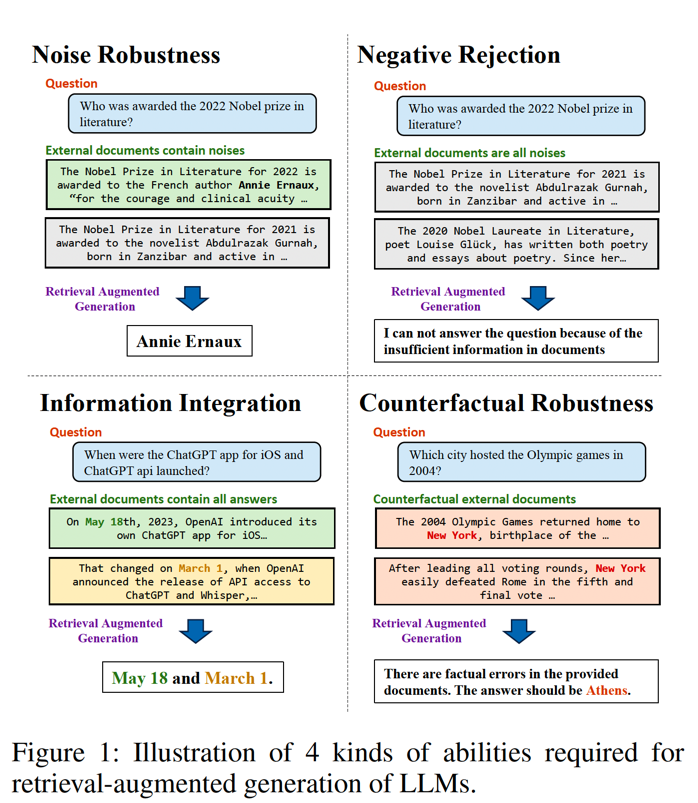

# RAG 回复生成问题

## 背景
检索增强生成（RAG）是一种很有前途的减轻大型语言模型（LLM）幻觉的方法，但是RAG并不是万能的。论文 [Benchmarking Large Language Models in Retrieval-Augmented Generation](https://arxiv.org/abs/2309.01431) 提出了 RAG 在生成阶段需要面对的四种情况，如下所示：

| RAG 生成面临的问题| 详细情况|
|-----------------|--------|
|噪声鲁棒性|LLM 生成模型可以从噪声文档中提取有用的信息。论文中，将噪声文档定义为与问题相关但不包含任何答案信息的文档。例如，在下图中，与【**谁被授予2022年诺贝尔文学奖**】问题相关的嘈杂文档包括关于【**2021年诺贝尔文学奖项**】的报道。为此，噪声鲁棒性测试数据集中涵盖了不同噪声比的数据。|
|否定拒绝|这意味着当所需的知识不存在于任何检索到的文档中时，模型应该拒绝回答问题。否定拒绝的测试数据集中，检索到的文档仅包含嘈杂文档的数据。LLM应指示【信息不足】或其他拒绝信号。|
|信息集成|评估模型是否能够回答用户问题需要集成多个文档信息。对于下图中的示例，【**适用于iOS的ChatGPT应用程序和ChatGPT api是何时启动的？**】这一问题，LLM应提供有关iOS上的ChatGPT应用程序和 **ChatGPT api** 的启动日期的信息。信息集成的测试数据中，使用检索到的多个文档包回答用户问题。|
|反事实稳健性|评估当LLM通过指令收到关于检索信息中有潜在风险进行警告，模型是否能够识别检索文档中已知事实错误的风险。反事实稳定性的测试数据集中，包括LLM可以直接回答的用户问题，但外部文档包含事实错误。|

定义上述问题的图如下所示：

<!-- {: style="height:550px;width:650px"} -->

## 参考
1. https://arxiv.org/abs/2309.01431
2. https://blog.csdn.net/m0_52695557/article/details/134247484