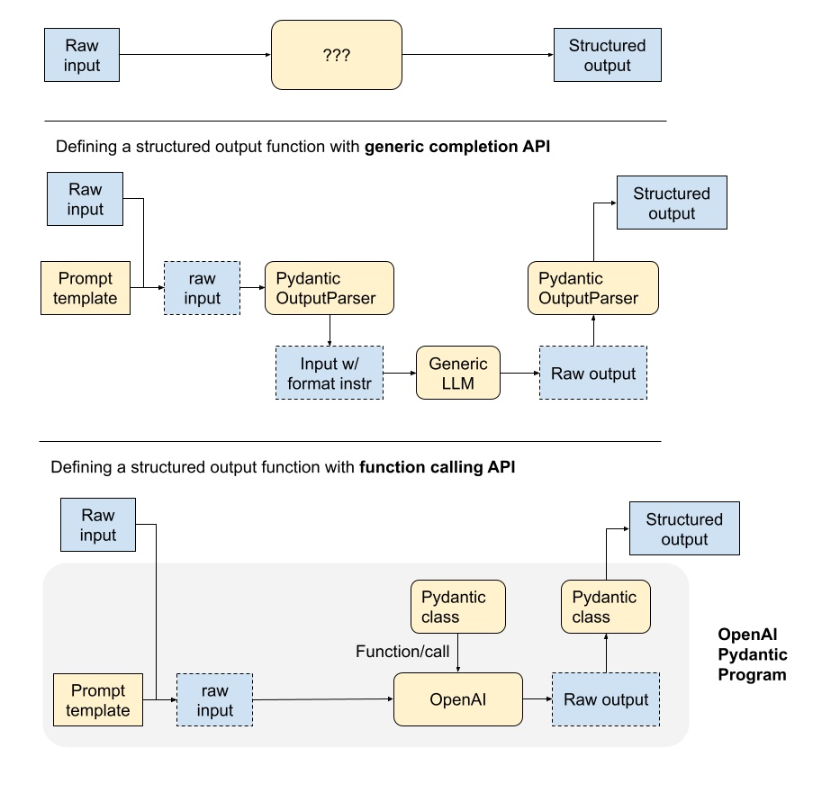

## 结构化输出

LLM 生成结构化输出的能力对于依赖可靠解析输出值的下游应用程序非常重要。LlamaIndex 本身也以以下方式依赖结构化输出。

* 文档检索：LlamaIndex 中的许多数据结构都依赖于具有特定架构的 LLM 调用来进行文档检索。例如，树索引要求 LLM 调用采用“ANSWER: (number)”格式。
* 响应合成：用户可能期望最终响应包含一定程度的结构（例如 JSON 输出、格式化的 SQL 查询等）
  
LlamaIndex 提供各种模块，使 LLM 能够以结构化格式生成输出。默认情况下，我们的 LLM 类提供结构化输出。我们还提供较低级别的模块：

* Pydantic 程序：这些是通用模块，将输入提示映射到结构化输出，由 Pydantic 对象表示。它们可以使用函数调用 API 或文本完成 API + 输出解析器。它们也可以与查询引擎集成。
* 预定义的 Pydantic 程序：我们有预定义的 Pydantic 程序，将输入映射到特定的输出类型（如数据框）。
* 输出解析器：这些模块在 LLM 文本完成端点之前和之后运行。它们不与 LLM 函数调用端点一起使用（因为它们包含开箱即用的结构化输出）。
请参阅以下部分以了解输出解析器和 Pydantic 程序的概述。

## 结构化输出函数的剖析

这里我们描述了 LLM 支持的结构化输出函数的不同组件。管道取决于您使用的是通用 LLM 文本完成 API还是LLM 函数调用 API。

使用通用完成 API，输入和输出由文本提示处理。输出解析器在 LLM 调用之前和之后发挥作用，确保输出结构化。在 LLM 调用之前，输出解析器可以将格式指令附加到提示。在 LLM 调用之后，输出解析器可以将输出解析为指定的指令。

使用函数调用 API，输出本质上是结构化的格式，输入可以采用所需对象的签名。结构化输出只需转换为正确的对象格式（例如 Pydantic）。

## 入门指南

结构化输出简单指南

## 其他资源

* Pydantic 程序
* 结构化输出 + 查询引擎
* 输出解析器