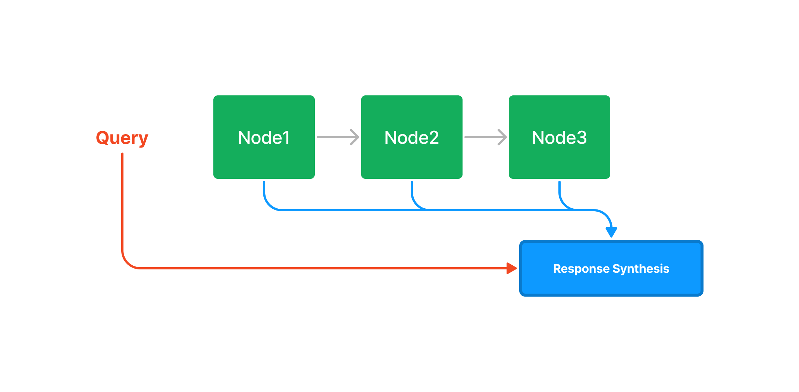
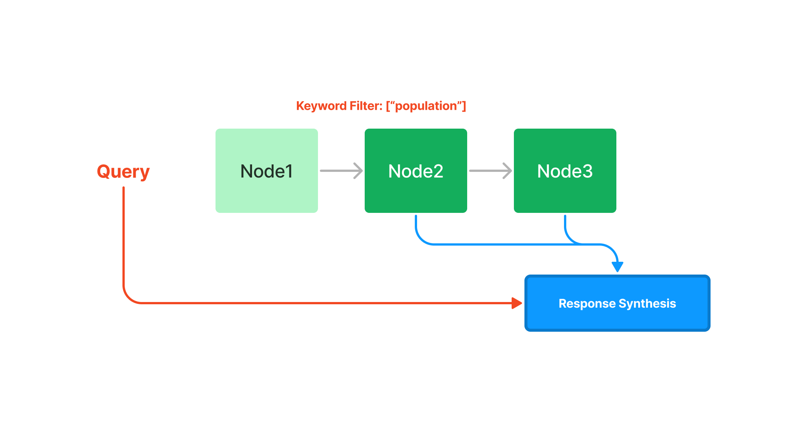
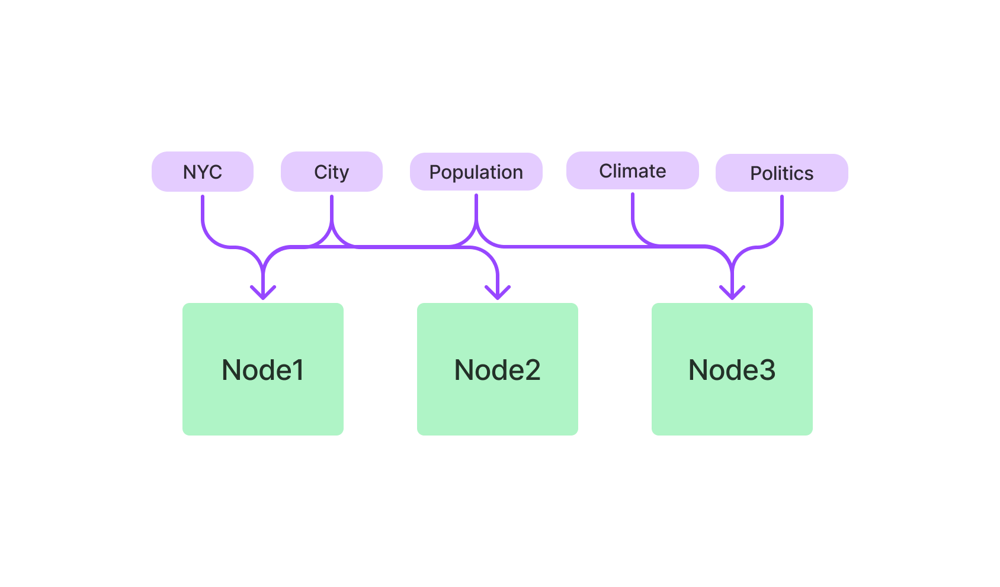

## 每个索引的工作原理

本指南通过图表描述了每个索引如何工作。

了解索引之前需要定义一些术语：

* `Node`：对应于 `Document` 中的一段文本。LlamaIndex 接收 `Document` 对象并在内部将其 【解析/分块】为 `Node` 对象。
* 响应合成：我们的模块根据检索到的节点合成响应。您可以看到如何指定不同的响应模式。
  
## 摘要索引（以前称为列表索引)

摘要索引只是将节点存储为顺序链。

### 查询

在查询期间，如果没有指定其他查询参数，LlamaIndex 只会将列表中的所有节点加载到我们的响应合成模块中。

摘要索引方式确实提供了多种查询检索到摘要索引的方法，从基于嵌入的查询（将获取前 k 个邻居）或添加关键字过滤器，如下所示：

## 向量存储索引

向量存储索引将每个节点和相应的嵌入存储在向量数据库中。

### 查询

查询一个向量数据库中的索引涉及检索前 k 个最相似的节点，并将它们传递到我们的响应合成模块中。

## 树索引

树索引从一组节点（成为该树中的叶节点）构建一个层次树。

### 查询

查询树形索引涉及从根节点向下遍历到叶节点。默认情况下，（child_branch_factor=1），查询在给定父节点的情况下选择一个子节点。如果child_branch_factor=2，查询每级选择两个子节点。

## 关键字表索引
关键字表索引从每个节点提取关键字，构建一个从关键字到该关键字对应节点之间的映射关系。

### 查询

在查询时，我们从查询中提取相关关键字，并将其与预先提取的节点关键字进行匹配以获取相应的节点。提取的节点被传递给我们的响应合成模块。

## 属性图索引

**属性图索引** 的工作原理是首先构建一个包含 **标记节点** 和 **关系** 的知识图谱。此图谱的构建高度可定制，范围上从让 LLM 提取其想要的任何内容，到使用严格模式提取，甚至实现我们自己的提取模块。

另外，还可以嵌入节点以便稍后检索。

您还可以跳过创建，并使用 Neo4j 等集成连接到现有知识图。

### 查询

查询属 **性图索引** 也非常灵活。检索通过使用多个子检索器并合并结果来实现。默认情况下，使用 【**关键字** + **同义词扩展**】以及 **向量检索**（如果您的图是嵌入的）来检索相关三元组。

除了检索到的三元组之外，我们还可以选择还包含源文本（对于在 LlamaIndex 之外创建的图表不可用）。

更多内容请参阅[属性图的完整指南](https://docs.llamaindex.ai/en/stable/module_guides/indexing/lpg_index_guide/)。