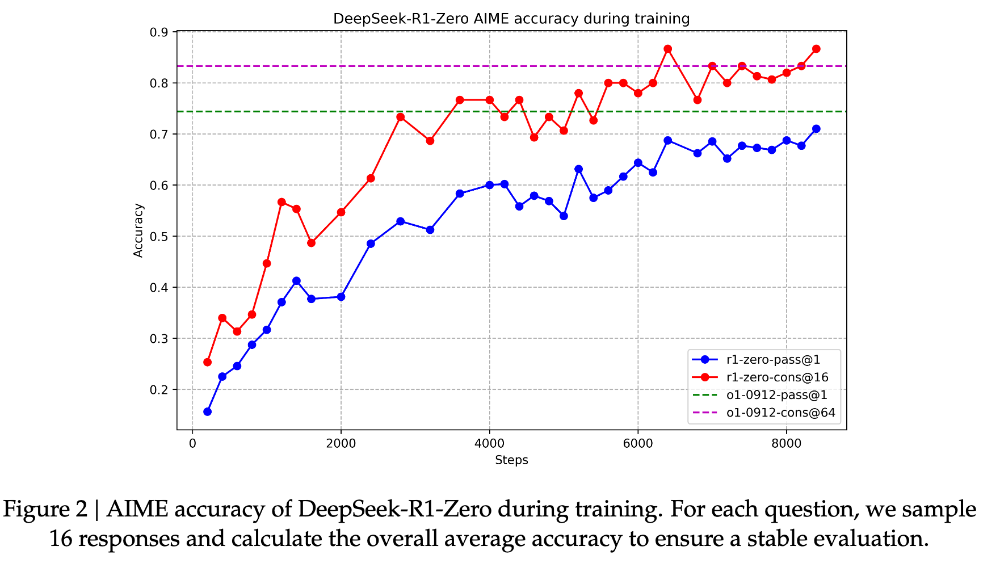
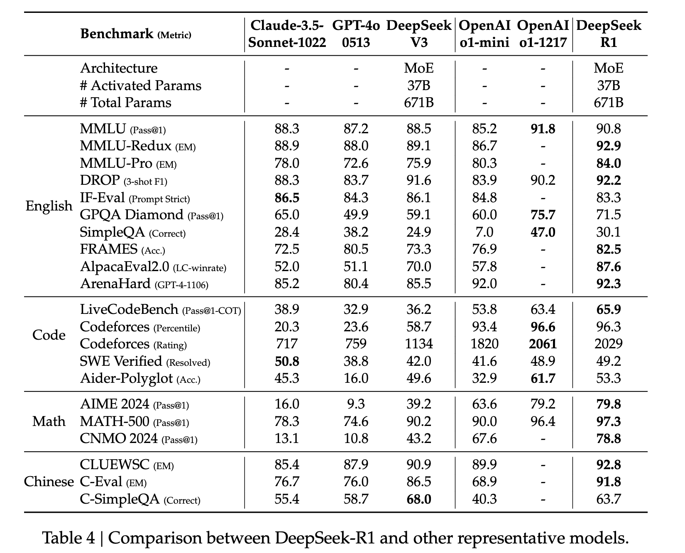
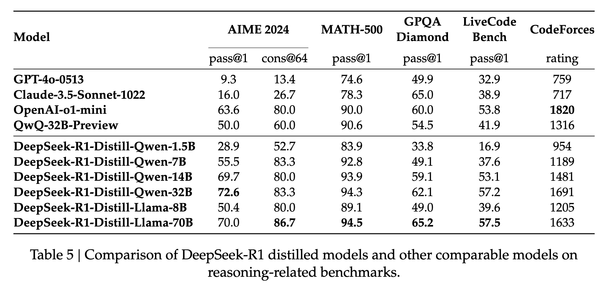

# DeepSeek-R1：通过强化学习激发LLM的推理能力

> DeepSeek AI
research@deepseek.com

## 摘要

我们介绍了我们的第一代推理模型 DeepSeek-R1-Zero 和 DeepSeek-R1。DeepSeek-R1-Zero是一个通过大规模强化学习（RL）训练的模型，没有经过初步的监督微调（SFT），表现出卓越的推理能力。通过RL，DeepSeek-R1-Zero自然地出现了许多强大而有趣的推理行为。然而，它遇到了可读性差和语言混合等挑战。为了解决这些问题并进一步提高推理性能，我们引入了DeepSeek-R1，它在RL之前结合了多阶段训练和冷启动数据。DeepSeek-R1在推理任务上的性能与OpenAI-o1-1217相当。为了支持研究社区，我们开源了DeepSeek-R1-Zero、DeepSeek-R1，以及基于Qwen和Llama从DeepSeek-R2中提取的六个密集模型（1.5B、7B、8B、14B、32B、70B）。
 
## 1 引言

近年来，大型语言模型（LLM）正在经历快速迭代和进化（Anthropic，2024；Google，2024，OpenAI，2024a），逐渐缩小了与通用人工智能（AGI）的差距。

最近，post-training 已成为全面训练流程的重要组成部分。它已被证明可以提高推理任务的准确性，与社会价值观保持一致，并适应用户偏好，同时与预训练相比需要相对较少的计算资源。在推理能力方面，OpenAI的o1（OpenAI，2024b）系列模型是第一个通过增加思维链推理过程的长度来引入推理时间缩放的模型。这种方法在各种推理任务中取得了重大改进，如数学、编码和科学推理。然而，有效测试时间缩放的挑战仍然是研究界的一个悬而未决的问题。之前的几项工作探索了各种方法，包括基于过程的奖励模型（Lightman等人，2023；Uesato等人，2022；Wang等人，2023）、强化学习（Kumar等人，2024）以及蒙特卡洛树搜索和波束搜索等搜索算法（Feng等人，2024.；Trinh等人，2024:Xin等人，2024].）。然而，这些方法都没有达到与OpenAI的o1系列模型相当的一般推理性能。

在这篇论文中，我们迈出了使用纯强化学习（RL）提高语言模型推理能力的第一步。我们的目标是探索LLM在没有任何监督数据的情况下发展推理能力的潜力，专注于通过纯粹的RL过程进行自我进化。具体来说，我们使用DeepSeek-V3-Base作为基础模型，并采用GRPO（Shao等人，2024）作为RL框架来提高推理中的模型性能。在训练过程中，DeepSeek-R1-Zero自然地出现了许多强大而有趣的推理行为。经过数千步强化学习，DeepSeek-R1-Zero在推理基准测试中表现出了卓越的性能。例如pass@1AIME 2024的得分从15.6%上升到71.0%，在多数投票的情况下，得分进一步提高到86.7%，与OpenAI-o1-0912的表现相匹配。

然而，DeepSeek-R1-Zero遇到了可读性差和语言混合等挑战。为了解决这些问题并进一步提高推理性能，我们引入了DeepSeek-R1，它结合了少量的冷启动数据和多阶段训练管道。具体来说，我们首先收集数千个冷启动数据，以微调DeepSeek-V3-Base模型。在此之后，我们执行面向推理的RL，如DeepSeek-R1-Zero。在RL过程接近收敛时，我们通过RL检查点上的拒绝采样创建新的SFT数据，并结合DeepSeek-V3在写作、事实QA和自我认知等领域的监督数据，然后重新训练DeepSeek-V3-Base模型。在对新数据进行微调后，检查点会经历一个额外的RL过程，同时考虑到所有场景的提示。经过这些步骤，我们获得了一个名为DeepSeek-R1的检查点，其性能与OpenAI-o1-1217相当。

我们进一步探索了从DeepSeek-R1到更小密度模型的蒸馏。使用Qwen2.5-32B（Qwen，2024b）作为基础模型，DeepSeek-R1的直接蒸馏优于在其上应用RL。这表明，较大基础模型发现的推理模式对于提高推理能力至关重要。我们开源了蒸馏的Qwen和Llama（Dubey等人，2024）系列。值得注意的是，我们提取的14B模型在很大程度上优于最先进的开源QwQ-32B预览版（Qwen，2024a），提取的32B和70B模型在密集模型的推理基准上创下了新纪录。
 
### 1.1 贡献

post-training：基于基础模型的大规模强化学习：

* 我们直接将RL应用于基础模型，而不依赖于监督微调（SFT）作为初步步骤。这种方法允许模型探索解决复杂问题的思维链（CoT），从而开发了DeepSeek-R1-Zero。DeepSeek-R1-Zero展示了自我验证、反射和生成长CoT等功能，标志着研究界的一个重要里程碑。值得注意的是，这是第一项公开研究，验证了LLM的推理能力可以完全通过RL来激励，而不需要SFT。这一突破为该领域的未来发展铺平了道路。
* 我们介绍了我们开发DeepSeek-R1的管道。该管道包含两个RL阶段，旨在发现改进的推理模式并与人类偏好保持一致，以及两个SFT阶段，作为模型推理和非推理能力的种子。我们相信，通过创建更好的模型，该管道将使行业受益。¬

蒸馏：较小的型号也可能很强大

* 我们证明，与通过RL在小模型上发现的推理模式相比，较大模型的推理模式可以被提炼成较小的模型，从而获得更好的性能。开源DeepSeek-R1及其API将有利于研究社区在未来提取更好的小型模型。
* 使用DeepSeek-R1生成的推理数据，我们对研究界广泛使用的几个密集模型进行了微调。评估结果表明，蒸馏出的较小密度模型在基准测试中表现出色。DeepSeek-R1-Distill-Qwen-7B在AIME 2024上取得了55.5%的成绩，超过了QwQ-32B预览版。此外¬，DeepSeek-R1-Distill-Qwen-32B在AIME 2024、MATH-500和LiveCodeBench上的得分分别为72.6%、94.3%和57.2%。这些结果明显优于之前的开源模型，与o1-mini相当。我们基于Qwen2.5和Llama3系列向社区开源了1.5B、7B、8B、14B、32B和70B检查点。

### 1.2 评估结果总结

* 推理任务：（1）DeepSeek-R1的得分为79.8%Pass@1在AIME 2024上，略微超过了OpenAI-o1-1217。在MATH-500上，它获得了令人印象深刻的97.3%的分数，与OpenAI-o1-1217相当，并且明显优于其他模型。（2） 在与编码相关的任务中，DeepSeek-R1在代码竞赛任务中表现出了专家级水平，因为它在Codeforce上获得了2029 Elo评级，超过了96.3%的人类参与者。对于与工程相关的任务，DeepSeek-R1的性能略优于DeepSeek-V3，这可以帮助开发人员完成现实世界的任务。
* 知识：在MMLU、MMLU Pro和GPQA Diamond等基准测试中，DeepSeek-R1取得了出色的成绩，明显优于DeepSeek-V3，MMLU得分为90.8%，MMLU Pro得分为84.0%，GPQA Diamonds得分为71.5%。尽管在这些基准测试中，DeepSeek-R1的性能略低于OpenAI-o1-1217，但它超越了其他闭源模型，展示了其在教育任务中的竞争优势。在事实基准SimpleQA上，DeepSeek-R1的表现优于DeepSeek-V3，展示了其处理基于事实的查询的能力。在这个基准测试中，OpenAI-o1超过了4o，也观察到了类似的趋势。
* 其他：DeepSeek-R1也擅长各种任务，包括创意写作、一般问答、编辑、总结等。它在AlpacaEval 2.0上实现了令人印象深刻的87.6%的长度控制胜率，在Are-naHard上实现了92.3%的胜率，展示了其智能处理非面向考试的查询的强大能力。此外，DeepSeek-R1在需要长上下文理解的任务上表现出色，在长上下文基准测试上大大优于DeepSeek-V3。

## 2 方法

### 2.1 概述

之前的工作在很大程度上依赖于大量的监督数据来提高模型性能。在这项研究中，我们证明了即使不使用监督微调（SFT）作为冷启动，通过大规模强化学习（RL）也可以显著提高推理能力。此外，通过包含少量冷启动数据，可以进一步提高性能。在以下部分中，我们将介绍：

* （1）DeepSeek-R1-Zero，它将RL直接应用于基础模型，而不需要任何SFT数据，以及
* （2） DeepSeek-R1，它从一个检查点开始应用RL，该检查点经过数千个长链思维（CoT）示例的微调。
* （3） 将DeepSeek-R1的推理能力提取到小型密集模型中。

### 2.2 DeepSeek-R1-Zero：基于基础模型的强化学习

强化学习在推理任务中表现出了显著的有效性，正如我们之前的工作所证明的那样（Shao等人，2024；Wang等人，2023）。然而，这些工作在很大程度上依赖于监督数据，而这些数据的收集需要耗费大量时间。在本节中，我们将探讨LLM在¬没有任何监督数据的情况下发展推理能力的潜力，重点关注它们通过纯强化学习过程的自我进化。我们首先简要概述了我们的RL算法，然后介绍了一些令人兴奋的结果，并希望这能为社区提供有价值的见解。

### 2.2.1 强化学习算法

为了节省RL的训练成本，我们采用了组相对策略优化（GRPO）（Shao等人，2024），它放弃了通常与策略模型大小相同的批评模型，而是根据组分数估计基线。具体来说，对于每个问题 $q$, 然后优化策略模型 $\pi_{\theta}$ 通过最大化以下目标：
$$
J_{GRPO}(\theta) = E[q \sim P(Q), \{o_{i}\}_{i}^{G} \sim \pi_{old}(O|q)]
$$
哪里 $\epsilon$ 和 $\beta$ 是超参数，以及 $A_{i}$ 是优势，使用与每个组内的输出相对应的一组奖励 $\{r_{1}, r_{2}, \cdots, r_{G}\}$ 计算得出：
 

### 2.2.2 奖励建模
奖励是训练信号的来源，它决定了RL的优化方向。为了训练DeepSeek-R1-Zero，我们采用了一种基于规则的奖励系统，主要由两种类型的奖励组成：

* 准确性奖励：准确性奖励模型评估响应是否正确。例如，在具有确定性结果的数学问题的情况下，模型需要以指定的格式（例如，在框内）提供最终答案，从而能够对正确性进行可靠的基于规则的验证。同样，对于LeetCode问题，可以使用编译器根据预定义的测试用例生成反馈。
* 格式奖励：除了准确性奖励模型外，我们还采用了一种格式奖励模型，该模型强制将其思维过程置于“<think>”和“</inthink>”标签之间。
我们在开发DeepSeek-R1-Zero时没有应用结果或过程神经奖励模型，因为我们发现神经奖励模型在大规模强化学习过程中可能会遭受奖励黑客攻击，而重新训练奖励模型需要额外的训练资源，这使整个训练管道变得复杂。

### 2.2.3 培训模板

为了训练DeepSeek-R1-Zero，我们首先设计了一个简单的模板，引导基础模型遵守我们指定的指令。如表1所示，该模板要求DeepSeek-R1-Zero首先生成推理过程，然后生成最终答案。我们有意将约束限制在这种结构格式上，避免任何特定于内容的偏见，例如强制进行反思性推理或推广特定的问题解决策略，以确保我们能够在强化学习过程中准确观察模型的自然进程。

### 2.2.4 DeepSeek-R1-Zero的性能、自演化过程和Aha时刻

图2展示了DeepSeek-R1-Zero在整个强化学习训练过程中在AIME 2024基准测试中的性能轨迹。如图所示，随着强化学习训练的推进，DeepSeek-R1-Zero的性能稳步提高。值得注意的是，平均pass@1AIME 2024的得分显著提高，从最初的15.6%跃升至令人印象深刻的71.0%，达到了与OpenAI-o1-0912相当的性能水平。这一显著改进突显了我们的RL算法在优化模型性能方面的有效性。
表2提供了DeepSeek-R1-Zero和OpenAI的o1-0912模型在各种推理相关基准测试中的比较分析。研究结果表明，RL能够增强
 

图2训练期间DeepSeek-R1-Zero的AIME精度。对于每个问题，我们抽取16个答案并计算总体平均准确率，以确保稳定的评估。

DeepSeek-R1-Zero无需任何监督微调数据即可获得强大的推理能力。这是一项值得注意的成就，因为它强调了该模型仅通过RL有效学习和推广的能力。此外，DeepSeek-R1-Zero的性能可以通过多数投票的应用进一步增强。例如，当在AIME基准测试中采用多数投票时，DeepSeek-R1-Zero的性能从71.0%上升到86.7%，从而超过了OpenAI-o1-0912的性能。DeepSeek-R1-Zero在有和没有多数投票的情况下都能实现如此有竞争力的性能，这突显了其强大的基础能力及其在推理任务方面进一步发展的潜力。

DeepSeek-R1-Zero的自进化过程是一个引人入胜的演示，展示了RL如何驱动模型自主提高其推理能力。通过直接从基础模型启动RL，我们可以密切监控模型的进展，而不受监督微调阶段的影响。这种方法清晰地展示了模型如何随时间演变，特别是在处理复杂推理任务的能力方面。
如图3所示，DeepSeek-R1-Zero的思考时间持续改善-

DeepSeek-R1-Zero通过利用扩展的测试时间计算，自然获得了解决日益复杂的推理任务的能力。这种计算范围从生成数百到数千个推理令牌，使模型能够更深入地探索和完善其思维过程。

这种自我进化最显著的方面之一是随着测试时间计算的增加，复杂行为的出现。反思（模型修改和重新评估其先前步骤）和探索解决问题的替代方法等行为是自发产生的。这些行为不是明确编程的，而是模型与强化学习环境交互的结果。这种自发开发显著增强了DeepSeek-R1-Zero的推理能力，使其能够以更高的效率和准确性处理更具挑战性的任务。

DeepSeek-R1-Zero训练过程中观察到的一个特别有趣的现象是“啊哈时刻”的发生。如表3所示，这一时刻发生在模型的中间版本中。在此阶段，DeepSeek-R1-Zero通过重新评估其初始方法，学会为问题分配更多的思考时间。这种行为不仅证明了模型不断增长的推理能力，也是强化学习如何产生意想不到的复杂结果的一个迷人例子。
这一时刻不仅是模型的“顿悟时刻”，也是研究人员观察其行为的时刻。它强调了强化学习的力量和美丽：我们不是明确地教授模型如何解决问题，而是简单地为其提供正确的激励，它自主地开发出先进的解决问题的策略。“顿悟时刻”有力地提醒我们，强化学习有潜力在人工系统中解锁新的智能水平，为未来更自主和自适应的模型铺平道路。
 
问题：如果𝑎 > 1, 	那么，以下问题的实解之和	𝑎 − √𝑎 + 𝑥 = 𝑥 等于响应：<think>
求解方程式√︁𝑎 − √𝑎 + 𝑥 = 𝑥, 让我们从两个平方开始·
𝑎 − √𝑎 + 𝑥 2 = 𝑥2 =→ 𝑎 − √𝑎 + 𝑥 = 𝑥2.
重新排列以隔离内部平方根项：
(𝑎 − 𝑥2)2 = 𝑎 + 𝑥 =→ 𝑎2 − 2𝑎𝑥2 + (𝑥2)2 = 𝑎 + 𝑥 =→ 𝑥4 − 2𝑎𝑥2 − 𝑥 + (𝑎2 − 𝑎) = 0
 
等等。等待。这是一个我可以在这里标记的顿悟时刻。
让我们一步一步地重新评估一下，以确定正确的总和是否可以。我们从以下方程式开始：
𝑎	√𝑎	𝑥 = 𝑥
首先，让我们把两边都弄平：
𝑎	√𝑎	𝑥 = 𝑥2 =	√𝑎	𝑥 = 𝑎	𝑥2
接下来，我可以再次对两边进行平方，处理方程式：
. . .
表3 DeepSeek-R1-Zero中间版本的一个有趣的“顿悟时刻”。该模型学会了使用拟人化的语气进行重新思考。这对我们来说也是一个顿悟的时刻，让我们见证了强化学习的力量和美丽。

尽管DeepSeek-R1-Zero展现出强大的推理能力，并能自主开发出出乎意料且强大的推理行为，但它仍面临几个问题。例如，DeepSeek-R1-Zero面临着可读性差和语言混合等挑战。为了使推理过程更具可读性并与开放社区共享，我们探索了DeepSeek-R1，这是一种利用RL和人类友好的冷启动数据的方法。

## 2.3 DeepSeek-R1：冷启动强化学习

受到DeepSeek-R1-Zero有希望的结果的启发，出现了两个自然的问题：1）通过引入少量高质量数据作为冷启动，可以进一步提高推理性能或加速收敛吗？2） 我们如何训练一个用户友好的模型，不仅产生清晰连贯的思维链（CoT），而且表现出强大的通用能力？为了解决这些问题，我们设计了一个训练DeepSeek-R1的管道。该管道由四个阶段组成，概述如下。

### 2.3.1 冷启动

与DeepSeek-R1-Zero不同，为了防止基础模型中RL训练的早期不稳定冷启动阶段，对于DeepSeek-R1，我们构建并收集了少量长CoT数据，以微调模型作为初始RL参与者。为了收集这些数据，我们探索了几种方法：以长CoT为例，使用少镜头提示，直接提示模型生成详细的答案并进行反射和验证，以可读格式收集DeepSeek-R1-Zero输出，并通过人工注释器的后处理来精化结果。
在这项工作中，我们收集了数千个冷启动数据，以微调DeepSeek-V3-Base作为RL的起点。与DeepSeek-R1-Zero相比，冷启动数据的优势在于包括：

* 可读性：DeepSeek-R1-Zero的一个关键限制是它的内容通常不适合阅读。回复可能会混合多种语言，或者缺乏向下标记格式来为用户突出显示答案。相比之下，在为DeepSeek-R1创建冷启动数据时，我们设计了一个可读的模式，在每个响应的末尾都包含摘要，并过滤掉对读者不友好的响应。在这里，我们将输出格式定义为 `|special_token|<reasoning_process>|special_token||
`，其中推理过程是查询的CoT，摘要用于总结推理结果。
* 潜力：通过使用人类先验仔细设计冷启动数据的模式，我们观察到DeepSeek-R1-Zero的性能更好。我们认为迭代训练是推理模型的更好方法。

### 2.3.2 面向推理的强化学习

在冷启动数据的基础上对DeepSeek-V3-Base进行微调后，我们应用了与DeepSeek-R1-Zero相同的大规模强化学习训练过程。这一阶段的重点是增强模型的推理能力，特别是在编码、数学、科学和逻辑推理等推理密集型任务中，这些任务涉及具有明确解决方案的明确问题。在训练过程中，我们观察到CoT经常表现出语言混合，特别是当RL提示涉及多种语言时。为了缓解语言混合的问题，我们在强化学习训练期间引入了语言一致性奖励，该奖励按目标语言单词在CoT中的比例计算。尽管消融实验表明这种对齐会导致模型性能的轻微下降，但这种奖励与人类偏好相一致，使其更具可读性。最后，我们将推理任务的准确性和语言一致性的奖励直接相加，形成最终的奖励。然后，我们对微调后的模型应用RL训练，直到它在推理任务上达到收敛。

### 2.3.3 拒收采样和监督微调

当面向推理的RL收敛时，我们利用得到的检查点为下一轮收集SFT（监督微调）数据。与主要侧重于推理的初始冷启动数据不同，这一阶段整合了来自其他领域的数据，以增强模型在写作、角色扮演和其他通用任务中的能力。具体来说，我们生成数据并对模型进行微调，如下所述。

推理数据我们通过从上述RL训练的检查点进行拒绝采样来策划推理提示并生成推理轨迹。在上一阶段，我们只包括可以使用基于规则的奖励进行评估的数据。然而，在这个阶段，我们通过合并额外的数据来扩展数据集，其中一些数据使用生成奖励模型，将基本事实和模型预测输入DeepSeek-V3进行判断。此外，由于模型输出有时混乱且难以阅读，我们用混合语言、长段落和代码块过滤掉了思想链。对于每个提示，我们对多个响应进行采样，只保留正确的响应。我们总共收集了大约60万个与推理相关的训练样本。
非推理数据对于非推理数据，如写作、事实QA、自我认知和翻译，我们采用DeepSeek-V3管道并重用DeepSeek-V3SFT数据集的部分。对于某些非推理任务，我们调用DeepSeek-V3在通过提示回答问题之前生成潜在的思维链。然而，对于更简单的查询，例如“你好”，我们不提供CoT作为响应。最后，我们总共收集了大约20万个与推理无关的训练样本。
我们使用上述约80万个样本的精选数据集对DeepSeek-V3-Base进行了两个时代的微调。

### 2.3.4. 针对所有场景的强化学习

为了进一步使模型与人类偏好保持一致，我们实施了一个二次强化学习阶段，旨在提高模型的有用性和无害性，同时完善¬其推理能力。具体来说，我们使用奖励信号和不同提示分布的组合来训练模型。对于推理数据，我们遵循DeepSeek-R1-Zero中概述的方法，该方法利用基于规则的奖励来指导数学、代码和逻辑推理领域的学习过程。对于一般数据，我们采用奖励模型来捕捉复杂和微妙场景中的人类偏好。我们以DeepSeek-V3管道为基础，采用类似的偏好对和训练提示分布。为了提供帮助，我们只关注最终总结，确保评估强调响应对用户的实用性和相关性，同时尽量减少对底层推理过程的干扰。为了无害化，我们评估了模型的整个响应，包括推理过程和总结，以识别和减轻生成过程中可能出现的任何潜在风险、偏见或有害内容。最终，奖励信号和不同数据分布的整合使我们能够训练一个在推理方面表现出色的模型，同时优先考虑有用性和无害性。¬

## 2.4. 蒸馏：赋予小模型推理能力

为了为更高效的小型模型配备DeepSeek-R1等推理功能，我们直接对Qwen（Qwen，2024b）和Llama等开源模型进行了微调（AI@Meta，2024）使用DeepSeek-R1策划的80万个样本，详见§2.3.3。我们的研究结果表明，这种直接的蒸馏方法显著提高了较小模型的推理能力。我们在这里使用的基本模型是Qwen2.5-Math-1.5B、Qwen2.5-Math-7B、Qwen-2.5-14B、Qwon2.5-32B、Llama-3.1-8B和Llama-3.3-70B-Instruct。我们选择Llama-3.3是因为它的推理能力略优于Llama-3.1。
对于蒸馏模型，我们只应用SFT，不包括RL阶段，尽管加入RL可以大大提高模型性能。我们的主要目标是证明蒸馏技术的有效性，将RL阶段的探索留给更广泛的研究界。

## 3 实验

**基准** 我们评估了MMLU（Hendrycks等人，2020）、MMLU Redux（Gema等人，2024）、MMLU-Pro（Wang等人，2024）、C-Eval（Huang等人，2023）和CMMLU（Li等人，2023年）、IFEval（Zhou等人，2023，2023）、FRAMES（Krishna等，2024年）、GPQA-Diamond（Rein等人，2023）、SimpleQA（OpenAI，2024c）、C-SimpleQA（He等人，2024c）、SWE Bench Verified（OpenAI）的模型，
 
2024d）、助手1、LiveCodeBench（Jain等人，2024）（2024-08–2025-01）、Codeforce 2、中国全国高中数学奥林匹克竞赛（CNMO 2024）3和美国邀请数学考试2024（AIME 2024）。除了标准基准测试外，我们还使用LLM作为评判标准，在开放式生成任务上评估我们的模型。具体来说，我们坚持AlpacaEval 2.0（Dubois等人，2024）和Arena Hard（Li等人，2024）的原始配置，它们利用GPT-4-Turbo-1106作为成对比较的判断标准。在这里，我们只将最终摘要提供给评估，以避免长度偏差。对于蒸馏模型，我们报告了AIME 2024、MATH-500、GPQA Diamond、Codeforce和LiveCodeBench的代表性结果。

**评估提示** 在DeepSeek-V3中设置之后，使用simple-evals框架中的提示评估MMLU、DROP、GPQA Diamond和SimpleQA等标准基准。对于MMLU-Redux，我们在零样本设置中采用零值提示格式（Lin，2024）。在MMLU-Pro、C-Eval和CLUE-WSC方面，由于最初的提示很少，我们将提示略微修改为零样本设置。几次射击中的CoT可能会损害DeepSeek-R1的性能。其他数据集遵循其原始评估协议，并由其创建者提供默认提示。对于代码和数学基准测试，HumanEval-Mul数据集涵盖了八种主流编程语言（Python、Java、C++、C#、JavaScript、TypeScript、PHP和Bash）。LiveCodeBench上的模型性能使用CoT格式进行评估，数据收集于2024年8月至2025年1月之间。Codeforces数据集使用10个Div.2竞赛的问题以及专家精心设计的测试用例进行评估，然后计算预期的评分和竞争对手的百分比。SWE Bench的验证结果是通过无代理框架获得的（Xia等人，2024）。与AIDER相关的基准使用“差异”格式进行衡量。DeepSeek-R1的输出上限为每个基准的32768个令牌。

**基线** 我们根据几个强大的基线进行全面评估，包括DeepSeek-V3、Claude-Connect-3.5-1022、GPT-4o-0513、OpenAI-o1-mini和OpenAI-o1-1217。由于访问OpenAI-o1-1217 API在中国大陆具有挑战性，我们根据官方报告报告其性能。对于蒸馏模型，我们还比较了开源模型QwQ-32B预览版（Qwen，2024a）。¬

**评估** 设置我们将模型的最大生成长度设置为32768个令牌。我们发现，使用贪婪解码来评估长输出推理模型会导致更高的重复率和不同检查点之间的显著差异。因此，我们默认通过@𝑘 评估（Chen等人，2021）和报告pass@1使用非零温度。具体来说，我们使用0.6的采样温度和顶部-𝑝 生成值为0.95𝑘 每个问题的答案（通常在4到64之间，具体取决于测试集的大小）。Pass@1然后计算为
$$
pass@1 = \frac{1}{k} \sum_{i=1}^{k} p_i
$$
哪里 $p_{i}$ 表示以下内容的正确性𝑖-的回应。这种方法提供了更可靠的性能估计。对于AIME 2024，我们还使用64个样本报告了共识（多数票）结果（Wang等人，2022），表示为cons@64.
 
### 3.1 DeepSeek-R1评估

对于MMLU、MMLU Pro和GPQA Diamond等面向教育的知识基准测试，DeepSeek-R1的性能优于DeepSeek-V3。这一改进主要归因于STEM相关问题的准确性提高，通过大规模强化学习取得了显著成果。此外，DeepSeek-R1在FRAMES方面表现出色，FRAMES是一项依赖于上下文的长期QA任务，展示了其强大的文档分析能力。这突显了推理模型在人工智能驱动的搜索和数据分析任务中的潜力。在事实基准SimpleQA上，DeepSeek-R1的表现优于DeepSeek-V3，展示了其处理基于事实的查询的能力。在OpenAI-o1超过GPT-4o的情况下，也观察到了类似的趋势。然而，在中国SimpleQA基准测试中，DeepSeek-R1的表现不如DeepSeek-V3，主要是因为它倾向于在安全RL后拒绝回答某些查询。如果没有安全RL，DeepSeek-R1的准确率可以达到70%以上。¬¬
DeepSeek-R1在IF Eval上也取得了令人印象深刻的结果，IF Eval是一个旨在评估模型遵循格式说明能力的基准。这些改进可能与在监督微调（SFT）和强化学习训练的最后阶段纳入指令跟踪数据有关。此外，在AlpacaEval2.0和ArenaHard上观察到了显著的性能，表明了DeepSeek-R1在编写任务和开放域问答方面的优势。它在DeepSeek-V3上的显著表现突显了大规模RL的泛化优势，这不仅提高了推理能力，还提高了跨不同领域的性能。此外，DeepSeek-R1生成的摘要长度简洁明了，ArenaHard上平均有689个令牌，AlpacaEval 2.0上平均有2218个字符。这表明
 
DeepSeek-R1避免了在基于GPT的评估过程中引入长度偏差，进一步巩固了其在多个任务中的稳健性。
在数学任务方面，DeepSeek-R1的性能与OpenAI-o1-1217相当，远远超过了其他模型。在编码算法任务上也观察到了类似的趋势，例如LiveCodeBench和Codeforce，其中以推理为中心的模型主导了这些基准测试。在面向工程的编码任务中，OpenAI-o1-1217在Aider上的表现优于DeepSeek-R1，但在SWE Verified上的表现相当。我们相信DeepSeek-R1的工程性能将在下一个版本中得到改善，因为目前相关的RL训练数据量仍然非常有限。

 
### 3.2 蒸馏模型评估

如表5所示，简单地提取DeepSeek-R1的输出，可以使高效的DeepSeek-R1-7B（即DeepSeek-R2-Distill-Qwen-7B，下同）全面超越GPT-4o-0513等非推理模型。DeepSeek-R1-14B在所有评估指标上都超过了QwQ-32B预览版，而DeepSeek-R-132B和DeepSeek-R1-70B在大多数基准测试中都明显超过了o1-mini。这些结果表明了蒸馏的巨大潜力。此外，我们发现将RL应用于这些蒸馏模型会产生显著的进一步收益。我们认为这值得进一步探索，因此这里只介绍简单的SFT提取模型的结果。¬

## 4 讨论

### 4.1 蒸馏与强化学习

在第3.2节中，我们可以看到，通过提取DeepSeek-R1，小模型可以获得令人印象深刻的结果。然而，仍然存在一个问题：该模型能否在不进行蒸馏的情况下，通过本文讨论的大规模RL训练实现可比的性能？
为了回答这个问题，我们使用数学、代码和STEM数据在Qwen-32B-Base上进行了大规模的RL训练，训练了超过10K步，得到了DeepSeek-R1-Zero-Qwen-32B。表6所示的实验结果表明，在大规模使用32B基础模型后
 

RL训练，达到与QwQ-32B预览相当的性能。然而，从DeepSeek-R1中提取的DeepSeek-R1-Distill-Qwen-32B在所有基准测试中的表现明显优于DeepSeek-R2-Zero-Qwen-34B。
因此，我们可以得出两个结论：第一，将更强大的模型蒸馏成更小的模型会产生很好的结果，而依赖于本文提到的大规模RL的较小模型需要巨大的计算能力，甚至可能无法达到蒸馏的性能。其次，尽管蒸馏策略既经济又有效，但要超越智能的界限，可能仍需要更强大的基础模型和更大规模的强化学习。

### 4.2 失败的尝试

在开发DeepSeek-R1的早期阶段，我们也遇到了失败和挫折。我们在这里分享我们的失败经验以提供见解，但这并不意味着这些方法无法开发有效的推理模型。

过程奖励模型（PRM）PRM是一种合理的方法，可以引导模型朝着更好的方法解决推理任务（Lightman等人，2023；Uesato等人，2022；Wang等人，2023）。然而，在实践中，PRM有三个主要局限性，可能会阻碍其最终的成功。首先，在一般推理中明确定义细粒度步骤具有挑战性。其次，确定当前中间步骤是否正确是一项具有挑战性的任务。使用模型的自动注释可能不会产生令人满意的结果，而手动注释不利于扩大规模。第三，一旦引入基于模型的PRM，它不可避免地会导致奖励黑客攻击（Gao等人，2022），重新训练奖励模型需要额外的训练资源，并使整个训练管道复杂化。总之，尽管PRM在重新排序模型生成的前N个响应或辅助引导搜索方面表现良好（Snell等人，2024），但与我们实验中大规模强化学习过程中引入的额外计算开销相比，它的优势是有限的。

受AlphaGo（Silver等人，2017b）和AlphaZero（Silver¬等，2017a）的启发，我们探索了使用蒙特卡洛树搜索（MCTS）来增强测试时间计算的可扩展性。这种方法涉及将答案分解为更小的部分，使模型能够系统地探索解决方案空间。为了促进这一点，我们提示模型生成多个标签，这些标签对应于搜索所需的特定推理步骤。对于训练，我们首先使用收集到的提示，在预训练值模型的指导下，通过MCTS找到答案。随后，我们使用得到的问答对来训练参与者模型和价值模型，迭代地改进过程。
然而，这种方法在扩大培训规模时遇到了几个挑战。首先，与国际象棋不同，国际象棋的搜索空间相对定义良好，令牌生成提供了一种
搜索空间呈指数级增长。为了解决这个问题，我们为每个节点设置了一个最大扩展限制，但这可能会导致模型陷入局部最优。其次，价值模型直接影响生成的质量，因为它指导了搜索过程的每一步。训练细粒度的价值模型本质上很困难，这使得模型迭代改进具有挑战性。虽然AlphaGo的核心成功依赖于训练一个价值模型来逐步提高其性能，但由于令牌生成的复杂性，这一原则在我们的设置中很难复制。
总之，虽然MCTS在与预训练的值模型配对时可以提高推理过程中的性能，但通过自搜索迭代提高模型性能仍然是一个重大挑战。

## 5 结论、局限性和未来工作

在这项工作中，我们分享了通过强化学习提高模型推理能力的过程。DeepSeek-R1-Zero代表了一种纯粹的强化学习方法，不依赖于冷启动数据，在各种任务中实现了强大的性能。DeepSeek-R1更强大，利用冷启动数据和迭代RL微调。最终，DeepSeek-R1在一系列任务上实现了与OpenAI-o1-1217相当的性能。
我们进一步探索了将推理能力蒸馏为小型密集模型的方法。我们使用DeepSeek-R1作为教师模型来生成800K的训练样本，并对几个小的密集模型进行微调。结果很有希望：DeepSeek-R1-Distill-Qwen-1.5B在数学基准测试中的表现优于GPT-4o和Claude-3.5-Sonnet，AIME为28.9%，math为83.9%。其他密集模型也取得了令人印象深刻的结果，明显优于基于相同底层检查点的其他指令调优模型。
未来，我们计划投资于DeepSeek-R1的以下方向的研究。
* 一般能力：目前，DeepSeek-R1在函数调用、多回合、复杂角色扮演和JSON输出等任务上的能力还不如DeepSeek-V3。展望未来，我们计划探索在多长时间内可以利用CoT来增强这些领域的任务。
* 语言混合：DeepSeek-R1目前针对中文和英文进行了优化
在处理其他语言的查询时，可能会导致语言混合问题。例如，DeepSeek-R1可能会使用英语进行推理和响应，即使查询语言不是英语或中文。我们的目标是在未来的更新中解决这一限制。
* 提示工程：在评估DeepSeek-R1时，我们观察到它很敏感
提示。很少有射门提示会持续降低其表现。因此，我们建议用户直接描述问题，并使用零样本设置指定输出格式以获得最佳结果。
* 软件工程任务：由于评估时间长，影响效率-
由于RL过程的科学性，大规模RL尚未在软件工程任务中得到广泛应用。因此，DeepSeek-R1在软件工程基准测试中并没有表现出比DeepSeek-V3的巨大改进。未来的版本将通过在软件工程数据上实施拒绝采样或在RL过程中引入异步评估来解决这一问题，以提高效率。
 
## 参考文献

* AI@Meta. Llama 3.1 model card, 2024. URL https://github.com/meta-llama/llama-m odels/blob/main/models/llama3_1/MODEL_CARD.md.
* Anthropic. Claude 3.5 sonnet, 2024. URL https://www.anthropic.com/news/claude-3 -5-sonnet.
* M. Chen, J. Tworek, H. Jun, Q. Yuan, H. P. de Oliveira Pinto, J. Kaplan, H. Edwards, Y. Burda, N. Joseph, G. Brockman, A. Ray, R. Puri, G. Krueger, M. Petrov, H. Khlaaf, G. Sastry, P. Mishkin, B. Chan, S. Gray, N. Ryder, M. Pavlov, A. Power, L. Kaiser, M. Bavarian, C. Winter, P. Tillet, F. P. Such, D. Cummings, M. Plappert, F. Chantzis, E. Barnes, A. Herbert-Voss, W. H. Guss, A. Nichol, A. Paino, N. Tezak, J. Tang, I. Babuschkin, S. Balaji, S. Jain, W. Saunders, C. Hesse, A. N. Carr, J. Leike, J. Achiam, V. Misra, E. Morikawa, A. Radford, M. Knight, M. Brundage, M. Murati, K. Mayer, P. Welinder, B. McGrew, D. Amodei, S. McCandlish, I. Sutskever, and W. Zaremba. Evaluating large language models trained on code. CoRR, abs/2107.03374, 2021. URL https://arxiv.org/abs/2107.03374.
W.扎伦巴。评估基于代码训练的大型语言模型。美国注册会计师协会，abs/2107.033742021。统一资源定位地址https://arxiv.org/abs/2107.03374.
A.杜贝、A.Jauhri、A.潘迪、A.卡迪安、A.达尔、A.莱特曼、A.马图尔、A.舍滕，
A.杨，A.范，等。骆驼3群模型。arXiv预印本arXiv:2407.217832024。
Y.Dubois、B.Galambosi、P.Liang和T.B.Hashimoto。长度控制羊驼评估：一种简单的方法来消除自动评估器的负担。arXiv预印本arXiv:2404044752024。
冯、万、温、麦卡勒、温、张、王。2024年，类似Alphazero的树搜索可以指导大型语言模型的解码和训练。URL https:
//arxiv.org/abs/2309.17179。
高、舒尔曼和希尔顿。2022年奖励模型过度优化的缩放定律。统一资源定位地址
https://arxiv.org/abs/2210.10760.
A.P.Gema、J.O.J.Leang、G.Hong、A.Devoto、A.C.M.Mancino、R.Saxena、X.He、Y.赵、X.Du、M.R.G.Madani、C.Barale、R.McHardy、J.Harris、J.Kaddour、E.van Krieken和
P.Minervini。我们结束mmlu了吗？美国注册会计师协会，abs/2406.041272024。统一资源定位地址https://doi.or克/10.48550/arXiv.2406.04127。
谷歌。我们的下一代型号：Gemini 1.52024。统一资源定位地址https://blog.google/technology/ai/google-geemini下一代模型-2024年2月。
何，李，刘，谭，王，黄，布，郭，胡，郑，等。¬汉语简易问答：大型语言模型的汉语真实性评价。arXiv预印本arXiv:2411.071402024。
D.Hendrycks、C.Burns、S.Basart、A.Zou、M.Mazeika、D.Song和J.Steinhardt。测量大量多任务语言理解能力。arXiv预印本arXiv:2009.03302020。
黄，白，朱，张，张，苏，刘，吕，张，雷，等.C-Eval:一个多层次、多学科的中国基础模型评价套件。arXiv预印本arXiv:2305.08322023。
简，韩，顾，李，阎，张，王，孙，森，斯托伊卡。Livecodebench：对代码的大型语言模型进行整体和无污染的评估。美国注册会计师协会，abs/2403.079742024。统一资源定位地址https://doi.org/10.48550/arXiv.2403.07974.
 
S.克里希纳、K.克里希纳、A.Mohananey、S.Schwarcz、A.Stambler、S.Upadhyay和M.Faruqui。事实、获取和原因：检索增强生成的统一评估。美国心脏病学会，abs/2409.129412024。doi:10.48550/ARXIV.2409.12941。统一资源定位地址https://doi.org/10.48550/arXiv.2409.12941。
A.Kumar，V.Zhuang，R.Agarwal，Y.Su，J.D.Co Reyes，A.Singh，K.Baumli，S.Iqbal，C.Bishop，R.Roelofs等人。通过强化学习训练语言模型进行自我纠正。arXiv预印本arXiv:2409.129172024。
H.Li、Y.Zhang、F.Koto、Y.Yang、H.赵、Y.Gong、N.Duan和T.Baldwin。CMMLU：测量¬中文中的大规模多任务语言理解能力。arXiv预印本arXiv:2306.09212023。
李、蒋、弗里克、邓拉普、吴、朱、冈萨雷斯和斯托伊卡。从众包数据到高质量基准测试：竞技场硬件和基准构建器管道。arXiv预印本arXiv:2406.19392024。
H.Lightman、V.Kosaraju、Y.Burda、H.Edwards、B.Baker、T.Lee、J.Leike、J.Schulman、I.Sutskever和K.Cobbe。让我们一步一步地验证。arXiv预印本arXiv:2305.20052023。
林：《ZeroEval：评估语言模型的统一框架》，2024年7月。统一资源定位地址
https://github.com/WildEval/ZeroEval.
最高可用性构架。美国数学邀请考试。在美国邀请数学考试-AIME 2024，2024年2月。统一资源定位地址https://maa.org/math
-竞赛/美国数学邀请赛。
OpenAI。你好，GPT-4o，2024a。统一资源定位地址https://openai.com/index/hello-gpt-4o/.
OpenAI。学会用llms推理，2024b。统一资源定位地址https://openai.com/index/learning-to-reason-with-llms/。
OpenAI。介绍SimpleQA，2024c。统一资源定位地址https://openai.com/index/introducing
-simpleqa/。
OpenAI。引入SWE试验台验证，我们将发布一个经过人类验证的SWE试验台子集，超过2024d。统一资源定位地址https://openai.com/index/introducing-swe-bench
-验证/。
Qwen。Qwq：深入思考未知的边界，2024a。统一资源定位地址https://qwenlm
.github.io/blog/qwq-32b预览/。
Qwen。Qwen2.5：一组基础模型，2024b。统一资源定位地址https://qwenlm.github.io/blog/qwen2.5。
D.赖因、B.L.侯、A.C.斯蒂克兰、J.佩蒂、R.Y.庞、J.狄拉尼、J.迈克尔和S.R.鲍曼。GPQA：一个研究生级别的谷歌证明问答基准。arXiv预印本arXiv:2311.12022023。
邵建国，王，朱，徐，宋，张，李，吴，郭。Deepseekmath：在开放语言模型中突破数学推理的极限。arXiv预印本arXiv:2402.033002024。
D.Silver、T.Hubert、J.Schrittwieser、I.Antonoglou、M.Lai、A.Guez、M.Lanctot、L.Sifre、D.Kumaran、T.Graepel、T.P.Lillicrap、K.Simonyan和D.Hassabis。使用一般强化学习算法通过自我游戏掌握国际象棋和将棋。美国注册会计师协会，abs/1712.01815，2017a。URL。
 
D.西尔弗、J.Schrittwieser、K.Simonyan、I.Antonoglou、A.黄、A.Guez、T.Hubert、L.Baker、M.Lai、A.Bolton、Y.Chen、T.P.Lillicrap、F.Hui、L.Sifre、G.van den Driessche、T.Graepel和
D.哈萨比斯。在没有人类知识的情况下掌握围棋。《自然》杂志，550（7676）：354–3592017b。doi:10.1038/NATURE24270。统一资源定位地址https://doi.org/10.1038/nature24270.
C.Snell、J.Lee、K.Xu和A.Kumar。2024年，最佳地缩放llm测试时间计算可能比缩放模型参数更有效。统一资源定位地址https://arxiv.org/abs/2408.033 14.
郑永庆、吴彦祖、黎、何、阮。在没有人类演示的情况下解决奥林匹克几何问题。《自然》，2024年。doi:10.1038/41586-023-06747-5。
J.Uesato、N.Kushman、R.Kumar、F.Song、N.Siegel、L.Wang、A.Creswell、G.Irving和I.Higgins。用基于过程和结果的反馈解决数学单词问题。arXiv预印本arXiv:2211.142752022。
王，李，邵，徐，戴，李，陈，吴，隋。Math shepherd：一个用于数学推理中llms的无标签逐步验证器。arXiv预印本arXiv:2312.089352023。
王、魏建国、舒尔曼、乐、迟、那良、周。自洽性改善了语言模型中的思维链推理。arXiv预印本arXiv:2203.111712022。
王，马，张，倪，钱德拉，郭，任，阿鲁拉杰，何，江，李，库，王，庄，范，岳，陈。Mmlu pro：一个更强大、更具挑战性的多任务语言理解基准。CoRR，abs/2406.015742024。URL。
夏，邓，邓，张。无代理：揭开基于llm的软件工程代理的神秘面纱。arXiv预印本，2024年。
辛，任，宋，邵，赵，王，刘，张，陆，杜，高，
朱、杨、苟、吴、罗、阮。Deepseek-prover-v1.5：利用证明辅助反馈进行强化学习和蒙特卡洛树搜索，2024年。统一资源定位地址https://arxiv.org/abs/2408.08152.
周，陆，米什拉，梵天，巴苏，栾，周，侯。大型语言模型评估后的说明。arXiv预印本arXiv:2311.0791112023。
 
附录
A.贡献与致谢

 
核心贡献者
大雅郭德健杨浩伟张俊晓宋若瑜张润新徐启浩朱世荣马培义王晓碧
小康张兴凯
于武
吴
郭志斌志宏邵卓书李自义高

撰稿人刘冰雪
王秉轩吴伯超
北峰成达陆成刚赵成启邓冲阮大麦戴
陈东杰季二航李芳云林富聪戴富丽罗光波郝官庭陈国伟
H.张汉伟徐洪辉丁华佐高慧渠
 
会李建忠郭家石李景昌陈景阳袁金浩图
李俊杰邱俊龙
蔡
倪建良金陈凯东胡*
你凯超高康关克新黄快宇王利恩
乐从张亮赵利通王立跃张磊徐
夏铭传张明华张明辉唐明旭周梦丽
苗君王明明李宁田潘潘黄鹏张前程王秦宇陈秋石杜
葛瑞琪*张瑞松潘润吉王
陈
金
如意陈尚浩陆尚炎周善煌陈胜峰叶世玉王水萍余顺峰周树亭潘
李
双周少青吴胜峰叶陶云
孙天宇
王望定曾文刘文峰梁文军高文琴*张文涛
W.L.肖伟安晓东刘
王晓涵陈晓涛聂心成
刘欣
刘兴超、杨新元、李学成、苏旭恒、林
李
陈晓文孙晓香王新楠宋信义周显祖王新霞山
李
王
 
魏
杨张艳红徐耀丽
姚赵姚峰孙耀辉王义瑜
张一凡史一良熊英何一石朴一松王一轩谭一扬马*刘永强郭元欧玉环王岳公玉恒邹玉佳何云帆熊玉祥罗玉祥尤萱刘玉洋周
朱
黄耀辉
易郑玉辰朱云贤马英唐玉坤扎玉婷颜
任
泽辉任章立沙哲傅徐振达谢
张哲文郝志成马志刚严志宇吴
顾梓辉
 
刘紫嘉朱紫军*李紫薇谢紫阳宋紫正潘
 
甄黄志鹏徐忠禹张甄张
 

在每个角色中，作者按名字的字母顺序排列。标有*的姓名表示已离开我们团队的个人。
