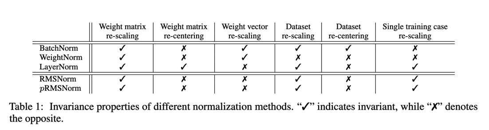

Root Mean Square Layer Normalization

## 摘要

层归一化（LayerNorm）因其能够处理输入和权重矩阵的重新中心化和重新缩放，已成功应用于各种深度神经网络中，有助于稳定训练和加速模型收敛。然而，LayerNorm引入的计算开销使得这些改进成本高昂，并显著减慢了底层网络的速度，尤其是循环神经网络（RNN）。在本文中，我们假设LayerNorm中的重新中心化不变性是可省略的，并提出了均方根层归一化（RMSNorm）。RMSNorm根据均方根（RMS）对一层中神经元的累加输入进行正则化，使模型具备重新缩放不变性和隐式学习率适应能力。RMSNorm在计算上更简洁，因此比LayerNorm更高效。我们还提出了部分均方根层归一化（pRMSNorm），其中RMS是根据累加输入的p%来估计的，同时不破坏上述特性。在多个任务上使用不同网络架构进行的广泛实验表明，RMSNorm的性能与LayerNorm相当，但在不同模型上减少了7%~64%的运行时间。源代码可在 https://github.com/bzhangGo/rmsnorm 获取。

## 1. 引言

如何高效地训练深度神经网络是一个长期存在的挑战。为了加速模型收敛，Ba等人[3]提出了层归一化（LayerNorm），它通过均值和方差统计量来正则化一层内神经元的动态，从而稳定深度神经网络的训练。由于其简洁性且不需要训练样本之间的依赖关系，LayerNorm已被广泛应用于不同的神经网络架构，并在计算机视觉[19, 26]、语音识别[37]到自然语言处理[31, 35]等各种任务上取得了显著成功。在某些情况下，LayerNorm被发现是成功训练模型的关键因素[6]。此外，由于摆脱了基于批次的样本限制，LayerNorm在处理使用循环神经网络（RNN）的可变长度序列时，相较于批归一化（BatchNorm）[12]具有优势。

不幸的是，引入层归一化（LayerNorm）会增加计算开销。尽管对于层数较少的小型浅层神经网络模型来说，这种开销可以忽略不计，但当底层网络变得更大更深时，这个问题就会变得严重。结果，虽然训练更快更稳定（就训练步数而言）带来了效率提升，但每步训练的计算成本增加，抵消了这一提升，导致净效率下降，如图1所示。LayerNorm的一大特性，即其重新中心化不变性，被广泛认为是其稳定训练的原因之一：当输入或权重矩阵发生一定量的噪声偏移时，经过LayerNorm的累加输入保持不变。我们认为，这种均值归一化并不会减少隐藏状态或模型梯度的方差，并假设它对LayerNorm的成功影响甚微。

在本文中，我们提出了均方根层归一化（RMSNorm），它仅使用均方根（RMS）统计量对一层中神经元的累加输入进行正则化。

RMSNorm相比LayerNorm减少了计算量并提高了效率。尽管其公式更简洁，但RMS归一化器有助于稳定层激活的幅度，确保对权重和数据集重新缩放的不变性。我们还展示了在累加输入的一个子集上估计均方根（RMS）的可能性，同时保持这种不变性。假设累加输入具有独立同分布的结构，我们提出了部分均方根层归一化（pRMSNorm），其中仅利用前p%的累加输入进行RMS估计。

我们在各种任务上对我们的模型进行了全面测试，包括机器翻译、图像分类、图像-标题检索和问答。实验结果表明，在不同模型中，RMSNorm的性能与LayerNorm相当，但在运行速度方面表现出优越性，提速7%~64%。当使用部分（6.25%）累加输入来估计均方根（RMS）时，部分均方根层归一化（pRMSNorm）的性能与RMSNorm相比具有竞争力。

## 3. 背景

本节我们将基于标准的前馈神经网络简要回顾层归一化（LayerNorm）。给定一个输入向量 $x \in R^{m}$，前馈神经网络通过线性变换后接非线性激活函数，将其映射为一个输出向量 $y \in R^{n}$，具体过程如下：

$$
a_{i} = \sum_{j = 1}^{m} w_{ij} x_{j}, y_{i} = f(a_{i} + b_{i})
$$

其中，$\mathbf{w}_{i}$ 是第 $i$ 个输出神经元的权重向量，$b_{i}$ 是通常初始化为0的偏置标量，$f(\cdot)$ 是逐元素的非线性函数。 $\mathbf{a} \in R^{n}$ 表示神经元的加权求和输入，这也是归一化的目标。

这种基础网络可能会受到内部协变量偏移问题[12]的影响，即当前层的输入分布会随着前一层的更新而发生变化。这可能会对参数梯度的稳定性产生负面影响，从而延缓模型的收敛。为了减少这种偏移，层归一化（LayerNorm）对加权求和输入进行归一化，以固定其均值和方差，具体方法如下：

$$ 
\bar{a_{i}} = \frac{a_{i} - \mu}{\sigma}, \hspace{2em} y_{i} = f(\bar{a_{i}} + b_{i})
$$

其中，̄$\bar{a_{i}}$ 是向量̄ $\mathbf{\bar{a}}$ 中的第 $i$ 个值，作为 $a_{i}$ 的归一化替代用于层激活。$\mathbf{g} \in R^{n}$ 是增益参数，用于对标准化后的加权求和输入进行重新缩放，初始值设为1。$\mu$ 和 $\sigma^{2}$ 分别是根据原始加权求和输入 $\mathbf{a}$ 估计的均值和方差统计量。

$$
\mu = \frac{1}{n} \sum_{i=1}^{n} a_{i} \hspace{2em}\sigma = \sqrt{\frac{1}{n} \sum_{i=1}^{n} (a_{i} - \mu)^{2}}
$$

因此，层归一化（LayerNorm）使神经元的范数与输入和权重矩阵解耦。

## 4. RMSNorm

层归一化（LayerNorm）之所以成功，一个广为人知的解释是其重新中心化和重新缩放的不变性。前者使模型对输入和权重上的偏移噪声不敏感，后者确保当输入和权重被随机缩放时，输出表示保持不变。在本文中，**我们假设重新缩放不变性是LayerNorm成功的关键，而非重新中心化不变性**。

我们提出了均方根层归一化（RMSNorm），它仅关注重新缩放不变性，并根据均方根（RMS）统计量对加权求和输入进行简单正则化：
$$
    \hat{a_i} = \frac{a_i}{RMS(\mathbf{a})} g_{i} \hspace{2em} 其中 \hspace{1em}\text{RMSNorm}(\mathbf{a}) = \frac{a}{\sqrt{\sum_{i=1}^{n} a_i^2 / n}}
$$

直观上，均方根层归一化（RMSNorm）通过完全移除方程（3）中的均值统计量来简化层归一化（LayerNorm），但代价是牺牲了均值归一化所提供的不变性。当加权求和输入的均值为零时，RMSNorm与LayerNorm完全相同。尽管RMSNorm不像LayerNorm那样对加权求和输入进行重新中心化，但我们通过实验证明，这一特性并不是LayerNorm成功的关键，而且RMSNorm的效果与之相当甚至更好。

均方根（RMS）衡量输入的二次均值，在RMSNorm中，它将加权求和输入强制到一个以 $\sqrt{n}$ 为尺度的单位球面上。这样做使得输出分布与输入和权重分布的缩放无关，有利于层激活的稳定性。尽管欧几里得范数与RMS仅相差一个 $\sqrt{n}$ 的因子，并且已被成功探索过[22]，但我们通过实验发现，它并不适用于层归一化。我们假设，用输入向量的大小来缩放球面很重要，因为这使得归一化在不同大小的向量之间更加稳健。据我们所知，之前还没有研究过将RMS用于神经网络归一化的想法。

### 4.1 方差分析

不变性衡量的是归一化后的模型输出是否随其输入和权重矩阵发生显著变化。Ba等人[3]表明，不同的归一化方法展现出不同的不变性特性，这对模型的鲁棒性有很大影响。在本节中，我们将从理论上探讨RMSNorm的不变性特性。我们考虑RMSNorm的以下一般形式：
$$
\mathbf{y} = f \left( \frac{\mathbf{Wx} }{RMS(\mathbf{a})} \odot \mathbf{g} + \mathbf{b} \right)
$$
其中，$\odot$ 表示逐元素乘法。我们的主要结果总结在表1中。由于均方根（RMS）具有以下线性性质：$RMS(\alpha \mathbf{x}) = \alpha RMS(\mathbf{x})$ （其中 $\alpha$ 为缩放值），因此RMSNorm对权重矩阵和输入缩放均具有不变性。

假设权重矩阵按因子 $\delta$ 缩放，即 $\mathbf{W^{\prime}} = \delta \mathbf{W}$ ，则这种变化不会影响最终层输出：
$$
y^{\prime} = f \left( \frac{\mathbf{W^{\prime}x}}{RMS(\mathbf{a^{\prime}})} \odot \mathbf{g} + \mathbf{b} \right) = f \left( \frac{\delta \mathbf{Wx} }{ \delta RMS(\mathbf{a})} \odot \mathbf{g} + \mathbf{b} \right) = y
$$

相比之下，如果仅对单个权重向量进行缩放，则该性质不再成立，因为不同的缩放因子会破坏RMS的线性性质。

同样地，如果我们对输入施加因子 $\delta$ 的缩放，即 $x^{\prime} = \delta$，通过类似于方程的分析，RMSNorm的输出保持不变。我们可以轻松地将这一等式扩展到基于批次的输入以及整个数据集。因此，RMSNorm对输入的缩放具有不变性。

与LayerNorm的主要区别在于，**RMSNorm不进行重新中心化**，因此对于变量平移不具有类似的线性性质。它并不是对所有重新中心化操作都具有不变性。

### 4.2 梯度分析

上述分析仅考虑了缩放输入和权重矩阵对层输出的影响。然而，在一般情况下，增强型RMSNorm神经网络是通过标准随机梯度下降法训练的，其中模型梯度的鲁棒性对于参数更新和模型收敛至关重要（也参见Santurkar等人[23]的观点，他们认为归一化方法的成功并非源于为层输入增加了稳定性，而是由于优化平面的平滑度得到了提升）。在本节中，我们将研究RMSNorm中模型梯度的特性。

给定损失函数 $\mathcal{L}$ ，我们通过式（4）进行反向传播，以获得关于参数 $\mathbf{g}$ 和 $\mathbf{b}$ 的梯度，如下所示：
$$
\frac{ \partial \mathcal{L}}{\partial \mathbf{b}} = \frac{ \partial \mathcal{L}}{\partial \mathbf{\mathbf{v}}}, \frac{ \partial \mathcal{L}}{\partial \mathbf{g}} = \frac{ \partial \mathcal{L}}{\partial \mathbf{v}} \odot \frac{\mathbf{Wx}}{RMS(\mathbf(a))}
$$
其中 $\mathbf{v}$ 是式（4）中 $f(\cdot)$ 部整个表达式的简写，而 $\frac{ \partial \mathcal{L}}{\partial \mathbf{\mathbf{v}}}$ 是从 $\mathcal{L}$ 反向传播到 $\mathbf{v}$ 的梯度。梯度 $\frac{ \partial \mathcal{L}}{\partial \mathbf{b}}$ 和 $\frac{ \partial \mathcal{L}}{\partial \mathbf{g}}$ 对于输入 $x$ 和权重矩阵 $\mathbf{W}$ 的缩放是不变的（在 $\frac{ \partial \mathcal{L}}{\partial \mathbf{g}}$ 的情况下，由于式（6）的线性属性）。此外，g的梯度与归一化后的输入和之和成正比，而不是与原始输入成正比。这增强了g的大小的稳定性。与这些向量参数不同，由于RMS中的二次计算，权重矩阵W的梯度更为复杂。形式上，

diag(·)表示输入的对角矩阵，⊗表示克罗内克积，“I”表示单位矩阵。为了清晰起见，我们明确使用“×”来表示矩阵乘法。矩阵项R将W的梯度与输入x和权重矩阵W相关联。通过彻底分析，我们可以证明此项与输入和权重矩阵的缩放均呈负相关。当给输入x（x' = δx）或权重矩阵（W' = δW）分配一个δ尺度时，我们有
R' = 1/(δ × RMS(a)) × (I - (δWx) × (δWx)T / (n × (δ2))) = R/δ。（10）
如果将缩放后的项R'代回式（9），我们可以轻松证明梯度∂L/∂W对于输入缩放是不变的，但与权重矩阵的缩放保持负相关。减少梯度∂L/∂W对输入缩放的敏感性可以确保其平滑性并提高学习的稳定性。另一方面，负相关充当隐式学习率适配器，并动态控制梯度的范数，从而避免大范数的权重矩阵并改善模型的收敛性。

