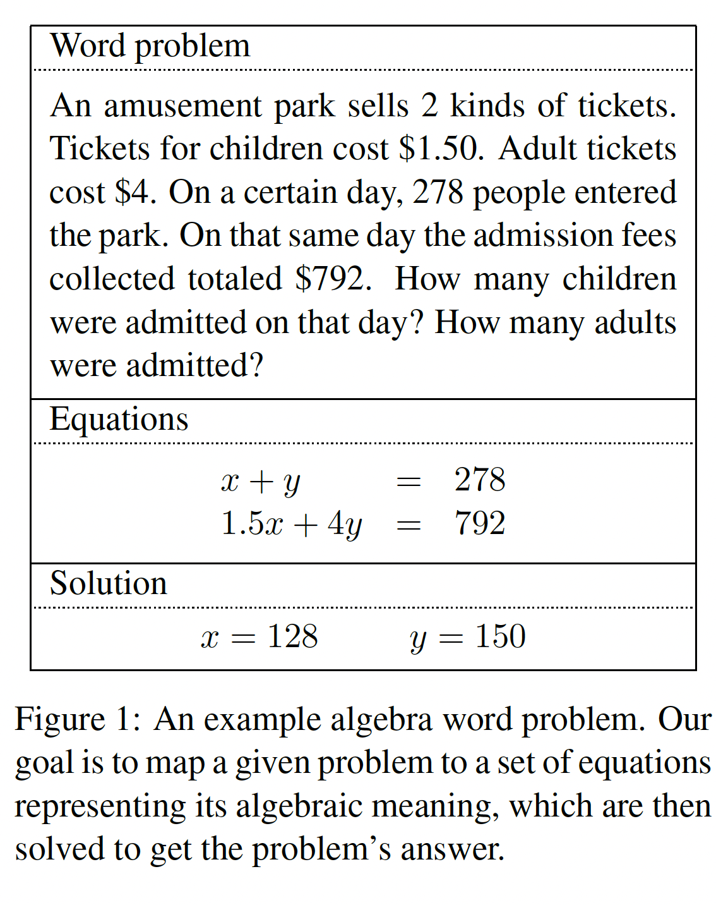
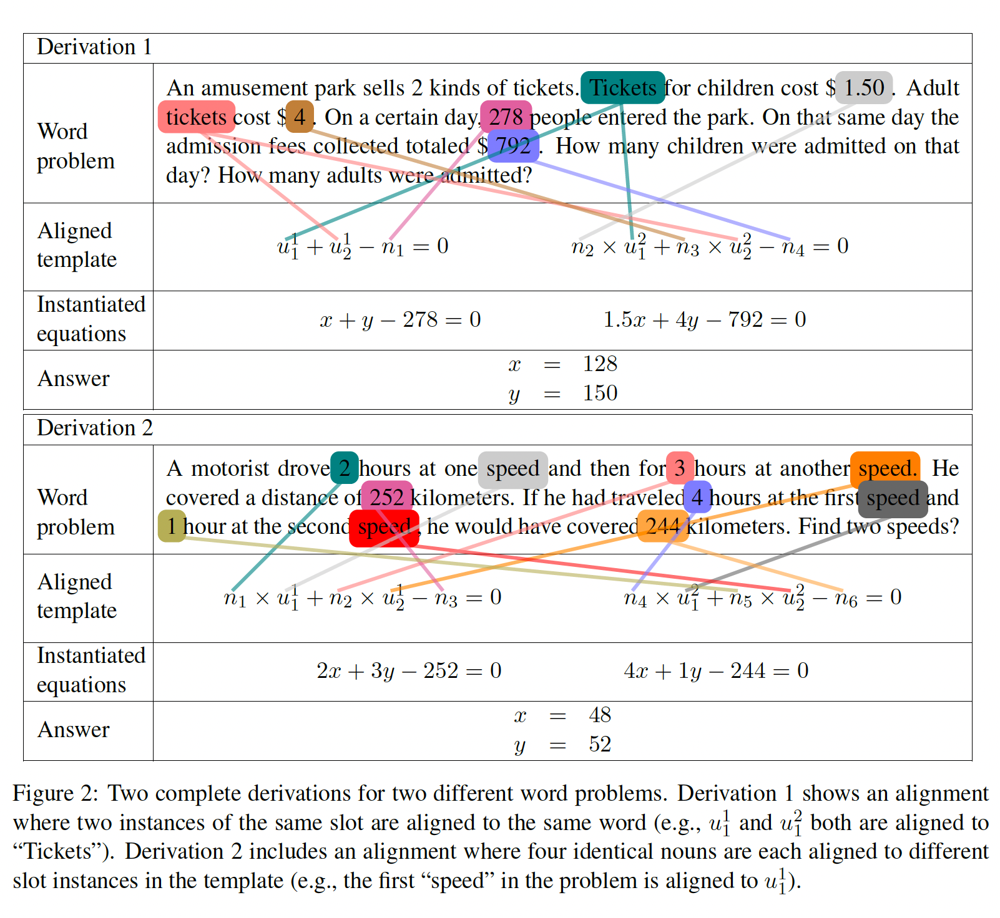

# Learning to Automatically Solve AlgebraWord Problems

## 摘要

我们提出了一种自动学习解决代数单词问题的方法。我们的算法跨越句子边界进行推理，以构建和求解线性方程组，同时恢复这些方程中的变量和数字与问题文本的对齐。学习算法使用不同的监督，包括完整的方程或只是最终的答案。我们评估了新收集的代数单词问题语料库的性能，证明该系统可以正确回答数据集中近70%的问题。据我们所知，这是这项任务的第一个学习结果。

## 1 介绍

代数单词问题简洁地描述了一个世界状态，并提出了关于它的问题。所描述的状态可以用一个方程组来建模，方程组的解指定了问题的答案。例如，图1显示了一个这样的问题。读者被要求根据门票价格和整体销售额的限制来推断有多少儿童和成人进入游乐园。本文研究了仅使用自然语言自动解决此类问题的学习任务。

解决这些问题需要跨越句子边界进行推理，以找到一个简洁地模拟所描述语义关系的方程组。例如，在图1中，第二个方程式中的总门票收入计算总结了第二、第三和第五个方程式中描述的门票价格和总销售额的事实句子。此外，第一个方程模拟了一种隐含的语义关系，即被接纳的儿童和成年人是进入公园的人群中不相交的子集。

我们的模型定义了整个方程组上的联合对数线性分布，以及这些方程与文本之间的对齐。**可能方程的空间由一组方程模板定义**，我们从训练示例中归纳出来，其中每个模板都有一组槽。**数字槽由文本中的数字填充**，未知槽与名词对齐。例如，图1中的系统是通过用四个特定数字 **（1.5、4、278和792）** 填充一个这样的模板并对齐两个名词 **（“儿童票”中的“票”和“成人票”中“票”）** 而生成的。这些推断的对应关系用于定义跨句特征，为模型提供全局线索。例如，在我们的运行示例中，字符串成对（“1.50美元”，“儿童”）和（“4美元”，”成人”）都围绕着“成本”一词，这表明一个输出方程包含两个常数变量乘积之和。

我们考虑在两个不同层次的监督下学习。在第一种情况下，我们假设可以访问大多数数据的每个问题的数值解（见图1），以及一小部分标有完整方程的种子示例。在学习过程中，求解者评估相互竞争的假设以推动学习过程。在第二种情况下，我们为每个问题提供了一个完整的方程组。在这两种情况下，可用的标记方程（种子集或全集）都被抽象出来，以提供模型的方程模板，而槽填充和对齐决策是潜在变量，其设置是通过直接优化边际数据对数似然性来估计的。

该方法在algebra.com上收集的514个代数单词问题和相关方程系统的新语料库上进行了评估。在训练过程中提供了完整的方程，我们的算法成功地解决了测试集中69%以上的单词问题。此外，我们发现该算法可以稳健地处理弱监督，当仅对答案进行训练时，可以达到上述性能的70%以上。

## 2 相关工作

我们的工作涉及三个主要研究领域：**情境语义解释**、**信息提取**和**自动单词问题求解器**。

* **情境语义解释在各种形式的监督下**: 有大量关于学习将自然语言映射到形式意义表征的研究。强化学习可用于学习在外部世界中阅读指令和执行动作（Branavan等人，2009；Branavan等，2010；Vogel和Jurafsky，2010）。其他方法依赖于对更昂贵的带注释逻辑形式的访问（Zelle和Mooney，1996；Thompson和穆尼，2003；Wong和Mooney；Zettlemoyer和Collins，2005；Kwiatkowski等人，2010）。这些技术最近被推广到从与受控应用程序的间接反馈配对的句子中学习。示例包括问答（Clarke等人，2010；Cai和Yates，2013a；Cai与Yates，2013.b；Berant等人，2013；Kwiatkowski等人，2013）、对话系统（Artzi和Zettlemoyer，2011）、机器人指令（Chen和Mooney，2011；Chen，2012；Kim和Mooney的，2012；Matuszek等人，¬¬¬¬2012；Artzi和Zettlemoyer的，2013）和程序执行（Kushman和Barzilay的，2013；Lei等，2013）。我们专注于从各种监督中学习，包括问答和方程系统，这两者都可以从注释者那里可靠地获得，无需语言训练，只需基本的数学知识。
几乎所有上述工作都是单独处理单句。考虑多个句子的技术通常以连续的方式进行，用有限的跨句推理依次处理每个句子（Branavan等人，2009；Zettlemoyer和Collins，2009；Chen和Mooney，2011；Artzi和Zettlemoye，2013）。我们专注于同时分析多个句子，这对于生成代数单词问题等领域中常见的全局语义表示是必要的。
* **信息提取**: 我们的方法与基于模板的信息提取工作有关，其目标是识别文本中事件模板的实例并提取其填充符。大多数工作都集中在监督情况下，其中模板是手动定义的，数据用对齐信息标记，例如（Grishman等人，2005；Maslennikov和Chua，2007；Ji和Grishman，2008；Reichart和Barzilay，2012）。然而，最近的一些工作研究了从数据中自动归纳出一组可能的模板（Chambers和Jurafsky，2011；Ritter等人，2012）。在我们的方法中，方程组相对容易指定，提供了一种模板结构，这些模板中的槽与文本的对齐主要是在学习过程中用潜在变量建模的。此外，映射到可以执行的语义表示允许我们在学习过程中利用较弱的监督。
* **自动单词问题解决器**: 最后，对自动解决各种类型的数学单词问题进行了研究。现有的主要方法是手工设计基于规则的系统来解决特定领域的数学问题（Mukherjee和Garain，2008；Lev等人，2004）。我们的重点是学习一个模型，用于解决仅给定与方程或答案配对的问题训练语料库的端到端任务。

## 3 将单词问题映射到方程式

我们定义了一个两步过程，将单词问题映射到方程。首先，选择一个模板来定义方程系统的整体结构。接下来，使用文本中的数字和名词实例化模板。在推理过程中，我们共同考虑这两个步骤。

图2显示了两个推导的两个步骤。模板规定了系统中方程的形式以及每个方程中的槽类型：$u$ 槽表示未知数，$n$ 槽表示必须从文本中填写的数字。在推导1中，所选模板有两个未知槽 $u1$ 和 $u2$，以及四个数字槽 $n1$ 到 $n4$。槽可以在方程之间共享，例如，示例中的未知槽 $u1$ 和 $u2$ 出现在两个方程中。一个插槽在问题中可能有不同的单词（单词“速度”的不同出现次数）。这允许在自然语言和系统模板之间进行更紧密的映射，其中与模板中的第一个方程对齐的单词来自前两句话，与第二个方程式对齐的单词来源于第三个句子。
我们每个槽位实例映射到问题中的每一个单词。每个数字槽 $n$ 与一个数字对齐，每个未知槽 $u$ 与一个名词对齐。例如，导数1将数字278与 $n1$ 、1.50与 $n2$、4与$n3$和792与$n4$对齐。它还将$u1$的两个实例（例如$u1$和$u2$）与“票”对齐，将$u2$的两个例子与“票“对齐。相比之下，在推导2中，相同未知槽的实例（例如$u1$和$u2$）被对齐为两个在自然语言和系统模板之间进行更紧密的映射，其中与模板中的第一个方程对齐的单词来自前两句话，与第二个方程式对齐的单词来源于第三个句子。
给定对齐方式，然后可以实例化模板：每个数字槽$n$都替换为示例中$u1$的位置。我们将每个槽实例与变量a中的一个单词对齐。然后自动求解该输出方程组以生成最终答案。

### 3.1 导数

* 定义：设X为所有单词问题的集合。一个单词问题 $x \in X$ 是k个单词的序列 $<w_1,\cdots, w_k>$。此外，将方程模板  $t$ 定义为公式 $A=B$，其中 $A$ 和 $B$ 是表达式。表达式 $A$ 是以下之一：
* 一个数字常数 $f$。
* 数字槽 $n$。
* 一个未知的插槽u。
* 数学关系式R的应用两个表达式（例如 $n_1 \times n_2$）。

我们将系统模板 $T$ 定义为一组l个方程模板 $\{t_0, \cdots, t_1\}$。$T$ 是一组游乐园出售两种门票。儿童票1.5美元。成人票4美元。某一天，278人进入公园。同一天，收取的入场费总计792美元。那天有多少孩子入院？有多少成年人被录取？

一个槽可以在系统模板中出现多次，以允许在不同的方程中重用变量。我们将插槽的特定实例 $i$（例如$u$）表示为 $u_i$。为了简洁起见，当一个插槽¬只出现一次时，我们省略了实例索引。为了捕捉x的文本和模板T之间的对应关系，我们将对齐p定义为一组对（w，s），其中w是x中的标记，s是T中的槽实例。

根据上述定义，可以从模板t构建方程e，其中每个数字槽n被替换为实数，每个未知槽¬u被替换为变量，每个数字常数f保持不变。我们称之为将模板转换为方程模板实例化的过程。类似地，方程系统E是一组l个方程{e0，…，EL}，可以通过在系统模板T中实例化每个方程模板来构造。最后，答案a是实数的元组。
我们将从单词问题到答案的导数y定义为元组 $T,p,a$，其中T是所选的系统模板，p是T和x之间的对齐，a是通过使用x到p实例化T并求解生成的方程而生成的答案。设Y为所有导数的集合。
* 可能推导的空间: 我们的目标是将每个单词问题x映射到一个方程组E.所考虑的方程组的空间由一组可能的系统模板T定义字（突出显示）可以与数字槽ni对齐。每个数字槽n∈T可以与文本中的任何数字对齐，数字词只能与单个槽n对齐，并且必须与该槽的所有实例对齐。此外，未知的槽实例u∈T只能与名词词对齐。一个完整的推导将T中的所有槽与x中的单词配对。

图3显示了图2中第一个问题和系统模板的可能对齐空间。名词（以黑体显示）可以与所选模板中的任何未知槽实例对齐（所选模板的u1、u2、u1和u2）。数字（突出显示）可以与任何数字槽（模板中的n1、n2、n3和n4）对齐。

### 3.2 概率模型
由于在选择系统¬模板和对齐时存在歧义，对于每个单词问题x∈x，都会有许多可能的导数y∈y。我们¬使用具有特征¬函数φ：x×y的对数线性模型来区分竞争分析→ Rd和参数向量θ∈Rd。给定问题x的导数y的概率定义为：
eθ·φ（x，y）
 
以及原始问题x中可用于填充槽的单词。在实践中，我们根据训练数据生成T，如第-¬
 
p（y|x；θ）=
 
Σ
y∈y
 
eθ·φ（x，y）
 
第4.1条。给定一个系统模板T∈T，我们在T和x之间创建一个对齐p。可能的对齐对的集合被约束如下-第6节定义了所使用的全套功能。
测试时的推理问题要求我们找到给定问题最可能的答案

x、 假设参数θ已知：
f（x）=arg最大值p（a|x；θ）
一
在	这里，答案的概率	 在模板选择和对齐方面被边缘化	了	：
 
p（a|x；θ）=	∑
y∈y
s.t.AN（y）=a
 
p（y|x；θ）	（1）
 
其中AN（y）从导数¬y中提取答案a。这样，导数¬y上的分布被建模为潜在变量。我们使用波束搜索推理程序来近似计算方程1，如第5节所述。

## 4 学习

为了学习我们的模型，我们需要在T中归纳系统模板的结构，并估计模型参数θ。

### 4.1 模板归纳

当提供对一组n个训练示例的访问时，可以生成系统模板T
{（xi，Ei）：i=1，…，n}，其中xi是一个词。我们通过最大化数据的条件对数似然来估计θ，并对所有有效导数进行边缘化：
 
Ei是一组方程。我们通过以下方式将¬每个E推广到系统模板T：（a）用未知槽替换每个变量，以及（b）¬用a替换文本中提到的每个数字
 
O=∑
我
 
Σ
y∈y
s.t.Vi（y）=1
 
对数p（y|neneneba xi；θ）
 
号码槽。问题文本中未提及的数字将作为常量保留在模板中。这使我们能够解决需要问题语义所隐含的数字的问题，而不是¬我们使用L-BFGS（Nocedal和Wright，2006）来优化参数。单个参数¬θj的梯度由下式给出：
 
而不是直接出现在文本中，如图4中的百分比问题。¬
 
∂O=∑
∂θj	i
 

Ep（y|neneneba xi，Vi（y）＝1；θ)
 
[φj
 
（xi，y）]−
 

2.
 
4.2 参数估计
对于参数估计，我们假设访问n个训练示例{（xi，Vi）：i＝1，…，n}，每个训练示例都包含单词问题xi和验证函数Vi。验证函数V:Y→ {0,1}如果导数y∈y正确，则将其映射为1，否则映射为0。
我们可以改变验证功能，从不同类型的监督中学习。在第8节中，我们将使用验证函数来检查导数¬y是否具有（1）正确的方程组¬E，或（2）正确的答案¬a。此外，在数据的不同子集上使用不同类型的验证函数可以实现半监督学习。这种方法与Artzi和Zettlemoyer
（2013）有关。

Ep（y|neneneba xi；θ）[φj（xi，y）]
第5节描述了我们如何使用波束搜索来近似梯度的两个项。
5 推论
计算方程1的归一化常数需要对所有模板和所有可能的实例化方法求和。这导致搜索空间中T（可用系统模板集）中最大模板的槽数呈指数增长。因此，我们使用波束搜索来近似计算。我们使用T中的所有模板初始化梁，并迭代地将梁中模板的槽与问题文本中的单词对齐。对于每个模板，下一个插槽¬
根据该模板的预定义规范化顺序选择要考虑的模板。每次迭代后，我们根据模型得分修剪光束，以保持¬前k个偏导数。在修剪梁时，我们最多允许对每个模板进行l次部分推导，以确保少数模板不会垄断梁。我们继续这个过程，直到梁中的所有模板都完全实例化。
在学习过程中，我们使用波束搜索近似计算梯度（方程2）中的第二项。根据可用的验证函数V（如第4.2节所定义），我们还可以精确地修剪梁，以计算梯度的前半部分。具体来说，当假设可以访问标记的方程时，我们可以限制搜索，只考虑可能完成以生成标记方程的部分假设。¬¬¬¬

6 型号详细信息

模板规范化有许多语法上不同但语义上等价的方法来表达给定的方程组。例如，短语“John比Bill大3岁”可以写成¬j=b+3或j-3=b。为了避免这种歧义，我们将模板规范化为标准形式表示。我们通过使用数学求解器Maxima（Maxima，2014）根据数字槽和常数获得未知槽的符号解来执行这种规范化。¬¬¬¬
插槽签名在s1+s2=s3这样的模板中，插槽s1与插槽s2不同，但我们希望它们共享许多用于-决定对齐的特征。为了便于实现这一点，我们¬为每个插槽和插槽对生成签名。槽的签名表示它出现的方程组、它所在的特定方程以及它所属的方程项。成对槽签名将两个槽的签名连接起来，并指示共享哪些术语。例如，这允许图2中推导1中的¬n2和n3具有相同的签名，而对n2、u1和n3、u1具有不同的签名。为了在模板之间共享特征，为整个模板以及每个组成方程生成槽和槽对签名。
特征特征φ（x，y）是针对导数y和问题x计算的，涵盖了所有导数-

可能表示如图4所示的模板。我们包括将每个模板与单词问题中的单字和双字连接起来的功能。我们还为每个系统模板提供了一个指标功能，为其使用提供了偏差。¬¬
单槽功能自然语言x总是¬包含一个或多个问题或命令，指示查询的数量。例如，图2中的第一个问题是“那天有多少孩子入院？”所查询的数量，在这种情况下是孩子的数量，必须用方程组中的一个未知数来表示。我们生成了一组特征，这些特征着眼于槽词和疑问句或命令句的对象之间的单词重叠和名词短语重叠。我们还计算了一个特征，该特征指示一个空位是否由疑问句中的单词填充。此外，代数问题经常使用“两种票”等短语（如图2）。这些数字通常不会出现在方程式中。为了解释这一点，我们添加了一个特征，指示一个数字是1还是2。最后，许多模板都包含con-¬¬¬
 

#问题	514
#句子	1616
#单词	19357
词汇量	2352
每个问题的平均单词数	37
每个问题的平均句数	3.1
每个问题的平均名词	13.4
#唯一方程组	28
每个系统的平均插槽数	7.
每个问题的平均导数	4米
表2：数据集统计。

中介动词相等的宾语关系，以及中介介词相等的名词到介词宾语关系。¬
解决方案特征通过将语义建立在数学基础上，我们能够包含查看最终答案a的特征，以了解哪些答案对于我们通常看到的代数问题是合理的。例如，许多（但不是全部）问题的解决方案涉及一组对象的大小，这些对象必须是正数和整数。
 
可以从附近插槽中使用的单词中识别的常量。例如，在图4中，常数0.01与文本中“%”的使用有关。为了捕捉这种用法，我们包含了一组词汇化特征，这些特征将单词引理与方程中附近的常数连接起来。这些功能不包括插槽签名。¬¬¬
槽对特征我们计算的大多数特征都解释了槽词之间的关系。这包括触发单词本身之间各种等价关系的特征，以及它们之间依赖路径的特征。我们还包括查看两个数字的数值关系的功能，其中未知数的数值是通过求解方程组生成的。这有助于认识到，例如，总和的总和通常大于每个（通常为正）总和。¬
此外，我们还有一个功能，用于¬查看成对插槽之间的共享关系。例如，在图2中，“儿童票”和“1.50美元”之间的关系是“成本”。同样，“成人票”和“4美元”之间的关系也是“成本”。由于这种关系的实际性质并不重要，因此这一特征不是词汇化的，而是仅在¬¬平等存在时触发的。我们考虑两种情况：-
 
7 实验装置
数据集我们从众包辅导网站algebra.com收集了一个新的代数单词问题数据集。学生们发布了这些问题，供社区成员回答。因此，这些问题多种多样，都是从给学生的实际问题中提取出来的。我们启发式地过滤数据，只得到不需要任何明确背景知识的线性代数问题。从这些问题中，我们随机选择了1024个问题。当这些问题被发布到网络论坛时，这些帖子通常包含不属于文字问题的额外评论，解决方案嵌入了长而自由的自然语言描述中。为了清理数据，我们要求亚马逊Mechanical Turk的工作人员从文本中提取：代数单词问题本身、解方程和数值答案。我们手动验证了方程式和数字，以确保它们是正确的。为了确保每种问题类型在训练数据中至少出现几次，我们删除了不常见的问题类型。具体来说，我们从每个方程系统中归纳出系统模板，如¬¬¬¬¬¬¬第4.1节所述，并消除了相关系统模板出现的所有问题

在数据集中少于6次。这给我们留下了514个问题。表2提供了数据统计。
监督形式我们考虑半监督学习和监督学习。在半监督场景中，我们假设可以访问¬训练¬语料库中所有问题的数值答案，以及与全方程组配对的少数问题。为了选择用方程注释哪些问题，我们确定了数据中五种最常见的问题类型，并对每种类型的随机抽样问题进行了注释。5EQ+ANS使用这种形式的弱监督。为了展示使用弱监督数据的好处，我们还提供了基线场景¬¬¬5EQ的结果，其中训练数据仅包括用方程系统注释的五个种子问题。在完全监督的¬ALLEQ场景中，我们假设可以访问整个训练集的完整方程系统。¬
评估方案我们使用5倍交叉验证进行所有实验。由于我们的模型为每个问题生成了一个解决方案，因此我们只报告准确性。我们报告了两个指标：方程精度用于衡量系统生成正确方程系统的频率，答案¬¬精度用于评估生成的数值答案的正确频率。在比较方程时，我们通过规范化方程组来避免虚假差异，如第6节所述。为了比较答案元组，我们忽略了顺序，并要求参考答案中出现的每个数字都出现在生成的答案中。¬
参数和求解器在我们的实验中，我们将波束搜索算法（第5节）中的k设置为200，l设置为20。我们运行L-BFGS计算50次迭代。我们使用¬L2范数和λ值0.1来规范我们的学习目标。我们的实现支持的数学关系集是{+¬，−，×，/}。我们的实现使用¬高效Java矩阵库（EJML）中的高斯消元函数（Abeles，2014）来生成给定一组方程的答案。

8 结果
8.1 监督的影响
表3总结了结果。正如预期的那样，在训练时访问完整的方程组（¬ALLEQ）可以获得最佳的学习模型，准确率接近69%。然而，主要从答案注释（5EQ+ANS）进行训练
 

    方程式
精确	答案
精确
5EQ	20.4	20.8
5EQ+答案	45.7	46.1
ALLEQ	66.1	68.7
表3：各种形式监督的交叉验证准确性结果。¬

    方程式
精确	答案
精确	%of
数据
≤ 10	43.6	50.8	25.5
11 − 15	46.6	45.1	10.5
16 − 20	44.2	52.0	11.3
> 20	85.7	86.1	52.7
表4:¬ALLEQ在不同模板频率下的性能。

结果性能几乎达到ALLEQ的70%，证明了弱监督数据的价值。相比之下，不能使用这种弱监督的¬5EQ的表现要差得多。
8.2 性能和模板频率
为了更好地理解结果，我们还测量了方程精度与数据集中每个方程模板频率的关系。表4报告了将问题分为四个不同频率区间后的ALLEQ结果。我们可以看到，该系统正确回答了85%以上的常见问题类型，同时对相对不常见的问题类型仍达到了50%以上的准确率。我们不包括¬5EQ+ANS的模板频率结果，因为在这种设置中，我们的系统只给出了前五个最常见的模板。这套有限的模板仅涵盖>20个bin中的问题，约占数据的52%。然而，在这个子集上，5EQ+ANS的表现非常好，正确回答了88%的问题，这与ALLEQ达到的86%大致相同。因此，虽然弱监督对生成可能方程的空间没有帮助，但在给定适当的方程空间时，它对学习生成正确答案非常有帮助。
8.3 消融分析
表5显示了每组特征的消融结果。沿对角线的结果显示了当一组特征被消融时的性能，而非对角线的数字显示了

当两组特征一起消融时的性能。我们可以看到，所有功能都对整体性能有贡献，其中成对功能是最重要的，其次是文档和解决方案功能。我们还看到，成对特征可以弥补其他特征的缺失。例如，当单独删除文档或解决方案功能时，性能只会略有下降。然而，当它们与配对特征一起被移除时，下降幅度要大得多。¬¬¬¬
8.4 定性误差分析
我们检查了ALLEQ的一个方面的系统输出，并确定了两类主要的错误。第一种，约占案件的四分之一，包括更多背景或世界知识可能有所帮助的错误。例如，图5中的问题1要求理解绘画尺寸之间的关系，以及在绘画印刷时如何保持这种关系，问题¬¬¬2依赖于理解商业概念，包括成本、销售价格和利润。虽然这些关系可以在我们的模型中用足够的数据学习，就像百分比问题一样（如图4），但各种外部资源，如知识库（如Freebase）或来自大型文本语料库的分布统计数据，可能会¬¬¬帮助我们用较少的训练数据学习它们。
第二类错误约占一半，包括源于组合语言的错误。例如，图5中问题3的第二句话可以生成方程2x−y=5，其中短语“其中一个的两次”生成表达式2x。考虑到典型的浅嵌套，在有足够数据的情况下，可以学习这些情况的模板，将来还可以开发新的跨句语义解析器，以便从较小的数据集中更好地进行泛化。
 

图5：我们的系统无法正确解决的问题示例。

9 结论
我们提出了一种自动学习解决代数单词问题的方法。我们的算法构建方程组，同时将它们的变量和数字与问题文本对齐。使用新收集的语料库，我们测量了各种形式的弱监督对绩效的影响。据我们所知，我们展示了这项任务的第一个学习结果。¬
仍有许多机会可以改进报告的结果，并将方法扩展到相关领域。我们想开发技术来学习生成新方程的意义组合模型。此外，数学的一般表示适用¬¬¬于许多不同的领域，包括几何、物理和化学。最终，我们希望将这些技术扩展到从自然语言合成更复杂的结构，如计算机程序。¬

致谢
作者感谢巴特尔纪念研究所（PO＃300662）和美国国家科学基金会（拨款IIS-0835652）的支持。我们感谢Nicholas FitzGerald、麻省理工学院NLP小组、华盛顿大学NLP小组和ACL审稿人的建议和意见。本文中表达的任何观点、发现、结论或建议都是作者的观点，不一定反映资助组织的观点。¬
